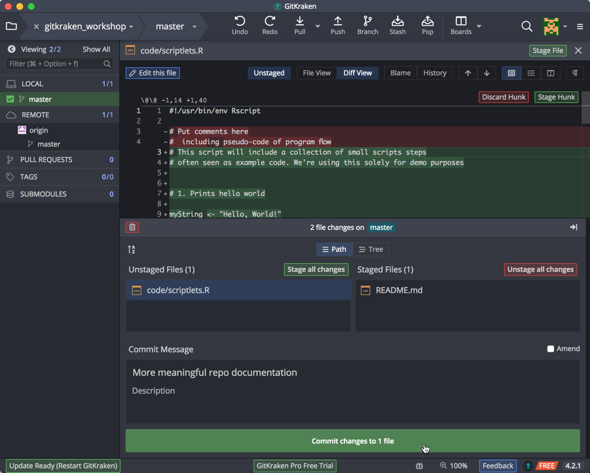
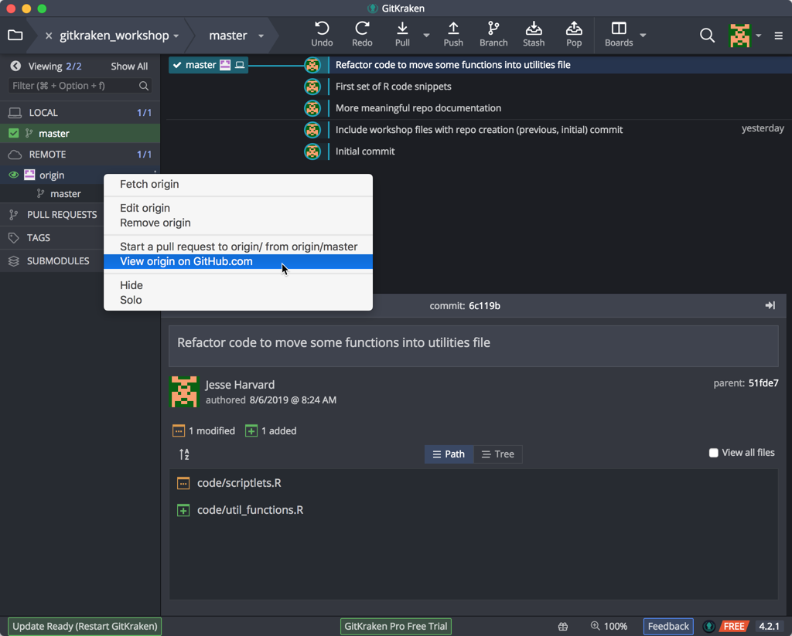
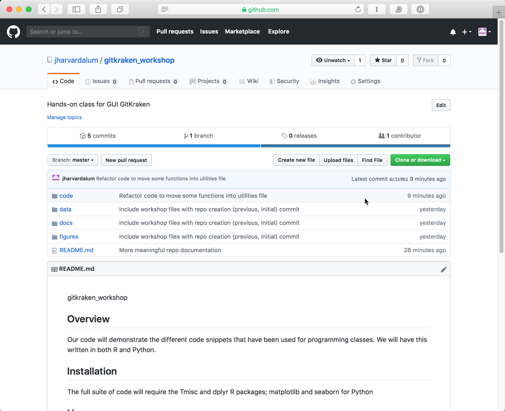

***
Previous: [Introduction to Version Control](01_Intro_to_versioning.md)

***


In this lesson the focus will be on gaining an understanding of the basic aims and principles of Version Control by working with a plain text document using Git (GitKraken & GitHub).

## Getting Started with Git using a GUI (Graphical User Interface)

Usually when programmers use Git for version control of their code, they use the command-line user interface, i.e. UNIX/Linux, to interact with Git. However, there are several tools that enable the use of Git easily for novices using a Graphical User Interface (GUI). Two examples of GUIs are [GitHub Desktop](https://desktop.github.com/) and [GitKraken](www.gitkraken.com). Although there are advantages to using the command line version of Git in the long run, a GUI is a great place to start. 

> **A Note on Terminology**
> 
> One of the trickier aspects of using GitHub is the new terminology (`repository`, `add`, `commit`, `pull`, `push`, `remote`, `detached head`). Some of the commands/terms are fairly self-explanatory, others less so, and in this workshop you will encounter some of these. [Here is a glossary of associated terms](https://help.github.com/articles/github-glossary/), however it is best to pick up terminology wile learning how to use GitHub.

### Register for a GitHub Account

Since we are going to be using [GitHub](https://github.com/) we will need to register for an account at GitHub if we don’t already have one. For [students](https://education.github.com/pack) and [researchers](https://github.com/blog/1840-improving-github-for-science) GitHub does offer free private repositories, these are not necessary but might be appealing if you want to keep some work private to you or a specified set of users.

### Install GitKraken

Most of you should have already installed [GitKraken](https://www.gitkraken.com/download). Open it, and sign in using the credentials you used to sign up for a github account. 


Once you sign in, GitKraken will take you to it's Welcome screen. At this point, you are ready to start working with a repository.

## Version Controlling a directory of files

### Creating a Repository

Git tracks the contents of a folder by creating a repository in a given folder; so it is important to organize projects in folders. 

Tracking items in a folder (repository) using Git:

* The repository is made up of a folder whose contents are ‘watched’ for changes by Git
* A repository can have many files and sub-folders
* Create a repository for each major project you are working on
* These folders are like the normal folders you would have on your computer for different projects, though the files in the folders have to be deliberately added to the repository in order to be version controlled.
* It can be set up to ignore some items in the folder (very large datasets, or temp files)
* Do not create repositories for folders within a repository (avoid matryoshka repos!)

Download the folder we have generated for this session [from here](../../raw/master/data/example_files.zip), and unzip it in a location of your choosing. It's usually easiest to place it on the desktop to retrieve it later more conveniently.


### Creating a Folder/Repository, Starting from your Local Machine

There are a number of different ways to add files/folders for GitKraken to track. For this lesson, click on the folder icon at the top left corner. This will allow you to either *Open* an existing repository, or *Clone* a repository that you or someone else has created, or *Init* (initialize/create) a new repository. Today, we will be initializing a repository.

Click on Init, and then GitHub.com, so that we can create a repository that we will keep locally, as well at a remote location as a backup or perhaps for sharing:


Fill in the fields as appropriate:
* your account
* the name of the repository. Keep this to letters, numbers, and underscores. For this class, let's call it 'gitkraken_workshop'
* a good description
* set the access for the remote location, whether this should be viewable by anyone, or kept private to yourself and people that you specifically add as collaborators
* leave the Clone after init option checked
* For the New repository path, select the location on your local computer or shared drive / mounted volume where the repo folder should be placed. Please include the name of the folder to house the repo and its files, or create the new folder inside this Browse window. For this class, let's place the repo on your Desktop.
* Finally, click on the Create Repository and Clone button.

**Note: sometimes people fail at this step and they are confused as to how to proceed. FINISH THESE HELPFUL INSTRUCTIONS!**

Voila! You now have your first Git repo!


Once we have added our folder we will be able to see it in a list of repositories on the left column.


We'll point out a few features here:
* a list of known/open repos at the top left
* a button/function bar in the top middle
* a listing of the branches for your local and linked remote repositories
* and then the commit (snapshot) message and files that are part of this commit

Since we'll now want to add more files to this repository, right-mouse click on the README.md file and select Show in Finder (Show in Explorer) from the pop-up menu:


The folder we created the repsitory with now contains an extra folder with the name ‘.git’ (this is a hidden folder). This folder is how GitKraken will track changes (adding files/folders, modifying existing ones, deleting files/folders) we make within our version controlled folder: 


### Creating a Repository, by Cloning an Existing Project


### Staging and Committing Changes


But before we continue, we wish to utilize a few best practices from research data management: organize your files, using appropriate folder structure and file naming. Create 5 new directories: code, data, docs, figures, and other; and copy all but three files into these directories, placing them into their appropriate, final location. Leave behind the files "Pi Formulas...", "README.md" (since one is already there), and "util_functions.R". When done, your repo should look something like the following image:


When we switch back to GitKraken, you'll notice the timeline window at the top has changed. GitKraken has noticed files have changes, and it's indicated this new set of changes is considered Work in Progress:


Click on the WIP line at the top to show the files it is watching, show in the bottom pane. You can resize this panel to show all the files if you desire:


A **commit** tells Git that you made some changes which you want to record. Though a **commit** seems similar to saving a file, there are different aims behind ‘committing’ changes compared to saving changes. **Commits** take a snapshot of the file at that point and allow you to document information about the changes made to the document.

We next need to tell Git that we wish to prep these files for a commit, what we call an initial commit, when we take a snapshot of the files at the start of our work and any tracking that we wish to do. To include these files for a commit, we **Stage** the changes by clicking on the 'Stage all changes' button:


You do have the option of adding only certain files to the Staging area if you wish to make separate commits. Simply click on the work Stage that appears near the files you wish to include.

To commit changes you must give a summary of the changes, include an optional message, and click on the Commit button:


After the commit, the timeline changes to reflect the current state & history of our repository. Clicking on the top line, our recent commit, shows in the bottom pane the changes that were include, which is the addition (green plus square) of these files:


A useful way to think about commits is as the ‘history’ of your project. Each commit records a development or change made to the documents in your repository; the history of the project can be traced by looking at all of the commits. 

* Think carefully about when to make commits, since the advantages of version control rely on taking snapshots of your changes regularly.
* Make the commits "atomic", i.e. **commit** a few related changes together; this will help if you have to revert back to a specific version/snapshot. 
* Use meaningful **commit summaries** and **messages**, so that your messages/summaries are independently understandable by your collaborators and your future self.

> **Note about Branches**:
>
> When you commit you will see ‘commit to master’. This refers to the **master** branch. 
> 
> Within a Git repository it is possible to have multiple ‘branches’. These different branches are essentially different places in which to work. Often they are used to test new ideas or work on a particular feature without modifying or "contaminating" the master copy (e.g. production version of a webpage). This feature is very useful when collaborating with others. We do not have time to go into this aspect of Version Control today, but we encourage you to explore it further.


### Changing File Contents and Committing Changes

We're going to make several sets of changes that reflect the flexibility and capability of our version control system. 

Let's open the `README.md` document using our favorite text editor (see note below about text editors) and make this more useful. GitHub automatically renders Markdown document into readable HTML pages that are displayed at the bottom of the main page of your repo. Let's turn this into something more meaningful by added some boilerplate text and helpful information to the small amount of text already there:

```

## Overview
Our code will demonstrate the different code snippets that have been used for programming
classes. We
will have this written in both R and Python. 

## Installation
The full suite of code will require the Tmisc and dplyr R packages; 
matplotlib and seaborn for Python

## Usage
Simply fire up RStudio for trying out your R code, or Spyder for your Python code.

## Getting help

## Contributors
Contributions and references are included in the source code files.

## References
Contributions and references are included in the source code files.

## Licensing
This is all available as CC BY 4.0 license. Enjoy!

```

Save the changes to your file.

Let's also open the `scriptlets.R` file. You'll notice we have some template text there as well --  great for reminding you what you need to do when starting to code. Let's also change the file to reflect the new example codes we've found. Feel free to copy & paste this code:

```
#!/usr/bin/env Rscript

# This script will include a collection of small scripts steps
# often seen as example code. We're using this solely for demo purposes


# 1. Prints hello world

myString <- "Hello, World!"

print (myString)


# 2. Square function
# adapted from https://hbctraining.github.io/Intro-to-R/lessons/03_introR-functions-and-arguments.html#user-defined-functions
# and https://www.r-bloggers.com/how-to-write-and-debug-an-r-function/

square_it <- function(x){
  sq <- x*x
  return(sq)
}

square_it(5)


# 3. Monte Carlo Pi

for (trials in 1:3000) {
  count = 0
  for(i in 1:trials) {
    if((runif(1,0,1)^2 + runif(1,0,1)^2) < 1) {
      count = count + 1
    }
  }
  print(paste(trials, ": ", (count*4) / trials))
}


# END

```

Save this file as well, and go back to GitKraken. Again, the program creates a new WIP timeline entry as it has detected changes. Click on this WIP line to show that GitKraken has noticed that our files have changed, and click on the README.md (file icon with an elipsis inside):


When you click on the filename, you will see that these new lines of text appear; this lets us know that Git is able to see changes in your file but at the moment these changes haven’t been recorded in an official ‘snapshot’ of your repository. To do this we need to **add** and **commit** our changes, just as we did before.


> **Text Editors:**
>
> When creating a plain text document, you will want to use a text editor like Atom, TextWrangler/Sublime Text (Mac) or NotePad++ (Windows) instead of Microscoft Word or the default text editors. You will also want to make sure that you save it as plain text. There are a [large number of free and paid text editors available](https://en.wikipedia.org/wiki/List_of_text_editors) to choose from. In a pinch, you can always use TextEdit (Mac) or Notepad (Windows).

In the context of GitKraken when you **stage** your changes, it is similar to the **add** command on the command line. You can add several changes in the staging area, and only **commit** when you are ready. 

Since we wish to keep all the different types of changes as separate commits, we will stage and commit first the documentation change, and then the code change: 

First, stage only the `README.md` file, and, as we did with our previous initial commit, include a change message, and click on the Commit button:



Again, you'll see our timeline has changed to include this commit. Now also stage the changed code file, include a meaningful change message, and click Commit. Our timeline should now contain these two serial commits:


There may be times, however, when we wish to ensure that we save a coordinated set of changes. For example, it's sometimes better to refactor our code so that utility functions are kept in a separate code file, and then called from our main file. We'll do that with our code snippets with following sets of changes:

1. Remove the square_it and montecarloPi section of code from the main file (as these are being separated into the new utilities file) and replace it three function calls:

```R
hello_world()

square_it(10)

montecarloPi(3000)
```

2. Let's functionalize the `hello_world` code lines:

```R
hello_world <- function() {
  myString <- "Hello, World!"
  print (myString)
}
```

3. And finally, we need to reference and ingest our functions that have been moved to another file. So we include a `source` line:

```R
source("./util_functions.R")
```

Your completed `scriptlets.R` file should look like the following:

```R
#!/usr/bin/env Rscript

# This script will include a collection of small scripts steps
# often seen as example code. We're using this solely for demo purposes

# Put globals, installs, and sources here
source("./util_functions.R")

# Put functions here
#   1. Prints hello world
hello_world <- function() {
  myString <- "Hello, World!"
  print (myString)
}


# main code

hello_world()

square_it(10)

montecarloPi(3000)

# END
```

Be sure to save this file. 

4. As a final step for the coordinated changes, we need to add this utilities file to the repo. From your workshop downloads folder, drag the `util_functions.R` script file into the repo folder `code`. 

When we return to GitKraken, it has noticed the two changes. Since the change in the main code file depends on the presence of this other file, we need to ensure this snapshot captures these dependent changes. So we stage both files, give a meaningful commit message reflecting this process, and Commit. Your repo should look like the following:


***

**Exercise #1**

1. Create a repository "learning_github" in GitKraken. Make sure to create it both locally, and remotely on github.com.
2. Find the folder on your local computer, and add a couple of small text files to it from your computer. 
3. Create a new plain text file called "data-file.txt", add a line or 2 of content to it and save it to the "learning_github" folder.
4. Go to GitKraken, and commit the change with an approriate message.
5. Switch repos back to class repo.

***

### Pushing Your Changes to Your Remote Repository

At the moment we are only recording our changes locally, but we may want to have these changes be available remotely as well (for collaborating/sharing/backing up). The idea is you keep your local and remote repositories "in sync". 

This is straightforward in GitKraken and you do it by doing a one-way synchronization of your repository to the remote that you linked it to when you first created the repo. This one-way synchronization will **push** your repository from your computer to the GitHub website, and populate the *remote* repository on GitHub's servers in the process.


We can now view our changes on our remote at GitHub.com. If the left pane, our remote is given the name 'origin', which is the default term for the remote repository in Git (note that you can call it whatever you'd like, and you can have more than one remote! But that is beyond the scope of this lesson.) If we then right-mouse click on our 'origin', we can select the pop-up menu option "View origin on GitHub.com":



Indeed, GitKraken sends us to our web browser and our repository on GitHub.com is displayed:



Notice that our commit short descriptions are shown here; and that we can see the different commits -- serial & coordinated -- that we performed.

> You can also have a fully local repository, without a remote "synced" one on GitHub. 
> If you would like to initialize such a repository with this intention pick the "Local Only" option under "Init".

***

**Exercise #2**

1. Push the changes to the "learning_github" repo (from the preivous exercise) to the remote repo on github.com
2. Make changes to data-file.txt on GitHub.com
3. Sync or "Pull" the changes that were made remotely to the local repository

***
Next: [Remote repositories, managing conflicts](03_Github_remote_and_conflicts.md)

***


* Materials used in these lessons are derived from Daniel van Strien's ["An Introduction to Version Control Using GitHub Desktop,"](http://programminghistorian.org/lessons/getting-started-with-github-desktop), Programming Historian, (17 June 2016). [The Programming Historian ISSN 2397-2068](http://programminghistorian.org/), is released under the [Creative Commons Attribution license](https://creativecommons.org/licenses/by/4.0/) (CC BY 4.0).*

* Materials are also derived from [Software Carpentry instructional material](https://swcarpentry.github.io/git-novice/). These materials are also licensed under the [Creative Commons Attribution license](https://creativecommons.org/licenses/by/4.0/) (CC BY 4.0).*
