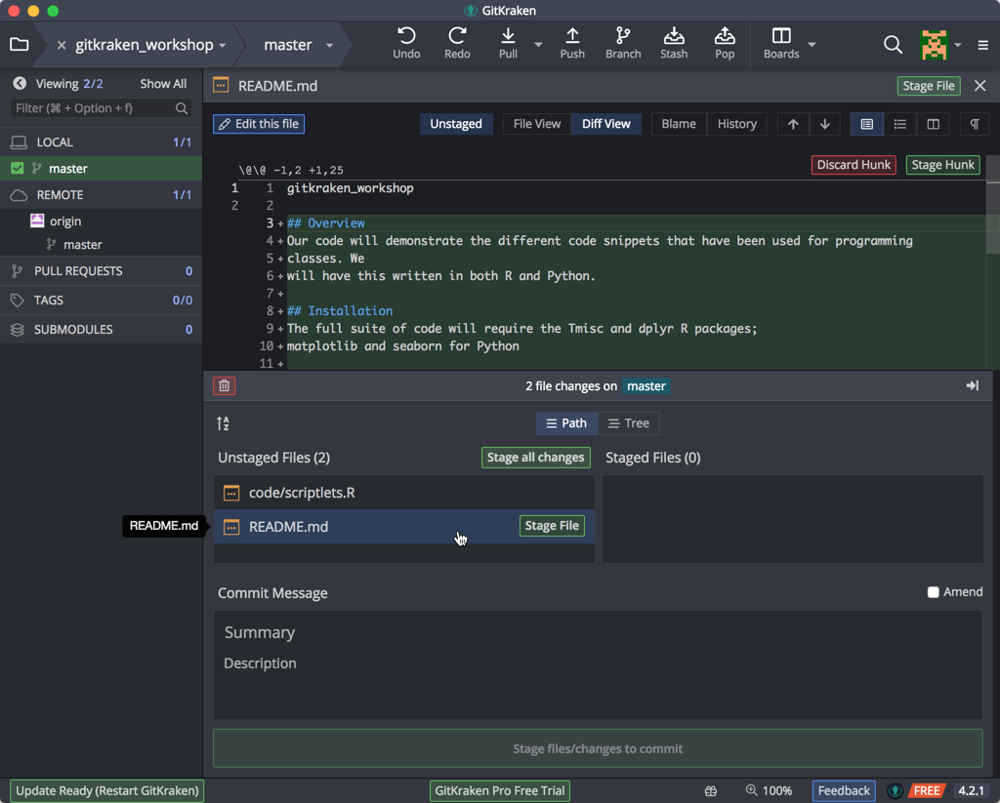

***
Previous: [Introduction to Version Control](01_Intro_to_versioning.md)

***

In this lesson the focus will be on gaining an understanding of the basic aims and principles of Version Control by working with a plain text document using Git (GitKraken & GitHub).

## Getting Started with Git using a GUI (Graphical User Interface)

Usually when programmers use Git for version control of their code, they use the command-line user interface, i.e. a terminal interface from a UNIX/Linux OS. However, there are several tools that enable the use of Git easily for novices using a Graphical User Interface (GUI), enabling a point-and-click interface. Two examples of GUIs are [GitHub Desktop](https://desktop.github.com/) and [GitKraken](www.gitkraken.com). 

Although there are several advantages to using the command line version of Git in the long run, a GUI is a great place to start with learning about Version Control. 

> **A Note on Terminology**
> 
> One of the trickier aspects of using Git is the associated jargon (`repository`, `add`, `commit`, `pull`, `push`, `remote`, `detached head`). Some of the commands/terms are fairly self-explanatory, others less so, and in this workshop you will encounter both of these. [Here is a glossary of associated terms](https://help.github.com/articles/github-glossary/), however it is best to pick up terminology while learning how to use GitHub.

### Register for a GitHub Account

Since we are going to be using [GitHub](https://github.com/) we will need to register for an account at GitHub if we don’t already have one. 

### Install GitKraken

Most of you should have already installed [GitKraken](https://www.gitkraken.com/download). Open it, and sign in using the credentials you used to sign up for a GitHub account. 


> When connecting GitHub to GitKraken, make sure that the authorization is performed on either Chrome or Firefox and not on Internet explorer.

Once you sign in, GitKraken will take you to it's welcome screen. At this point, you are ready to start working with *a repository*.

## Version Controlling a directory of files

### Creating a Repository

***So, what is a Git repository?***

*"A Git repository is the .git/ folder inside a project (folder). This repository tracks all changes made to files in your project, building a history over time. Meaning, if you delete the .git/ folder, then you delete your project’s history."* 
-adapted from [https://blog.axosoft.com/learning-git-repository/](https://blog.axosoft.com/learning-git-repository/)

Essentially, a (project) folder is chosen to be tracked and a Git repository is initiated within it; this ensure that the contents, and the changes to the contents within that folder will be "watched" by Git.

A few salient features of repositories are listed below:
* A repository can have many files and sub-folders (basically, a normal project folder)
* A separate repository for each separate project
* Do not create repositories for folders within a repository (avoid matryoshka repos!)
* The changes made within folders with repositories are being "watched" by Git as mentioned above, but these changes have to be deliberately added to the repository in order to be version controlled or recorded 
* It can be set up to ignore some items in the folder (very large datasets, or temp files)

Download the folder we have generated for this session [from here](../../raw/master/data/example_files.zip), and unzip it in a location of your choosing. We recommend placing it on your Desktop for the duration of this workshop.

### Creating a Folder/Repository, Starting from your Local Machine

There are a number of different ways to add files/folders for Git/GitKraken to track.

* **Click on the folder icon at the top left corner**. This will allow you to either *Open* an existing repository, or *Clone* a repository that you or someone else has created, or *Init* (initialize/create) a new repository. 
* Today, we will be initializing a repository within a new folder, **click on Init, and then GitHub.com**, so that we can create a repository that we will keep locally, *as well at a remote location* as a backup or perhaps for sharing:


Fill in the fields as appropriate:
* your GitHub account
* the name of the repository. *Keep this to letters, numbers, and underscores; for this class, let's call it "gitkraken_workshop".*
* add a description of what this folder/repository will contain.
* set the access for the remote location, whether this should be viewable by anyone, or kept private to yourself and only people you add as collaborators
* leave the "Clone after init" option checked. This will make the repository available to you on GitHub.
* For the "New repository path", select a location on your computer where the newly created folder (with repo) should be placed using the Browse window. For this class, let's place the repo on your Desktop.
* Finally, click on the "Create Repository and Clone" button.

**Note: sometimes people fail at this step and they are confused as to how to proceed. FINISH THE INSTRUCTIONS LISTED ABOVE!**

Voila! You now have your first Git repo!

Our folder should now be visible on the top left and we will be able to see more information about it in the left column.


We'll point out a few features here:
* a list of known/open repos at the top left
* a button/function bar in the top middle
* a listing of the branches for your local and linked remote repositories
* and then the commit (snapshot) message and files that are part of this commit

Since we'll now want to add more files to this repository, right-mouse click on the `README.md` file and select "Show in Finder" ("Show in Explorer") from the pop-up menu:


The folder we created the repository with now contains an extra folder with the name `.git` (this is a hidden folder). This folder is how GitKraken will track changes (adding files/folders, modifying existing ones, deleting files/folders) we make within our version controlled folder: 


> To view hidden folders in Mac OSX, you can press Command+Shift+Dot.

### Staging and Committing Changes

But before we continue, we wish to utilize a few best practices from research data management: organize your files, using appropriate folder structure and file naming. 

1. Let's start by creating 5 new directories: `code`, `data`, `docs`, `figures`, and `other`
2. Now, let's move some of the files into these newly created directories from the downloaded `example_files` folder. Move the files into the appropriate folders as shown in the image below. We won't be moving `Pi Formulas...`, `README.md` (since one is already exists in our new repo), and `util_functions.R`.

When done with the moving, your new repo (folder) should look something like the following image:


Now, when we switch back to GitKraken, you'll notice the timeline window at the top has changed. GitKraken has noticed files have changes, and it's indicated this new set of changes is considered "Work in Progress" (WIP):


Click on the **WIP** line at the top to show the files it is watching, show in the bottom pane. You can resize this panel to show all the files if you desire:


A **commit** tells Git that you made some changes which you want to record. Though a **commit** seems similar to saving a file, there are different aims behind ‘committing’ changes compared to saving changes. **Commits** take a snapshot of the file at that point and allow you to document information about the changes made to the document.

We next need to tell Git that we wish to stage these files for a commit, what we call an initial commit, when we take a snapshot of the files at the start of our work and any tracking that we wish to do. To include or **add** these files for a commit, we **stage** all the changes by clicking on the "Stage all changes" button:


You also have the option of adding only certain files to the "Staging" area if you wish to make separate commits. Simply click on the word Stage that appears near the files you wish to include.

To commit changes **you must give a summary of the changes**, include an optional message, and click on the Commit button:


After the commit, the timeline changes to reflect the current state & history of our repository. Clicking on the top line, our recent commit, shows in the bottom pane the changes that were include, which is the addition (green plus square) of these files:


A useful way to think about commits is as the ‘history’ of your project. Each commit records a development or change made to the documents in your repository; the history of the project can be traced back by looking at all of the commits. 

* Think carefully about when to make commits, since the advantages of version control rely on taking snapshots of your changes regularly.
* Make the commits "atomic", i.e. **commit a few related changes together**; this will help if you have to revert back to a specific version/snapshot. 
* Use meaningful **commit summaries** and **messages**, so that your messages/summaries are independently understandable by your collaborators and your future self.

> **Note about Branches**:
>
> When you commit you will see ‘commit to master’. This refers to the **master** branch. 
> 
> Within a Git repository it is possible to have multiple ‘branches’. These different branches are essentially different (virtual) places in which to work. Often they are used to test new ideas or work on a particular feature without modifying or "contaminating" the master copy (e.g. production version of a webpage). This feature is very useful when collaborating with others. We do not have time to go into this aspect of Version Control today, but we encourage you to explore it further.

### Changing File Contents and Committing Changes

We're going to make several sets of changes that reflect the flexibility and capability of a version control system. 

Let's open the `README.md` document using our favorite text editor (see note below about text editors) and make this more useful. The information in this document is displayed at the bottom of the main page of your repo when you view it on GitHub (online). The `.md` extension means that this is a text file in ["markdown" format](https://guides.github.com/features/mastering-markdown/), which GitHub automatically renders into readable HTML pages.

> README files are an essential part of any analysis workflow, so that your future self or your collaborators are able to understand what they need to know. Git and Github encourage this practice for every repository. [Click here to learn more about README files associated with biomedical datasets/analyses](https://datamanagement.hms.harvard.edu/readme-files).

Let's turn our `README.md` file for this Git repository into something more meaningful by added some boilerplate text and helpful information to the small amount of text already there:

```
## Overview
Our code will demonstrate the different code snippets that have been used for programming
classes. We will have this written in both R and Python. 

## Installation
The full suite of code will require the Tmisc and dplyr R packages; 
matplotlib and seaborn for Python

## Usage
Simply fire up RStudio for trying out your R code, or Spyder for your Python code.

## Getting help

## Contributors
Contributions and references are included in the source code files.

## References
Contributions and references are included in the source code files.

## Licensing
This is all available as CC BY 4.0 license. Enjoy!
```

Save the changes to your file.

Let's also open the `scriptlets.R` file. You'll notice we have some template text there as well --  great for reminding you what you need to do when starting to code. Let's also change the file to reflect the new example codes we've found. Copy & paste this code:

```
#!/usr/bin/env Rscript

# This script will include a collection of small scripts steps
# often seen as example code. We're using this solely for demo purposes


# 1. Prints hello world

myString <- "Hello, World!"

print (myString)


# 2. Square function
# adapted from https://hbctraining.github.io/Intro-to-R/lessons/03_introR-functions-and-arguments.html#user-defined-functions
# and https://www.r-bloggers.com/how-to-write-and-debug-an-r-function/

square_it <- function(x){
  sq <- x*x
  return(sq)
}

square_it(5)


# 3. Monte Carlo Pi

for (trials in 1:3000) {
  count = 0
  for(i in 1:trials) {
    if((runif(1,0,1)^2 + runif(1,0,1)^2) < 1) {
      count = count + 1
    }
  }
  print(paste(trials, ": ", (count*4) / trials))
}


# END
```

Save this file as well, and go back to GitKraken. Again, the program creates a new **WIP** timeline entry as it has detected changes. Click on this WIP line to show that GitKraken has noticed that our files have changed, and click on the README.md (file icon with an ellipsis inside):



When you click on the filename, you will see that these new lines of text appear; this lets us know that Git is able to see changes in your file but at the moment these changes haven’t been recorded in an official ‘snapshot’ of your repository. To do this we need to **add** (**stage**) and **commit** our changes, just as we did before.


> **Text Editors:**
>
> When creating a plain text document, you will want to use a text editor like Atom, TextWrangler/Sublime Text (Mac) or NotePad++ (Windows) instead of Microscoft Word or the default text editors. You will also want to make sure that you save it as plain text. There are a [large number of free and paid text editors available](https://en.wikipedia.org/wiki/List_of_text_editors) to choose from. In a pinch, you can always use TextEdit (Mac) or Notepad (Windows).

In the context of GitKraken when you **stage** your changes, it is similar to the **add** command on the command line interface. You can add several changes in the staging area, and only **commit** when you are ready. 

Since we wish to keep all the different types of changes as separate commits, we will stage and commit first the documentation change to the README file, and then the code change in the Rscript file. 

First, stage only the `README.md` file, and, as we did with our previous initial commit, include a change message, and click on the Commit button:


Again, you'll see our timeline has changed to include this commit. Now also stage the changed code file, include a meaningful change message, and click Commit. Our timeline should now contain these two serial commits:


There may be times, however, when we wish to ensure that we save a coordinated set of changes. For example, if we want to make coordinated changes to multiple files it makes sense to make the changes and then stage (add) and commit all together (**atomic commit**). 

Let's say we want to update the code in the `scriplets.R` file to the following wherein we want to use the `util_functions.R` in the code. Remember that the `util_functions.R` is the Rscript file we left behind in the folder we had downloaded. 

1. Let's update the `scriplets.R` file with the following information and save it:

```R
#!/usr/bin/env Rscript

# This script will include a collection of small scripts steps
# often seen as example code. We're using this solely for demo purposes

# Put globals, installs, and sources here
source("./util_functions.R")

# Put functions here
#   1. Prints hello world
hello_world <- function() {
  myString <- "Hello, World!"
  print (myString)
}

# main code

hello_world()

square_it(10)

montecarloPi(3000)

# END
```

2. Now, let's move the `util_functions.R` script file from the downloaded `example_files` folder into the `code` folder in our new repo. 

When we return to GitKraken, it has noticed the two changes. Since the change in the main code file depends on the presence of this other file, we need to ensure this snapshot captures these dependent changes. So we stage both files, give a meaningful commit message reflecting this process, and Commit. Your repo should now look like the following:


***

**Exercise #1**

1. Create a repository `learning_github` in GitKraken. Make sure to create it both locally, and remotely on github.com.
2. Find the folder on your local computer, and add a couple of small text files to it from your computer. 
3. Create a new plain text file called `data-file.txt`, add a line or 2 of content to it and save it to the `learning_github` folder.
4. Go to GitKraken, and commit the change with an approriate message.
5. Switch repos back to the `gitkraken_workshop` repo.

***

Next: [Remote repositories, managing conflicts](https://hbctraining.github.io/versioning_data_scripts/03_Github_remote.html)

***


* Materials used in these lessons are derived from Daniel van Strien's ["An Introduction to Version Control Using GitHub Desktop,"](http://programminghistorian.org/lessons/getting-started-with-github-desktop), Programming Historian, (17 June 2016). [The Programming Historian ISSN 2397-2068](http://programminghistorian.org/), is released under the [Creative Commons Attribution license](https://creativecommons.org/licenses/by/4.0/) (CC BY 4.0).*

* Materials are also derived from [Software Carpentry instructional material](https://swcarpentry.github.io/git-novice/). These materials are also licensed under the [Creative Commons Attribution license](https://creativecommons.org/licenses/by/4.0/) (CC BY 4.0).*
