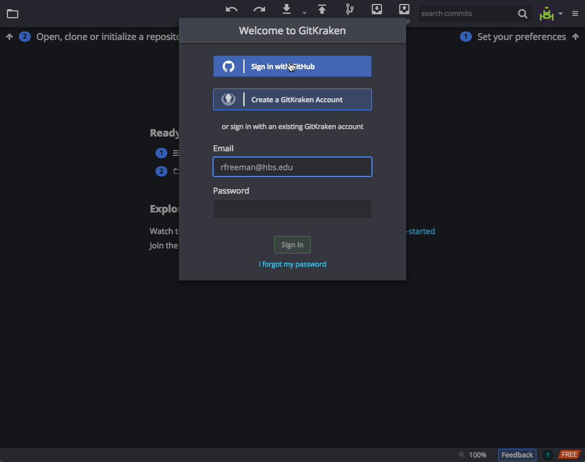
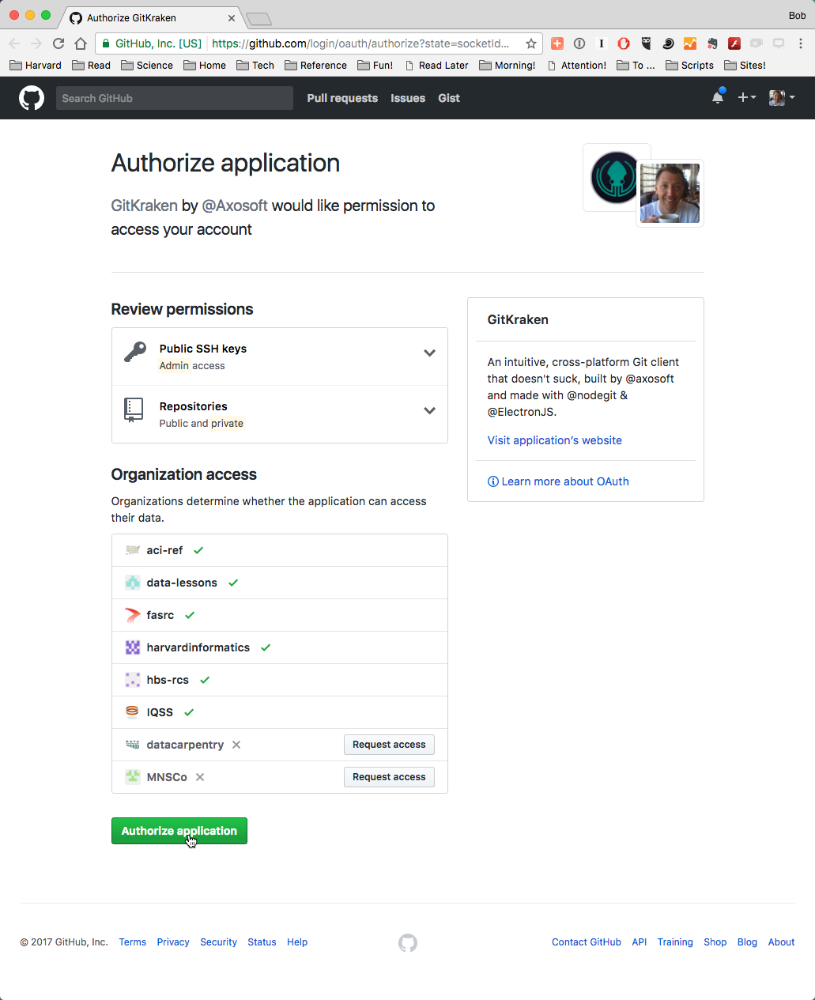
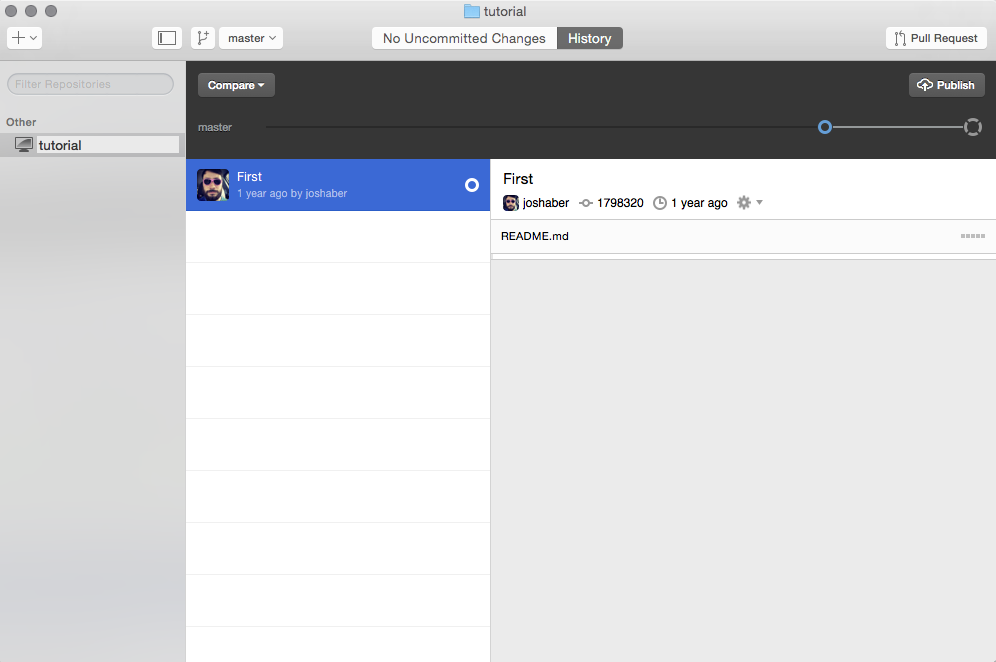
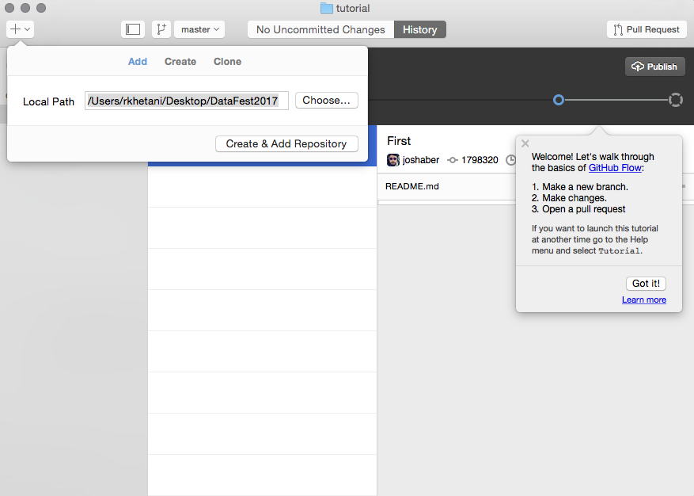
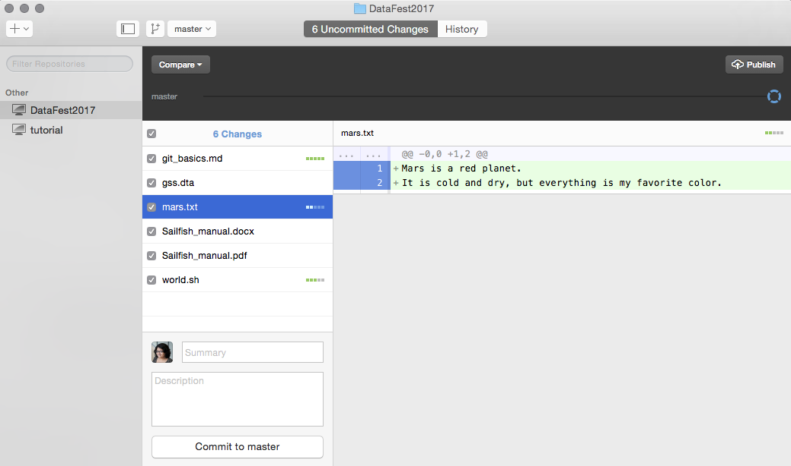
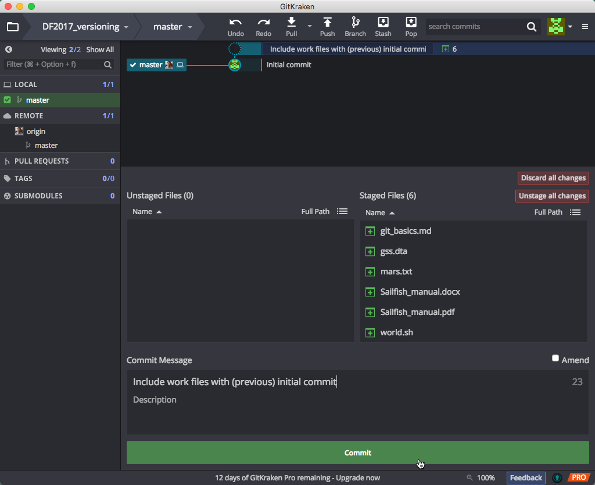
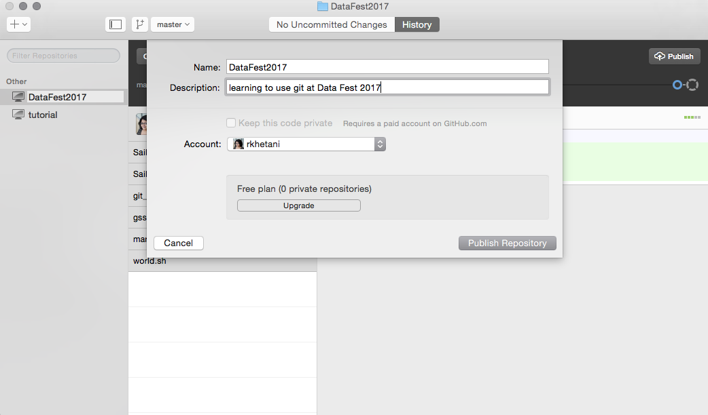

#  Versioning your Data and Scripts

>> NOTE: Materials used in these lessons are derived/adapted from [Daniel van Strien's "An Introduction to Version Control Using GitHub Desktop," Programming Historian, (17 June 2016)](http://programminghistorian.org/lessons/getting-started-with-github-desktop) and from [Software Carpentry instructional material](https://swcarpentry.github.io/git-novice/). Licensing information available at the bottom of this page.

## Getting Started with Github Desktop

GitHub Desktop offers a Graphical User Interface (GUI) to use Git, and will allow us to easily start using Version Control. Though there are advantages to using the command line version of Git in the long run, a GUI is a good place to start. 

> **A Note on Terminology**
> 
> One of the trickier aspects of using GitHub is the new terminology (`repository`,`add`, `commit`, `pull`, `push`, `remote`, `detached head`). Some of the commands/terms are fairly self-explanatory, others less so, and in this workshop you will encounter some of these. [Here is a glossary](https://help.github.com/articles/github-glossary/), however it is best to pick up terminology wile learning how to use GitHub.

### Register for a GitHub Account

Since we are going to be using [GitHub](https://github.com/) we will need to register for an account at GitHub if we don’t already have one. For [students](https://education.github.com/pack) and [researchers](https://github.com/blog/1840-improving-github-for-science) GitHub offers free private repositories. These are not necessary but might be appealing if you want to keep some work private.

### Install GitHub Desktop

Most of you should have already installed [Github Desktop](https://desktop.github.com/). Open it, and sign in using the credentials you used to sign up for a github account. 





Once you sign in, you'll see that there is already a tutorial repository available to you.



## Version Controlling a directory of files

### Creating a Repository

Git tracks the contents of a folder by creating a repository in a given folder; so it is important to organize projects in folders. 

Tracking items in a folder (repository) using Git:

* The repository is made up of a folder whose contents are ‘watched’ for changes by Git
* A repository can have many files and sub-folders
* Create a repository for each major project you are working on
* These folders are like the normal folders you would have on your computer for different projects, though the files in the folders have to be deliberately added to the repository in order to be version controlled.
* It can be set up to ignore some items in the folder (very large datasets, or temp files)
* Do not create repositories for folders within a repository (avoid matryoshka repos!)

Download the folder we have generated for this session [from here](https://github.com/IQSS/datafest/raw/master/versioning/data/DataFest2017.zip), and unzip it in a location of your choosing.

### Adding a Folder/Repository

There are a number of different ways to add files/folders for GitHub Desktop to track: 

* We can drag the folder containing the file onto GitHub Desktop. When you do this you will be asked whether you want to create a repository for this folder 
* Alternatively, we can click on the ‘plus’ icon to open a window to choose folders we want to add. This is what we will be doing:



Once we have added our folder we will be able to see it in a list of repositories on the left column.



Choose the repository we just added to see the files contained in that repository. From this menu we can choose which files we want to version control. On the right we will see the current document.

The folder we created the repsitory with now contains an extra folder with the name ‘.git’ (this is a hidden folder). This folder is how GitHub Desktop will track changes (adding files/folders, modifying existing ones, deleting files/folders) we make within our version controlled folder. 

Let's open the `mars.txt` document using our favorite text editor (see note below about text editors) and add a couple of lines to it.

```
Mars is a red planet.
It is cold and dry, but everything is my favorite color.

The two moons may make things interesting
```

Save the changes to your file and go back to GitHub Desktop. You will see that these new lines of text appear; this lets us know that GitHub is able to see changes in your file but at the moment these changes haven’t been recorded in an official ‘snapshot’ of your repository. To do this we need to **add** and **commit** our changes.


> **Text Editors:**
>
> When creating a plain text document, you will want to use a text editor like TextWrangler (Mac) or NotePad++ (Windows) instead of Microscoft Word or the default text editors. You will also want to make sure that you save it as plain text. There are a [large number of free and paid text editors available](https://en.wikipedia.org/wiki/List_of_text_editors) to choose from.

In the context of Github Desktop the **add** command to place changes in the *staging area* is transparent to us. You can "place/add" several changes in the staging area, and only **commit** when you are ready. 

### Committing Changes

A **commit** tells Git that you made some changes which you want to record. Though a **commit** seems similar to saving a file, there are different aims behind ‘committing’ changes compared to saving changes. **Commits** take a snapshot of the file at that point and allow you to document information about the changes made to the document.

To commit changes you must give a summary of the changes and include an optional message. 



A useful way to think about commits is as the ‘history’ of your project. Each commit records a development or change made to the documents in your repository; the history of the project can be traced by looking at all of the commits. 

* Think carefully about when to make commits, since the advantages of version control rely on taking snapshots of your changes regularly.
* Make the commits "atomic", i.e. **commit** a few related changes together; this will help if you have to revert back to a specific version/snapshot. 
* Use meaningful **commit summaries** and **messages**, so that your messages/summaries are independently understandable by your collaborators and your future self.

> **Note about Branches**:
>
> When you commit you will see ‘commit to master’. This refers to the **master** branch. 
> 
> Within a Git repository it is possible to have multiple ‘branches’. These different branches are essentially different places in which to work. Often they are used to test new ideas or work on a particular feature without modifying or "contaminating" the master copy (e.g. production version of a webpage). This feature is very useful when collaborating with others. We do not have time to go into this aspect of Version Control today, but we encourage you to explore it further.

***

**Exercise**

1. Create a new folder called "learning_github", and add a couple of small text files to it from your computer. 
2. Create a repository with this folder in Github Desktop.
3. Create a new plain text file called "data-file.txt", add a line or 2 of content to it and save it to the "learning_github" folder. 
4. Go to Github Desktop, and commit the change with an approriate message.

***

### Publishing Your Repository

At the moment we are only recording our changes locally. We may be happy to only store our changes locally, but we may want to upload our repository onto GitHub to make it public or to have it stored outside of our computer (for collaborating/sharing/backing up). 

This is straightforward in GitHub Desktop and you do it by "publishing" your repository. This will **push** your repository from your computer to the GitHub website, and set up a *remote* repository on Github's servers in the process.



***

* Materials used in these lessons are derived from Daniel van Strien's ["An Introduction to Version Control Using GitHub Desktop,"](http://programminghistorian.org/lessons/getting-started-with-github-desktop), Programming Historian, (17 June 2016). [The Programming Historian ISSN 2397-2068](http://programminghistorian.org/), is released under the [Creative Commons Attribution license](https://creativecommons.org/licenses/by/4.0/) (CC BY 4.0).*

* Materials are also derived from [Software Carpentry instructional material](https://swcarpentry.github.io/git-novice/). These materials are also licensed under the [Creative Commons Attribution license](https://creativecommons.org/licenses/by/4.0/) (CC BY 4.0).*
