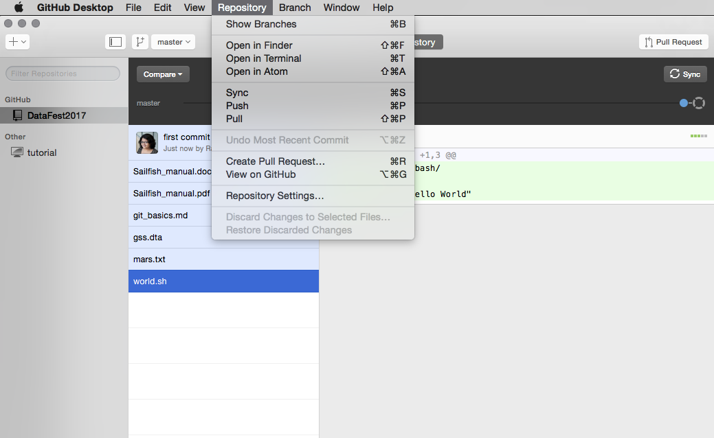
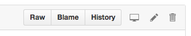
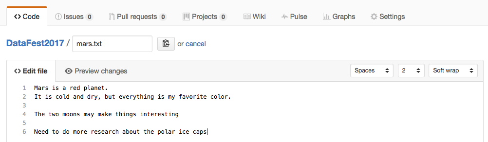
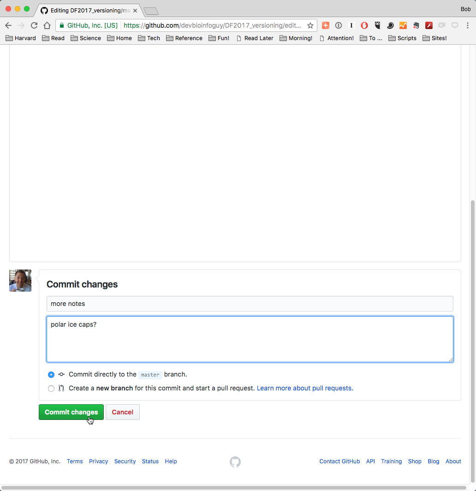
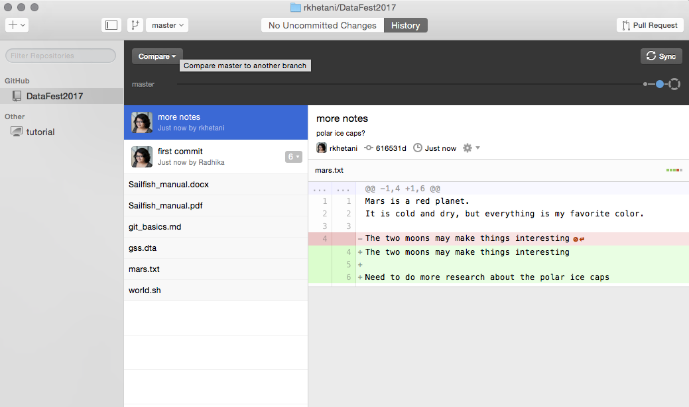

## Repositories online (remote)

Once you have ‘published’ your repository it will be viewable on your profile at [GitHub.com](github.com). You can choose to keep it public or make it private; and if it's private, you can choose specific GitHub users with whom you want to share it or collaborate with.

For this lesson, we will stick with a public repository. To quickly view your repository online you can choose from the menubar 'Repository' > 'View on GitHub'. This will reveal your online repository in your web browser.

Once your document is online, you can continue to make local changes to your file. But you will have to synchronize your local changes to reflect these changes in the published GitHub repository. GitHub stores changes both locally (on your computer) and remotely (on their servers), and it is important to keep these changes in sync. 

On GitHub Desktop this process is simplified by using the appropriately-named "**Sync**" option, which both **pulls** in changes from the remote repository, and **pushes** any local changes to the remote repo. 

### Making Changes Remotely

It is also possible to make a change to your repository on the web interface. Clicking on the name of the file in the title area will take you to a new page showing your document.

Click on the 'Edit' option or icon. You will now be able to edit the file and add some new text.

Once you have made some changes to your file, you will again see the option to commit changes near the bottom of the text entry box.

Once you have committed these changes they will be stored on the remote repository. To get them back onto our own (local) computer, we need to synchronize these changes. Use the ‘Sync’ button on GitHub Desktop to sync the local repository. 

You can see from this view that we now have the text with changes highlighted in green and red. Red indicates where things have been removed, while green indicates additions. This can be useful for viewing the edits you have made before making a commit. On the left you will see a history of the changes you have made; at the moment this is very brief but as you work on a project the history will become much longer. 

***

## Further Resources

GitKraken offers an easy way of getting started with GitHub and version control. Depending on your use case it may be sufficient for your needs. If you are already familiar with using the Command Line then using Git on the Command Line is recommended. 

This lesson introduced you to the most rudimentary (yet very useful) concepts and terminolofy associated with using Version control (Git). The resources below will allow you get started with getting a deeper/better understanding of version control.

* The [GitKraken documentation](https://support.gitkraken.com/getting-started/guide) is a great way to start exploring it's functionality, and learning more about what Git can do.
* GitHub also provides extensive support in the form of [guides](https://guides.github.com/) and [help](https://help.github.com/).
* GitHub [Glossary](https://help.github.com/articles/github-glossary/) outlines the most commonly used GitHub/Git terminology.

***

* Materials used in these lessons are derived from Daniel van Strien's ["An Introduction to Version Control Using GitHub Desktop,"](http://programminghistorian.org/lessons/getting-started-with-github-desktop), Programming Historian, (17 June 2016). [The Programming Historian ISSN 2397-2068](http://programminghistorian.org/), is released under the [Creative Commons Attribution license](https://creativecommons.org/licenses/by/4.0/) (CC BY 4.0).*

* Materials are also derived from [Software Carpentry instructional material](https://swcarpentry.github.io/git-novice/). These materials are also licensed under the [Creative Commons Attribution license](https://creativecommons.org/licenses/by/4.0/) (CC BY 4.0).*
