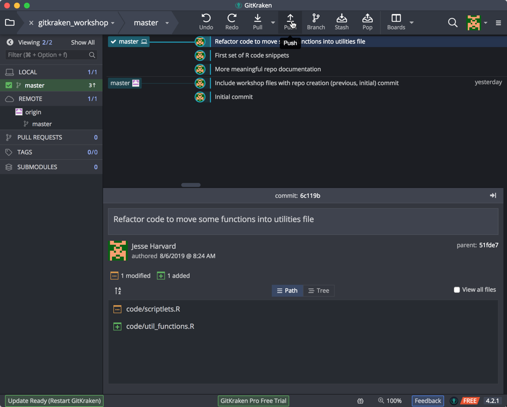
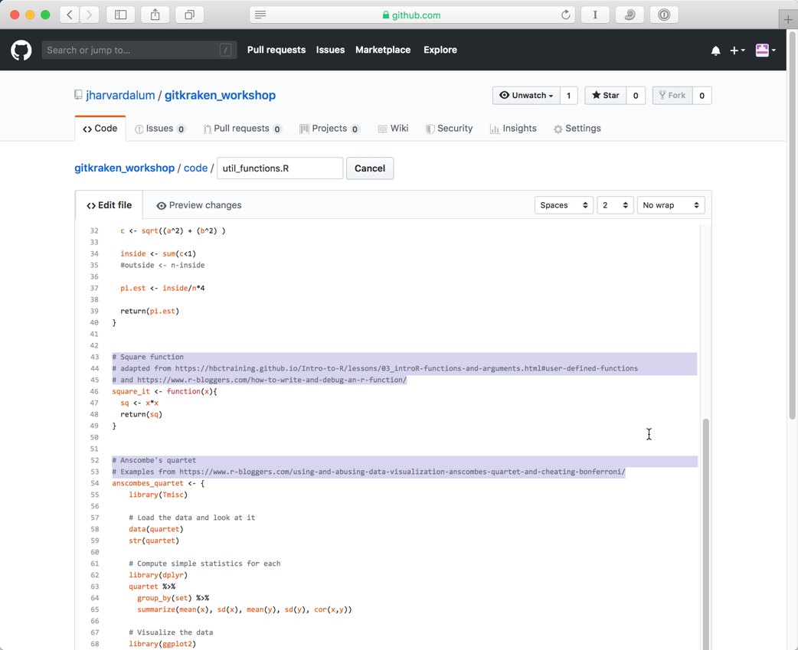
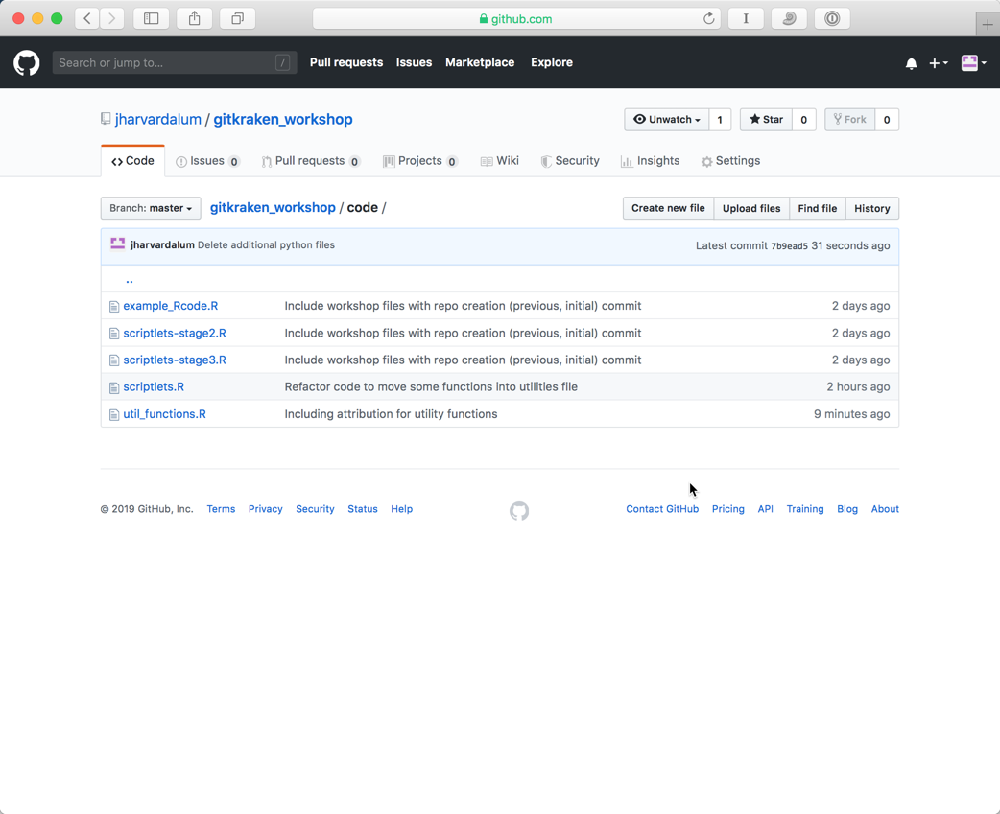
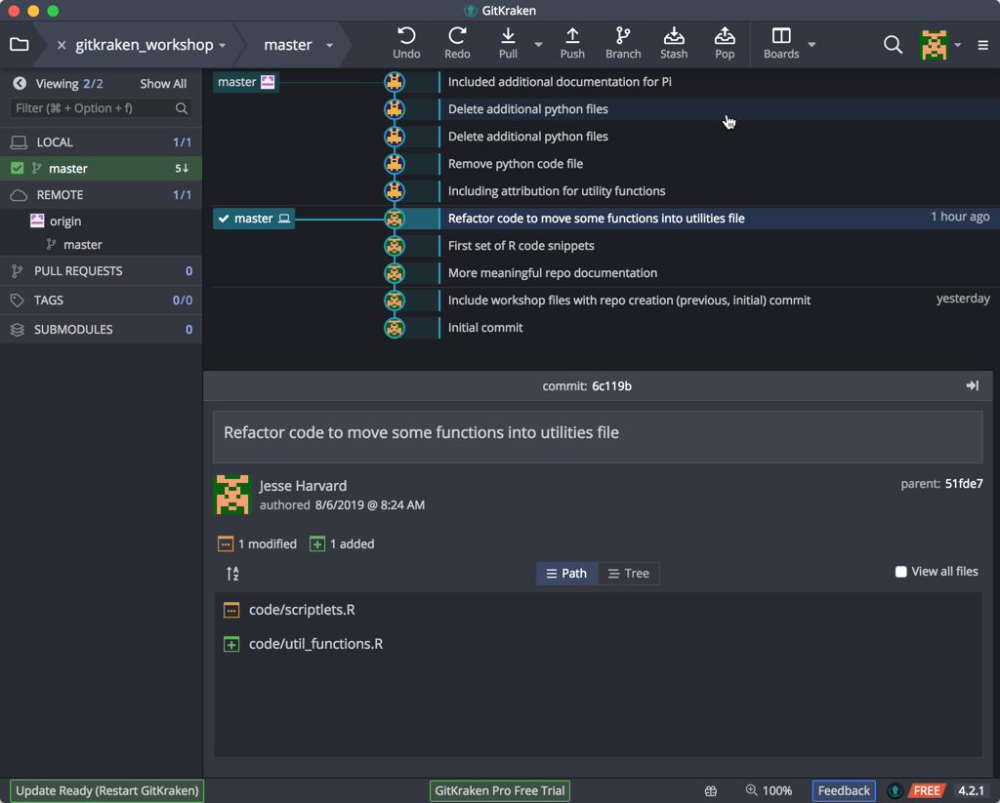
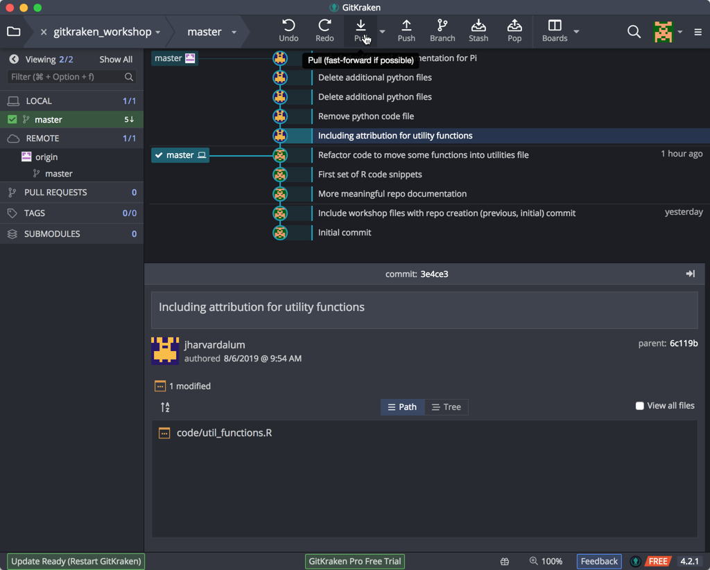
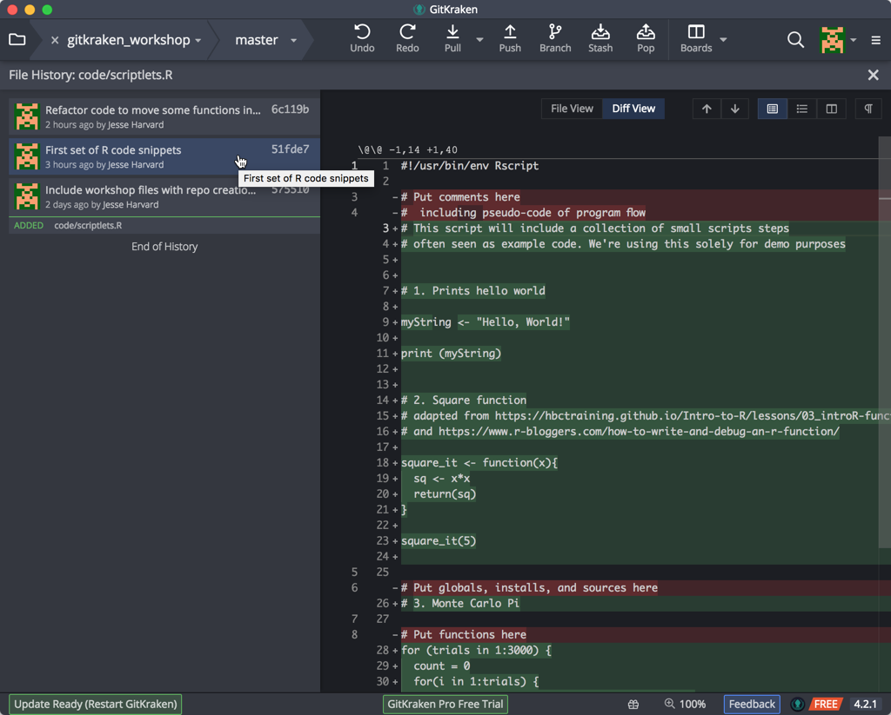
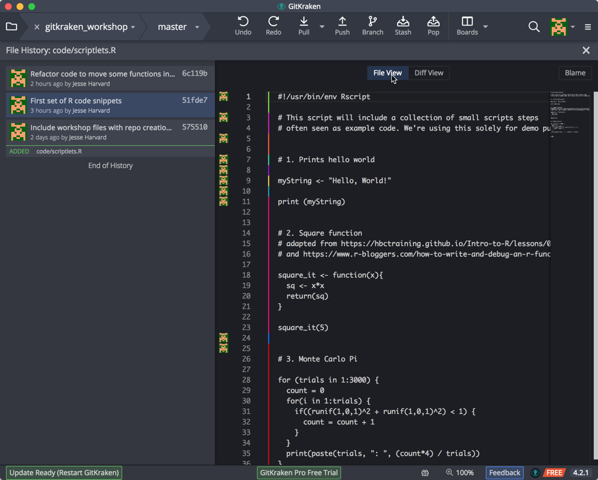

***
Previous: [Getting Started with Git using GitKraken](02_GitKraken.md)

***

## Repositories online (remote)

### Pushing Your Changes to Your Remote Repository

In the last lesson we were only recording our changes locally, but we may want to have these changes be available remotely as well (for collaborating/sharing/backing up). The idea is you keep your local and remote repositories "in sync". 

This is straightforward in GitKraken and you do it by doing a one-way synchronization of your repository to the remote that you linked it to when you first created the repo. This one-way synchronization will **push** your repository from your computer to the GitHub website, and populate the *remote* repository on GitHub's servers in the process.



We can now view our changes on our remote at GitHub.com. If the left pane, our remote is given the name 'origin', which is the default term for the remote repository in Git (note that you can call it whatever you'd like, and you can have more than one remote! But that is beyond the scope of this lesson.) If we then right-mouse click on our 'origin', we can select the pop-up menu option "View origin on GitHub.com":


Indeed, GitKraken sends us to our web browser and our repository on GitHub.com is displayed:


Notice that our commit short descriptions are shown here; and that we can see the different commits -- serial & coordinated -- that we performed.

> You can also have a fully local repository, without a remote "synced" one on GitHub. 
> If you would like to initialize such a repository with this intention pick the "Local Only" option under "Init".

***

**Exercise #2**

1. Push the changes to the "learning_github" repo (from the preivous exercise) to the remote repo on github.com
2. Make changes to data-file.txt on GitHub.com
3. Sync or "Pull" the changes that were made remotely to the local repository
***

On Github, you can choose to keep it public or make it private; and if it's private, you can choose specific GitHub users with whom you want to share it or collaborate with. For this lesson, we will stick with having a public repository. 

Once your document is online, you can continue to make local changes to your file. But you will have to synchronize your local changes to reflect these changes in the published GitHub repository. GitHub stores changes both locally (on your computer) and remotely (on their servers), and it is important to keep these changes in sync. 

In GitKraken and standard Git workflows, this is accomplished by regular, intentional rounds of **Pull** and **Push**, which both **pulls** in changes from the remote repository, and **pushes** any local changes to the remote repo. 

### Making Changes Remotely

It is also possible to make a change to your repository on the web interface. We forgot to give attribution to our functions in the `util_functions.R` file. Go into the `code` directory, and click on the name of the file in the title area to take you to a new page showing your document.

Click on the 'Edit' option or icon. You will now be able to edit the file and add some new text. Let's add comments to both the square function:

```
# Square function
# adapted from https://hbctraining.github.io/Intro-to-R/lessons/03_introR-functions-and-arguments.html#user-defined-functions
# and https://www.r-bloggers.com/how-to-write-and-debug-an-r-function/
```

and the Anscombe's quartet function:

```
# Anscombe's quartet
# Examples from https://www.r-bloggers.com/using-and-abusing-data-visualization-anscombes-quartet-and-cheating-bonferroni/
```



Once you have made some changes to your file, you will again see the option to commit changes near the bottom of the text entry box.


One can also add and delete files from the repo. Since we're working in R, let's remove the python code files. One must first view the file itself (click on the file's name) to reveal the Delete (trash can) icon. Click here to delete:


This solitary action requires a description and subsequent Commit:


Let's delete the other two as well. the `code` folder in your repo should look like the following:



One can also add files and folders to the repo via the web interface. We'll keep this simple. In the `doc` folder we can add the `Pi formulas...` document from our workshop downloads folder. Navigate to the `docs` folder in the repo, and click on the Upload files button.


This action also requires a Description and subsequent Commit:


You should now see the `Pi Formulas...` document in your `docs` folder.

Two important sidebars: since on GitHub.com file changes are done serially, coodinated file changes cannot be done here -- the must be done on your local machine with GitKraken. Also, all these changes are realtime on the GitHub remote -- Once you have committed these changes these changes are immediate.

Let's return to our local machine. GitKraken has already noticed that our remote repo has changed, and the markers for the two repos (local and remote) have diverged:



Click on the timeline entry to view the file changes:


And click on the filename itself to see the changes made within:


You can see from this view that we now have the text with changes highlighted in <span style="color:green">green</span> and <span style="color:red">red</span>. <span style="color:red">Red</span> indicates where things have been removed, while <span style="color:green">green</span> indicates additions. 

Click on the filename again to return to our commit timeline.

To get all these changes back onto our own (local) computer, we need to Pull these changes back to our local repo, using the Pull button in the GitKraken toolbar towards the top of the screen:



If all goes well, you should see a brief 'Success' message, and your repos should be in sync again:


## Viewing File Histories

One very useful feature of this and other Git clients is looking at how a file has changed over time. In GitKraken, select the timeline entry 'Refactor code...', and in the section below, right-mouse click on the `scriptlets.R` file and select "File History" to see exactly that: 


Our code file is displayed with comments on the left and differences between the (left) selected and previous versions:


Clicking on the previous comment shows the next level of changes:



And finally, clicking on the File View button shows all the changes together, with the log (legend) of changes being indicated with color coding:



Click on the X at the upper right to close this window and return to the commit timeline.


***

Next: [Managing Conflicts](04_Managing_conflicts.md)

***

* Materials used in these lessons are derived from Daniel van Strien's ["An Introduction to Version Control Using GitHub Desktop,"](http://programminghistorian.org/lessons/getting-started-with-github-desktop), Programming Historian, (17 June 2016). [The Programming Historian ISSN 2397-2068](http://programminghistorian.org/), is released under the [Creative Commons Attribution license](https://creativecommons.org/licenses/by/4.0/) (CC BY 4.0).*

* Materials are also derived from [Software Carpentry instructional material](https://swcarpentry.github.io/git-novice/). These materials are also licensed under the [Creative Commons Attribution license](https://creativecommons.org/licenses/by/4.0/) (CC BY 4.0).*
