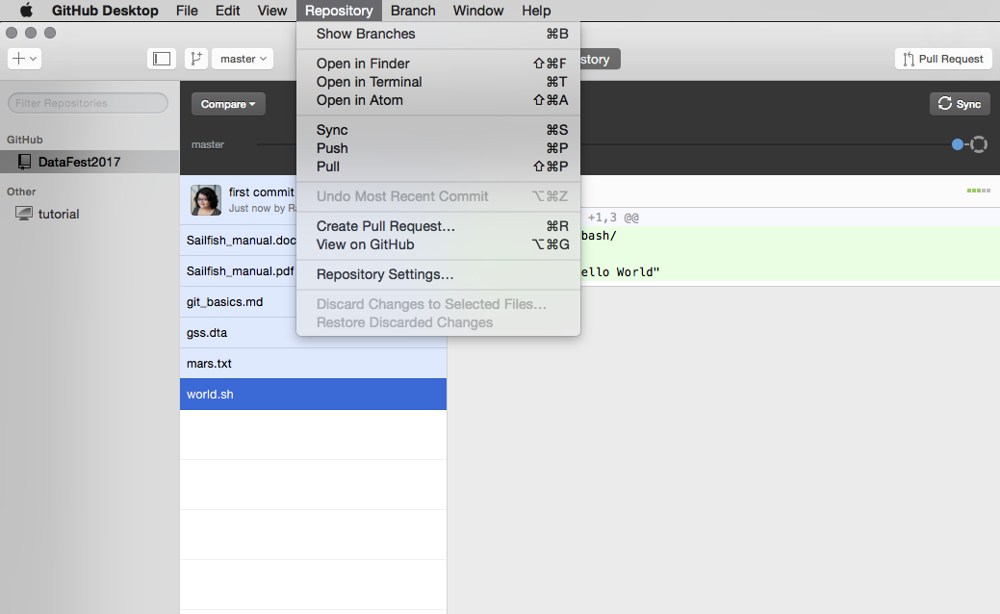
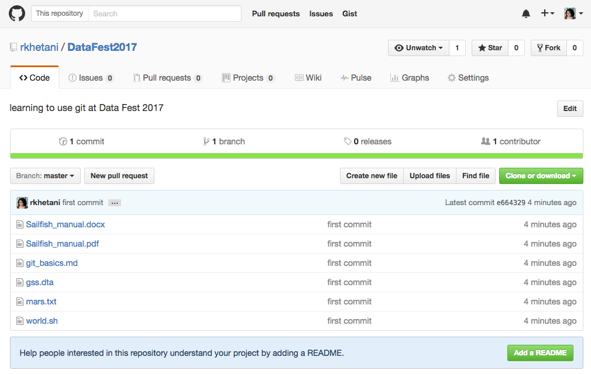
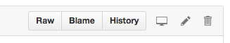
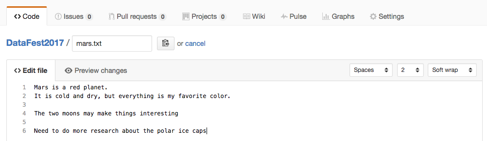
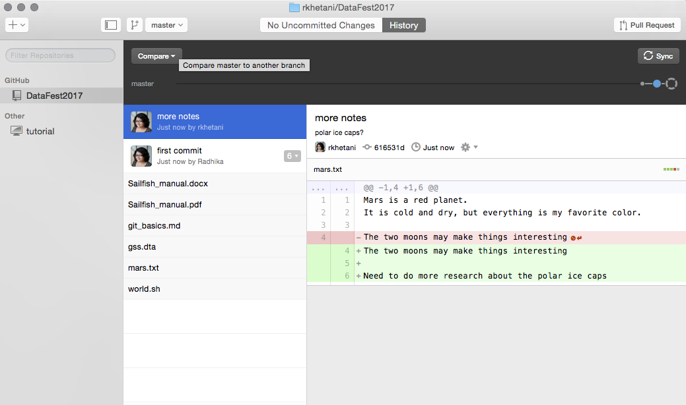
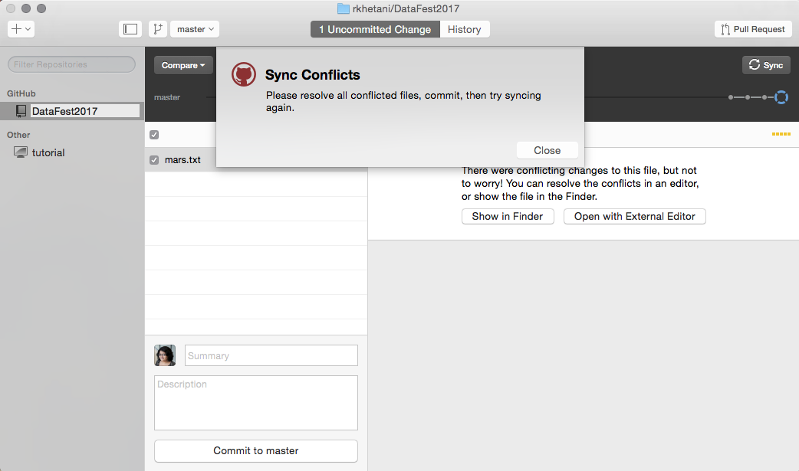
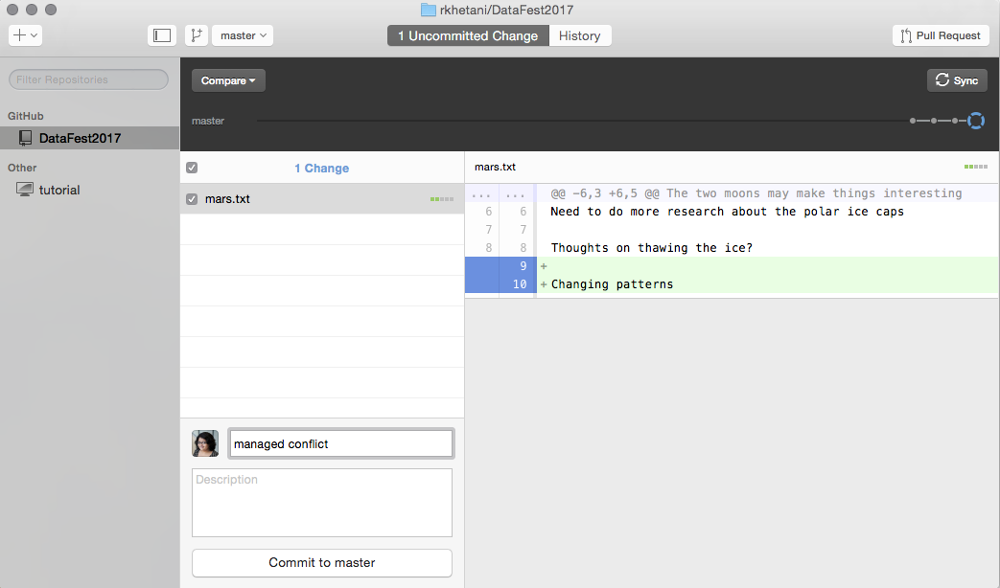

#  Versioning your Data and Scripts

>> NOTE: Materials used in these lessons are derived/adapted from [Daniel van Strien's "An Introduction to Version Control Using GitHub Desktop," Programming Historian, (17 June 2016)](http://programminghistorian.org/lessons/getting-started-with-github-desktop) and from [Software Carpentry instructional material](https://swcarpentry.github.io/git-novice/). Licensing information available at the bottom of this page.

## Repositories online (remote)

Once you have ‘published’ your repository it will be viewable on your profile at [gitHub.com](github.com). You can choose to keep it public or make it private, and if it's private, you can choose specific github users with whom you want to share it or collaborate with.

For this lesson, we will stick with a public repository. To quickly view your repository online you can use the repository menu and choose ‘View on GitHub’. This will bring you to your repository online in your browser.

Once your document is online, you can continue to make local changes to your file. But you will have to "**sync**" your local changes to reflect these changes in the published GitHub repository. GitHub stores changes both locally (on your computer) and remotely (on their servers) and it is important to keep these changes in sync. 

On GitHub Desktop this process is simplified by using the appropriately-named **Sync** option, which **pulls** in changes from the remote repository, and **pushes** any local changes to the remote repo. 

### Making Changes Remotely

It is also possible to make a change to your repository on the web interface. Clicking on the name of the file will take you to a new page showing your document.

Click on the edit option. You will now be able to edit the file and add some new text.

Once you have made some changes to your file, you will again see the option to commit changes at the bottom of the text entry box.

Once you have committed these changes they will be stored on the remote repository. To get them back onto our computer we need to sync our these changes. Use the ‘sync’ button on GitHub Desktop to sync the local repository. 

You can see from this view that we now have the text with changes highlighted in green and red. Red indicates where things have been removed while green indicates additions. This can be useful for viewing the edits you have made before making a commit. On the left you will see a history of the changes you have made; at the moment this is very brief but as you work on a project the history will become much longer. 

## Managing Conflicts

A ‘**conflict**’ emerges when you try to merge or ‘sync’ two versions of a document with changes which conflict with each other. If you are careful about committing and syncing then it is unlikely you will run into this issue; but if you do, it can be resolved fairly easily.

The most likely way a conflict will emerge is if you (or a collaborator) make a change on either the local or online repo, and then make a subsequent change on the other without first synching the changes. 

If you make changes in different parts of a file or within the repo, these changes can be ‘merged’ or synced together without any conflict. But if these changes conflict with one another (i.e. if you try and change the same line of the document in two different ways), that's when there is an issue.

An example will help illustrate the most likely way conflicts can emerge, and how to deal with them. 

Say we add a change to our remote repository to the `mars.txt` file.

We commit this change on the website. 

Without syncing, make a change to the same document using the text editor locally, and save the change.

Finally, let's commit our local changes and sync the repos. As expected, we get a message warning us about "Sync Conflicts".

This is not a big problem. What you will need to do is manage these conflicts. GitHub desktop offers you the option of opening the file with the sync conflicts.

Open the file with an external text editor (the document will open with whichever text editor/application we have chosen as the default for opening markdown files). 

If we take a look at the file we will see Git has highlighted the conflicting section.

You will see that the conflicting section is marked with <<<<<<< and ends with >>>>>>>. These are known as the conflict markers. The two conflicting blocks are divided by a ======= line. 

There are a number of approaches to dealing with a conflict:

* You could choose to go with either of the changes by deleting the version you no longer want and removing the conflict markers, OR

* You could change the section entirely and not choose either of the options.

Once you have ‘resolved’ the conflict, save the file and proceed to **commit** & **sync** your changes as usual. When you go to commit your changes you see that GitHub desktop specifies that the commit is to merge a conflict. This is useful historical information if you later want to go back and review how you managed any conflicts.

This may seem like a convoluted approach to dealing with conflicts but it is very useful because of the control given to you in dealing with conflicts. If conflicts emerge on a system like Dropbox the result is two files being created; although this is better than potentially losing important changes, it also means you still have to look at these two documents and decide how you are going to merge them. 

If you are careful about always syncing changes you will be able to avoid having to deal with conflicts. When collaborating, the likelihood for conflicts increases; so, it is useful to be aware of how to deal with conflicts before you begin to collaborate using GitHub. 

***

**Exercise**

1. Publish the "learning_github" repo. 
2. Create a conflict within the "data-file.txt" file by making changes locally and remotely.
3. Resolve the conflict and commit.
4. [Optional] Add your neighbor as a collaborator to a the "learning_github" repo (in Settings -> Collaborators & teams), make changes to create a conflict within the "data-file.txt" document in one of the repos (pick one), and resolve the conflict.

***

## Further Resources

GitHub Desktop offers an easy way of getting started with GitHub and version control. Depending on your use case GitHub desktop may be sufficient for your needs. If you are already familiar with using the Command Line then using Git on the Command Line may offer some advantages. Version control systems like Git have a lot of features available to use. Some of these will only be applicable in very specific contexts, others will be more commonly useful. Alongside the lesson suggested above the resources below will allow you to gain a deeper understanding of version control.

* The [GitHub Desktop](https://desktop.github.com/) and the GitHub Desktop [documentation](https://help.github.com/desktop/) outlines more features included in GitHub Desktop.
* GitHub provides extensive support in the form of [guides](https://guides.github.com/) and [help](https://help.github.com/).
* GitHub [Glossary](https://help.github.com/articles/github-glossary/) outlines the most commonly used GitHub/Git terminology.

***

* Materials used in these lessons are derived from Daniel van Strien's ["An Introduction to Version Control Using GitHub Desktop,"](http://programminghistorian.org/lessons/getting-started-with-github-desktop), Programming Historian, (17 June 2016). [The Programming Historian ISSN 2397-2068](http://programminghistorian.org/), is released under the [Creative Commons Attribution license](https://creativecommons.org/licenses/by/4.0/) (CC BY 4.0).*

* Materials are also derived from [Software Carpentry instructional material](https://swcarpentry.github.io/git-novice/). These materials are also licensed under the [Creative Commons Attribution license](https://creativecommons.org/licenses/by/4.0/) (CC BY 4.0).*
