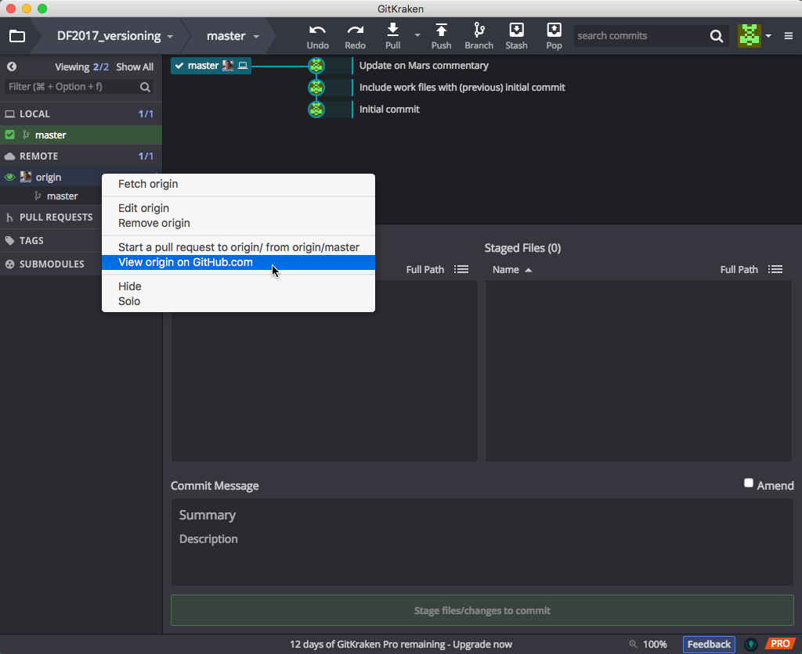
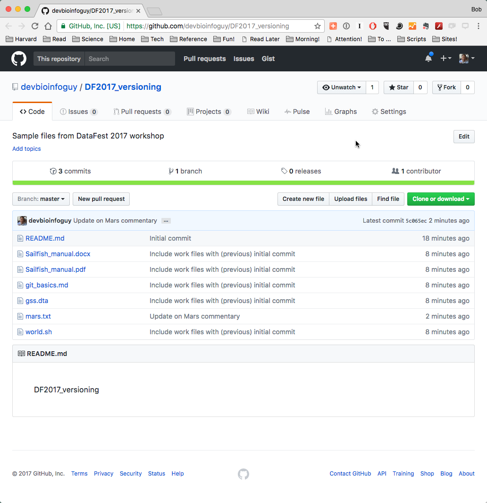

***
Previous: [Getting Started with Git using GitKraken](02_GitKraken.md)

***

## Repositories online (remote)

Once you have ‘published’ your repository it will be viewable on your profile at [GitHub.com](github.com). You can choose to keep it public or make it private; and if it's private, you can choose specific GitHub users with whom you want to share it or collaborate with.

For this lesson, we will stick with a public repository. To quickly view your repository online right-click on your remote's Origin in the left pane, and select 'View origin on GitHub.com'. This will reveal your online repository in your web browser.

Once your document is online, you can continue to make local changes to your file. But you will have to synchronize your local changes to reflect these changes in the published GitHub repository. GitHub stores changes both locally (on your computer) and remotely (on their servers), and it is important to keep these changes in sync. 

In GitKraken and standard Git workflows, this is accomplished by regular, intentional rounds of **Pull** and **Push**, which both **pulls** in changes from the remote repository, and **pushes** any local changes to the remote repo. 

### Making Changes Remotely

It is also possible to make a change to your repository on the web interface. Clicking on the name of the file in the title area will take you to a new page showing your document.

Click on the 'Edit' option or icon. You will now be able to edit the file and add some new text.

Once you have made some changes to your file, you will again see the option to commit changes near the bottom of the text entry box.

Once you have committed these changes they will be stored on the remote repository. GitKraken has already noticed that our remote repo has changed:

Click on the timeline entry to view the file changes:

And click on the file Mars.txt to see the changes within:

You can see from this view that we now have the text with changes highlighted in green and red. Red indicates where things have been removed, while green indicates additions. 

To get them back onto our own (local) computer, we need to Pull these changes back to our local repo, using the Pull button in the GitKraken toolbar towards the top of the screen:

Once done, you'll see a momentary "Success!" notice:

One very useful feature of this and other Git clients is looking at how a file has changed over time. In GK, right-mouse click on the file and select "File History" to see exactly that: 

Our Mars.txt file is display with comments on the left and differences between the (left) selected and previous versions:

Clicking on the previous comment shows the next level of changes:

And finally, clicking on the File View button shows all the changes together, with the log (legend) of changes being indicated with color coding:

Click on the X at the upper right to close this window.

(Edit out: This can be useful for viewing the edits you have made before making a commit. On the left you will see a history of the changes you have made; at the moment this is very brief but as you work on a project the history will become much longer. )

## Managing Conflicts

A **conflict** emerges when you try to merge (sync) two versions of a document with changes which conflict with each other. If you are careful about committing and syncing then it is unlikely you will run into this issue; but if you do, it can be resolved fairly easily.

The most likely way a conflict will emerge is if you, or if you are sharing your repo with a collaborator, make a change on either the local or online repo, and then make a subsequent change on the other without first syncing the changes.

If you make changes in different parts of a file or within the repo, these changes can be merged (synced) together without any conflict. But if these changes conflict with one another – if you try and change the same line of the document in two different ways – that's when there is an issue, as Git will not know which change is the one you wish to keep.

An example will help illustrate the most likely way conflicts can emerge, and how to deal with them. 

Let's add a change to our remote repository to the `mars.txt` file.

And let's commit this change on the website. 

Without syncing, make a change to the same document using the text editor locally, and save the change.

Finally, let's Commit our local changes:

and Sync the repos by doing a Push. GitKraken warns us that we are behind the remote, so we must do a Pull:
 

 
Once you do the Pull, as expected, we get a message warning us about "Merge Conflicts":

This is not a big problem: What Git is aking you to do is manage these conflicts. GitKraken offers you the option of opening the file with the sync conflicts.

Open the file with an external text editor (the document will open with whichever text editor/application we have chosen as the default for opening Markdown files). 

Looking at the file, we will see Git has highlighted the conflicting section.

This conflicting section is marked with `<<<<<<<` and ends with `>>>>>>>`. These are known as the **conflict markers**. The two conflicting blocks are divided by a `=======` line. 

There are a number of approaches to dealing with a conflict:

* You could choose to go with either of the changes by deleting the version you no longer want and removing the conflict markers, OR

* You could change the section entirely and not choose either of the options, OR

* You could keep both of the versions

Whichever option you choose, you must **remove** the conflict markers in order to proceed. Once you have *resolved* the conflict, save the file and indicate to GitKraken that you have resolved the problem:

and then proceed to **commit** and merge the changes (resolved conflict). When you go to Commit your changes you see that GitKraken specifies that the commit is to merge a conflict. This is useful historical information if you later wish to review how you managed any conflicts:

GK now shows our commit & its message in the timeline in the upper pane:

And clicking on the timeline entry shows the affected file:

Now, synchronize your local changes by the standard workflow of **Pull and Push** and your local and remote repositories will be in sync:

Since we merged the conflict which contained the remote changes, our local repo is already in sync, so we're told just that:

Now we just need to Push to finish the synchronization:

And the timeline shows that our repos are now at the same point in the timeline:

This may seem like a convoluted approach to dealing with conflicts, but it is very useful as you have total control and the last word in dealing with conflicts. In contrast, if conflicts emerge on a system like Dropbox, the result is two files being created: Although this is better than potentially losing important changes, it also means you still have to look at these two documents and decide how you are going to merge them. 

If you are careful about always syncing changes you will be able to avoid having to deal with conflicts. When collaborating, the likelihood for conflicts increases; so, it is useful to be aware of how to deal with conflicts before you begin to collaborate using GitHub. 

***

**Exercise**

1. Publish the "learning_github" repo. 
2. Create a conflict within the "data-file.txt" file by making changes locally and remotely.
3. Resolve the conflict and commit.
4. [Optional] Add your neighbor as a collaborator to a the "learning_github" repo (in Settings -> Collaborators & teams), make changes to create a conflict within the "data-file.txt" document in one of the repos (pick one), and resolve the conflict.

***

## Next steps and Resources

GitKraken offers an easy way of getting started with GitHub and version control. Depending on your use case it may be sufficient for your needs. If you are already familiar with using the Command Line then using Git on the Command Line is recommended. 

This lesson introduced you to the most rudimentary (yet very useful) concepts and terminology associated with using Version control (Git). The resources below will allow you get started with getting a deeper/better understanding of version control.

* The [GitKraken guide](https://support.gitkraken.com/getting-started/guide) is a great way to start exploring it's functionality, and learning more about what Git can do.
* GitHub also provides extensive support in the form of [guides](https://guides.github.com/) and [help](https://help.github.com/).
* GitHub [Glossary](https://help.github.com/articles/github-glossary/) outlines the most commonly used GitHub/Git terminology.

***

* Materials used in these lessons are derived from Daniel van Strien's ["An Introduction to Version Control Using GitHub Desktop,"](http://programminghistorian.org/lessons/getting-started-with-github-desktop), Programming Historian, (17 June 2016). [The Programming Historian ISSN 2397-2068](http://programminghistorian.org/), is released under the [Creative Commons Attribution license](https://creativecommons.org/licenses/by/4.0/) (CC BY 4.0).*

* Materials are also derived from [Software Carpentry instructional material](https://swcarpentry.github.io/git-novice/). These materials are also licensed under the [Creative Commons Attribution license](https://creativecommons.org/licenses/by/4.0/) (CC BY 4.0).*
