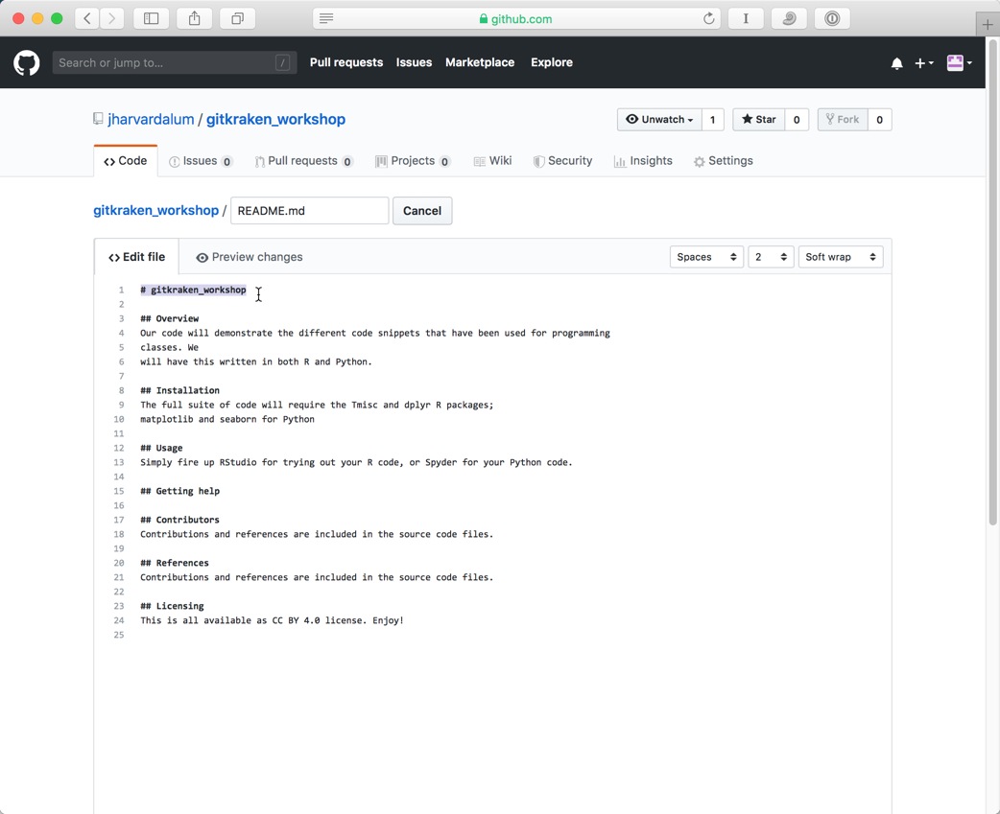
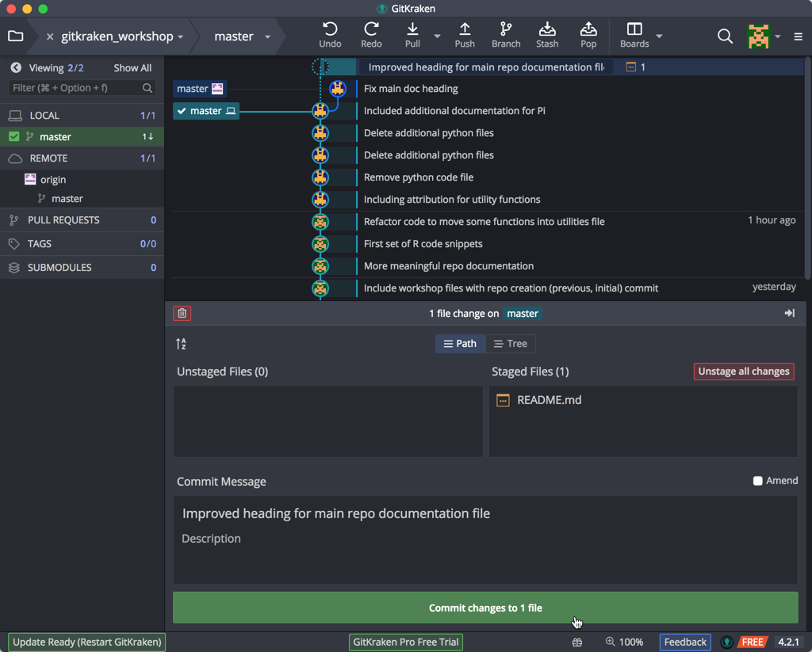
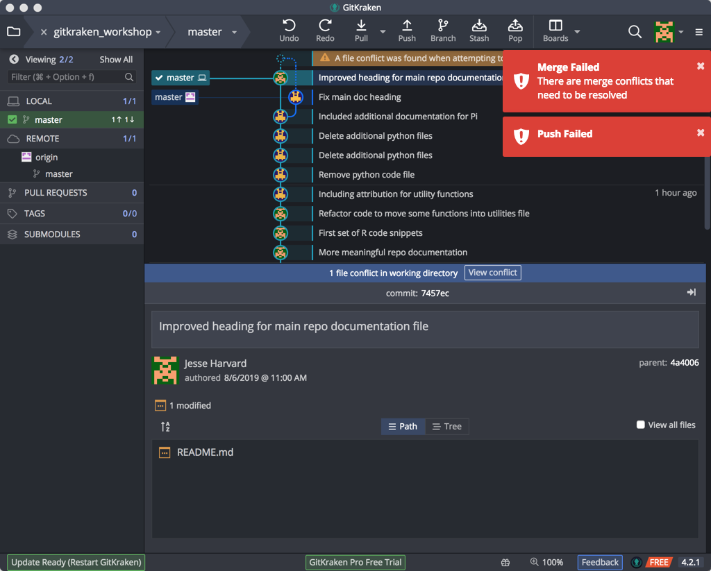
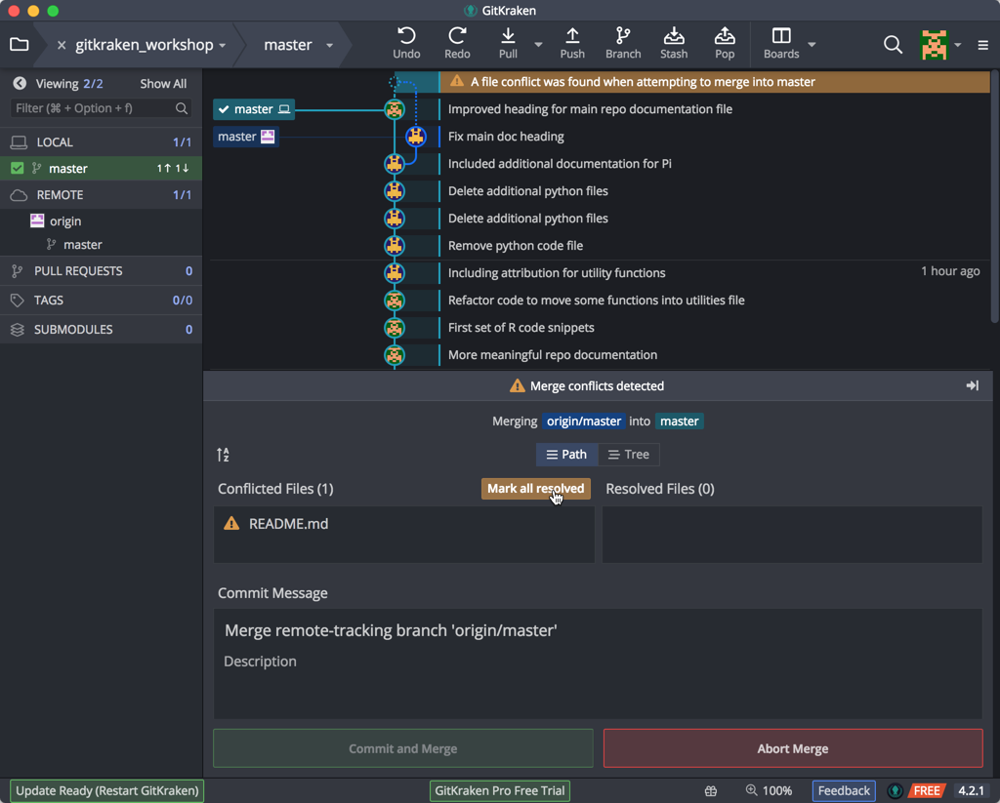
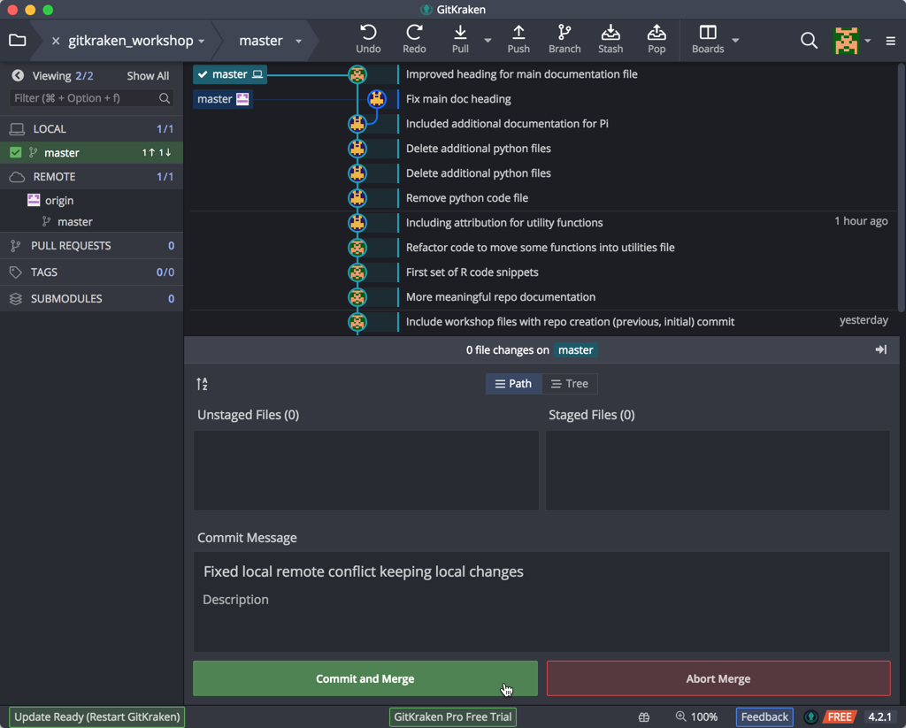
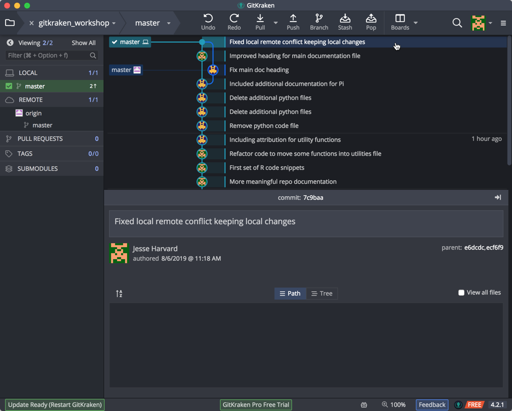

***

Previous: [Git(hub) Remote](03_Github_remote.md)

***

## Managing Conflicts

A **conflict** emerges when you try to merge (sync) two versions of a document with changes which conflict with each other. If you are careful about committing and syncing then it is unlikely you will run into this issue; but if you do, it can be resolved fairly easily.

The most likely way a conflict will emerge is if you, or if you are sharing your repo with a collaborator, make a change on either the local or online repo, and then make a subsequent change on the other without first syncing the changes.

If you make changes in different parts of a file or within the repo, these changes can be merged (synced) together without any conflict. But if these changes conflict with one another – if you try and change the same line of the document in two different ways – that's when there is an issue, as Git will not know which change is the one you wish to keep.

An example will help illustrate the most likely way conflicts can emerge, and how to deal with them. 

Let's add a change to our remote repository to main documentation `README.md` file. The first title line isn't properly formatted. Let's edit this file and line with a single `#` as an H1 tag:

Don't forget commit this change on the website. 

Without syncing, make a change to the same document using the text editor locally:

Save the changed file. Return to GitKraken, click on the WIP line, stage your change, add a description, and Commit:

Note the divergence as a branch. Synchronize the repos by doing a Push. GitKraken warns us that we are behind the remote, so we must do a Pull:
 

 
Once you do the Pull, we get a transient message about a 'Merge Conflict' and a timeline message warning us about "Merge Conflicts", which is not unexpected:

This is not a big problem: What Git is aking you to do is manage these conflicts. GitKraken offers you the option of opening the file with the sync conflicts.

Instead, open the file with an external text editor (the document will open with whichever text editor/application we have chosen as the default for opening Markdown files). 

Looking at the file, we will see Git has denoted the conflicting section (selected here).

This conflicting section is marked with `<<<<<<<` and ends with `>>>>>>>`. These are known as the **conflict markers**. The two conflicting blocks are divided by a `=======` line. 

There are a number of approaches to dealing with a conflict:

* You could choose to go with either of the changes by deleting the version you no longer want and removing the conflict markers, OR

* You could change the section entirely and not choose either of the options, OR

* You could keep both of the versions

Whichever option you choose, you must **remove** the conflict markers in order to proceed. We're going to keep the local copy, as it is more informative. Once you have *resolved* the conflict, save the file, click on the conflict timeline entry, and indicate to GitKraken that you have resolved the problem in the lower section:

and then proceed to **commit** and merge the changes (resolved conflict). When you go to Commit your changes you see that GitKraken specifies that the commit is to merge a conflict. This is useful historical information if you later wish to review how you managed any conflicts:

GK now shows our commit & its message in the timeline in the upper pane:

Now, synchronize your local changes by the standard workflow of **Pull and Push** and your local and remote repositories will be in sync:

This may seem like a convoluted approach to dealing with conflicts, but it is very useful as you have total control and the last word in dealing with conflicts. In contrast, if conflicts emerge on a system like Dropbox, the result is two files being created: Although this is better than potentially losing important changes, it also means you still have to look at these two documents and decide how you are going to merge them. 

If you are careful about always syncing changes you will be able to avoid having to deal with conflicts. When collaborating, the likelihood for conflicts increases; so, it is useful to be aware of how to deal with conflicts before you begin to collaborate using GitHub. 

***

**Exercise #3**

1. Create a conflict within the "data-file.txt" file by making changes locally and remotely.
2. Resolve the conflict and commit.
3. [Optional] Add your neighbor as a collaborator to a the "learning_github" repo (in Settings -> Collaborators & teams), make changes to create a conflict within the "data-file.txt" document in one of the repos (pick one), and resolve the conflict.

***

* Materials used in these lessons are derived from Daniel van Strien's ["An Introduction to Version Control Using GitHub Desktop,"](http://programminghistorian.org/lessons/getting-started-with-github-desktop), Programming Historian, (17 June 2016). [The Programming Historian ISSN 2397-2068](http://programminghistorian.org/), is released under the [Creative Commons Attribution license](https://creativecommons.org/licenses/by/4.0/) (CC BY 4.0).*

* Materials are also derived from [Software Carpentry instructional material](https://swcarpentry.github.io/git-novice/). These materials are also licensed under the [Creative Commons Attribution license](https://creativecommons.org/licenses/by/4.0/) (CC BY 4.0).*
