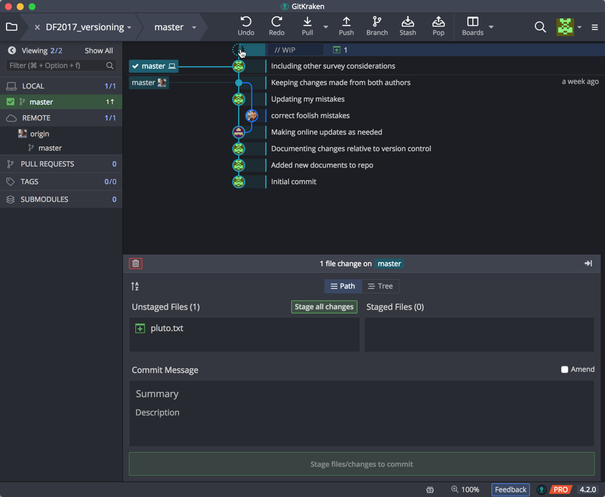
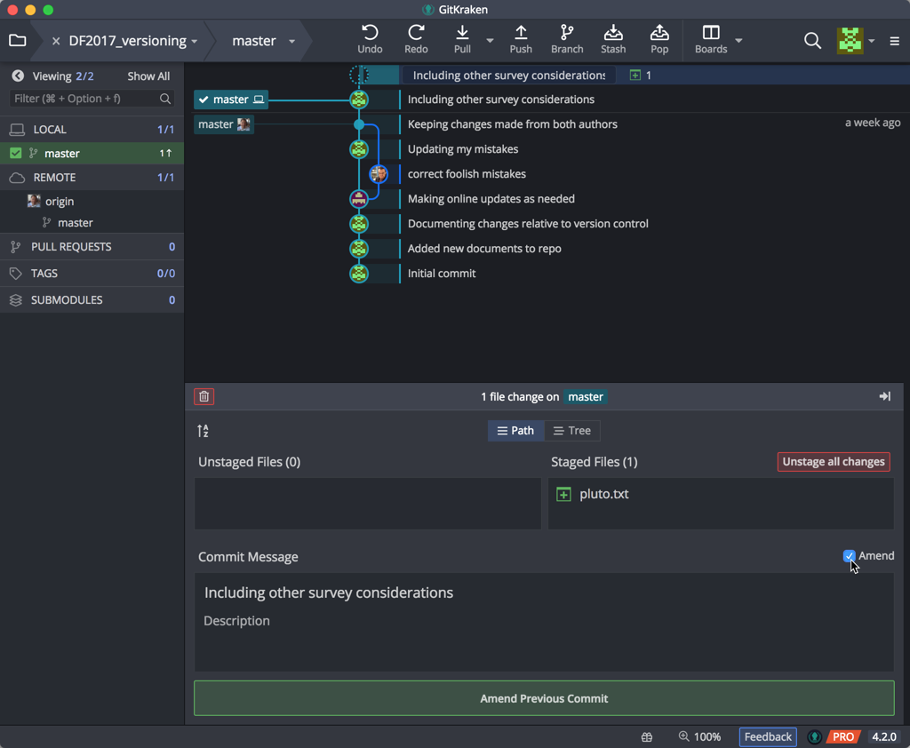
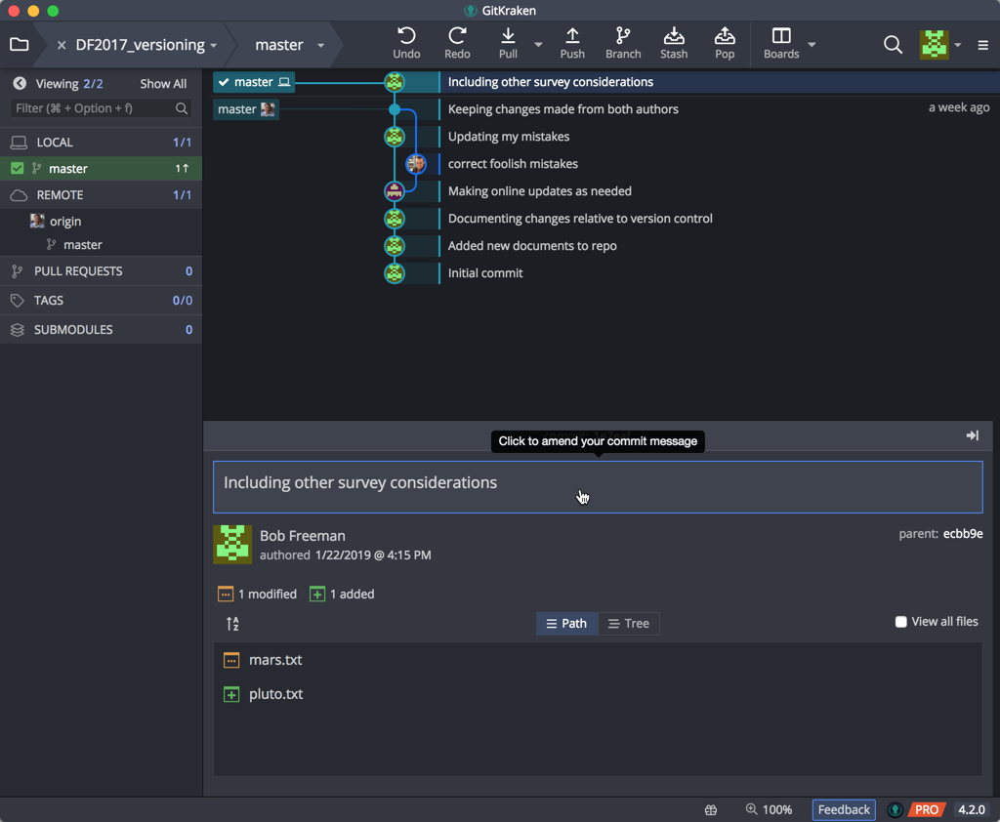
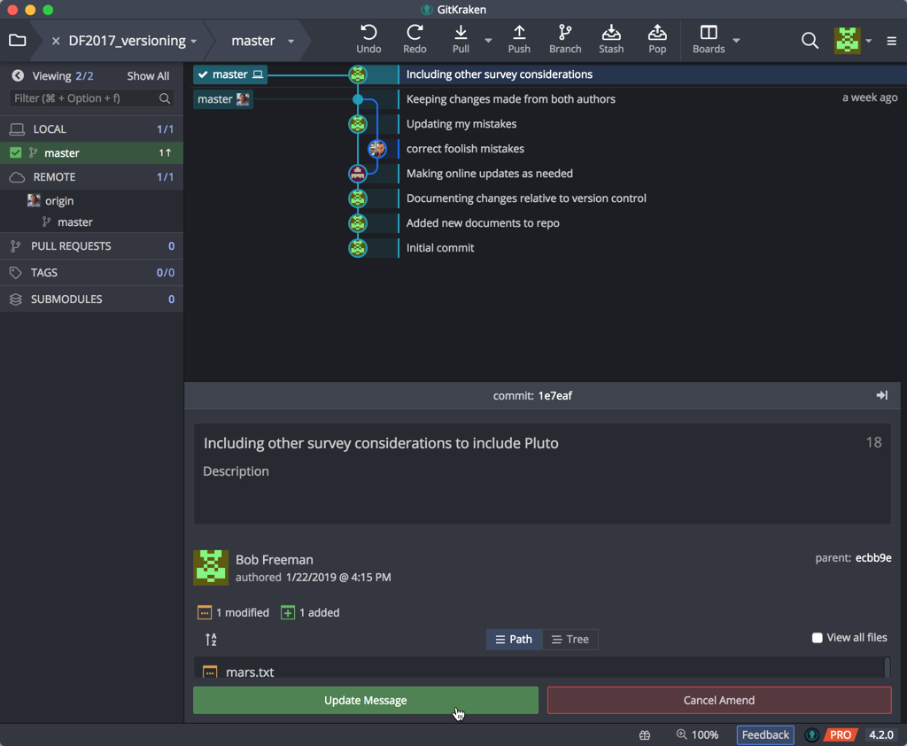
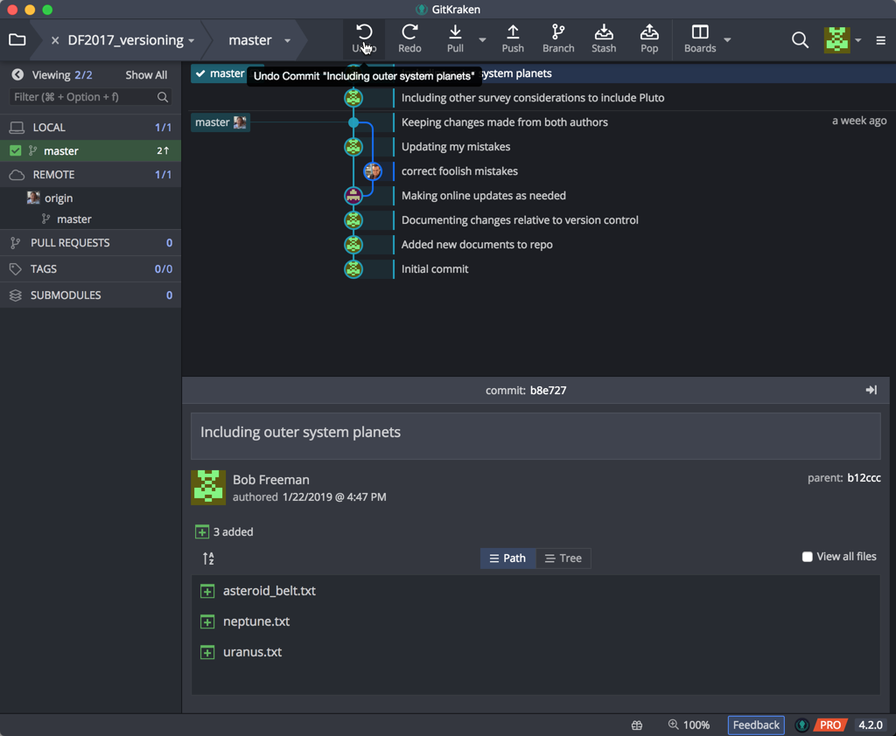
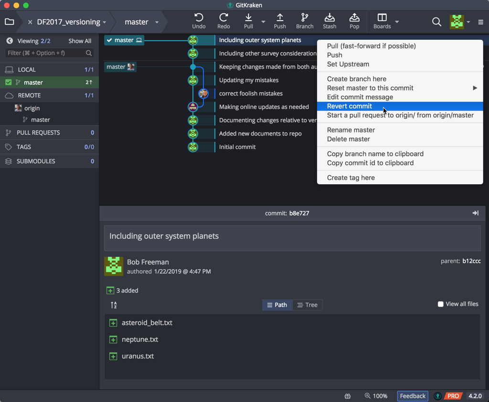
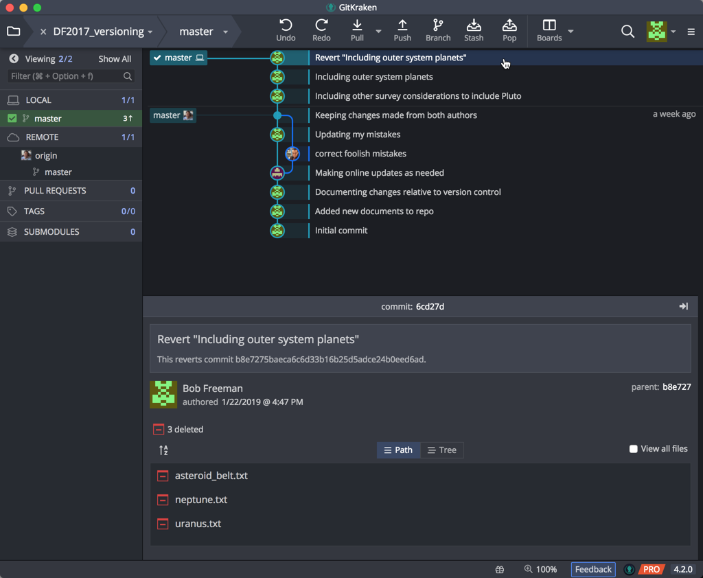

***
Previous: [Remote repositories, managing conflicts](03_Github_remote_and_conflicts.md)

***
Objectives:
- Learn how to amend a commit
- Learn how to revert a commit
- Learn how to work with a previous commit
- Learn how to temporarily hide work in progress

## Working with Commits

Sometimes a simple commit isn't that simple: you've forgotten something, you need to undo what you've done, or you need to go back to something you committed some time ago. This section with help you navigate these items.

## Amending Commits

Oops! Pushed 'Commit' button too fast? As long as you have not updated any remotes, you can amend the last commit message, add additional changes, or both.

To make changes / add files, click on the //WIP node on the graph:

stage the files would wish to include in the updated commit, and selected the Amend checkbox in the Commit Message pane:

You'll note that the previous commit message is copied into the Message and Description fields. And the Commit button is titled Amend Previous Commit instead. Go ahead.

If you wish to amend the message only, hover over and click on the commit message in the bottom pane for the latest commit:

Change your commit message, and click on the Update Message button at the bottom:

## Reverting Commits

Sometimes you just want to undo the last thing you did. Like that last change (e.g. commit, branch, etc) you didn't mean to make? GitKraken's Undo button in the top toolbar will let you undo most actions (which can also Redo if needed!). Hover over the Undo button to see what action it will take, and click if that seems appropriate:

If the Undo option is not available or not appropriate, one can use the Revert Commit option for the latest commit or even a previous one. This will not only bring back the changes to your working directory, but will include an explicit commit to document that this change to the repo. To perform this, click on the commit node, and right-mouse click to see the popup menu. From there, select the Revert Commit option:

  
When prompted, you can immediate commit this explicit change, or keep the changes as a WIP (work in progress) for you to do additional work. Clicking Yes enters the new commit to your repo:

***

**Exercise**

1. 
2. 
3. 
4. 

***

## 

***

## Next steps and Resources

GitKraken offers an easy way of getting started with GitHub and version control. Depending on your use case it may be sufficient for your needs. If you are already familiar with using the Command Line then using Git on the Command Line is recommended. 

This lesson introduced you to the most rudimentary (yet very useful) concepts and terminology associated with using Version control (Git). The resources below will allow you get started with getting a deeper/better understanding of version control.

* The [GitKraken guide](https://support.gitkraken.com/getting-started/guide) is a great way to start exploring it's functionality, and learning more about what Git can do.
* GitHub also provides extensive support in the form of [guides](https://guides.github.com/) and [help](https://help.github.com/).
* GitHub [Glossary](https://help.github.com/articles/github-glossary/) outlines the most commonly used GitHub/Git terminology.

***

* Materials used in these lessons are derived from Daniel van Strien's ["An Introduction to Version Control Using GitHub Desktop,"](http://programminghistorian.org/lessons/getting-started-with-github-desktop), Programming Historian, (17 June 2016). [The Programming Historian ISSN 2397-2068](http://programminghistorian.org/), is released under the [Creative Commons Attribution license](https://creativecommons.org/licenses/by/4.0/) (CC BY 4.0).*

* Materials are also derived from [Software Carpentry instructional material](https://swcarpentry.github.io/git-novice/). These materials are also licensed under the [Creative Commons Attribution license](https://creativecommons.org/licenses/by/4.0/) (CC BY 4.0).*

* Materials are also derived from [GitKraken Support for Git Client](https://support.gitkraken.com/start-here/interface/) on GitKraken's website. *

