```{r setup, include=FALSE}
knitr::opts_chunk$set(message = FALSE)
```

## Following along

<br>
<br>
<br>

This **slide deck** is available at: <http://tinyurl.com/zntn2h7>.

<br>

All of the **example code** is available at: <http://tinyurl.com/za2wx8h>.

## Acknowledgements

<br>
<br>
<br>

**Thanks** so much to **Garrett Grolemund and RStudio** for providing us with helpful suggestions and examples, some of which we've included here.

Thanks to the **open source** R community for making life way **cooleR**.

## About you

<br>
<br>
<br>

Complete the survey: <https://goo.gl/forms/b0UuRnpxpfjwpiD93>

## Prerequisits

- Basic familiarity with R (e.g. can install packages, source files, and so on).

- Familiarity with R Markdown would be a benefit. For DataFest tutorial ([see earlier session](http://tinyurl.com/gvbehak))

- Have a laptop with the following software installed:

    + R and RStudio

    + `rmarkdown`, `flexdashboard`, and `shiny` **packages** for R

- Working internet connection


# Dynamic and interactive documents

## Interactive documents

When your output documents are in **HTML**, you can create interactive
visualisations.

Potentially--though not always--more engaging and could let users explore data
on their own.

These slides are in html!

## Big distinction:

**Client Side**: HTML documenst are rendered on the user's (client's) computer. Often
**JavaScript in the browser**. You simply send them static HTML/JavaScript needed for
their browser to create the plots. Could be sent from a services such as [RPubs](https://rpubs.com/).

**Server Side**: Data manipulations and/or plots (e.g. with [shinyapps](https://www.shinyapps.io/)) are
done on a **server in R**. Browsers don't come with R built in.

## Why are dynamic and interactive documents helpful?

Lets consumers **explore** the data on their own.

Are generated by **reproduible code** that anyone can look at.

Can be **instantaneously updated** to reflect new data.

# R Markdown to HTML

## R Markdown Review
R Markdown is a scripting language (like LaTeX) that lets you embed R code to run analyses within your text. These slides are written in RMarkdown.

<br>
You can use R Markdown to create HTML documents.

See <http://rmarkdown.rstudio.com/> for an introduction to R Markdown.

## Display code chunks 

Use three back-ticks (```) to **start** and **end** a code chunk that is **not run**.

To create a **knit-able** code chunk begin the chunk with ````{r}`. 

Close the chunk with another three tick (```).

## Chunk options

Change how R Markdown chunks behave with **options**. Place
options in the chunk head: ````{r echo=FALSE, error=FALSE}`

| Option          | What it Does                                               |
| --------------- | ---------------------------------------------------------- |
| `echo=FALSE`    | Does not print the code only the output                    |
| `error=FALSE`   | Does not print errors                                      |
| `include=FALSE` | Does not include the code or output, but does run the code |
| `fig.width`     | Sets figure width                                          |
| `cache=TRUE`    | Cache the chunk. It is only run when the contents change.  |

Many others at <http://yihui.name/knitr/options>


## R Markdown header

The key is to declare `html_document` in the header. E.g.:

```
output:
    html_document
```

## Simple example:

<br>
<br>
<br>

For example, we can summarise the survey data using: <http://tinyurl.com/jx4gty2>.

Which downloads your survey data from Google Sheets and creates . . .

## Static HTML example results

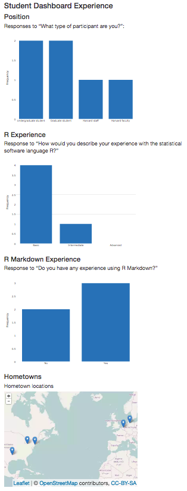

## Do . . .

<br>
<br>

Copy the code at <http://tinyurl.com/jx4gty2> used to create the survey summary document into a .Rmd file in RStudio.

Compile to html.

**Add an additional code chunk plotting** responses to the question "Have you ever built a 'data dashboard'?"

(Example code available at: <http://tinyurl.com/hjcvwau>.)

## Hosting

<br>
<br>
<br>

Hosting is actually pretty easy. More soon on this!


# The Power of Packages

## Packages {.build}

The Open Source R community writes packages that enable users to **do more but code less**.

Almost everything today take a couple of lines of code.

You no longer have to be a programmer to use R.

Packages are rapidly expanding R's capabilities.

## A growing community

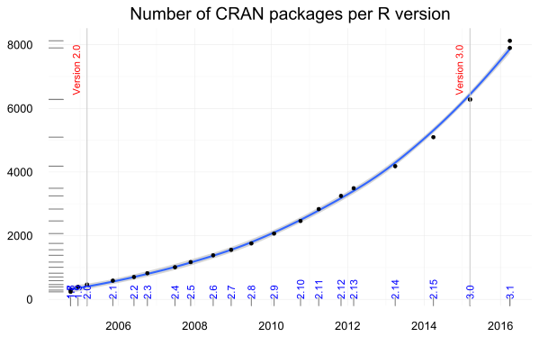


## Web-native visualisations

<br>

There are a growing number of R packages that make it easy to create interactive/web native visualisations.

Many of these are based on a framework called **htmlwidgets**. But also see [Plotly](https://plot.ly/r/shiny-tutorial/)

## Leaflet

```{r message=FALSE}
library(leaflet); library(dplyr)

leaflet() %>% addTiles() %>% fitBounds(0, 40, 10, 50)
```

## networkD3

```{r}
library(networkD3); data(MisLinks); data(MisNodes)

forceNetwork(Links = MisLinks, Nodes = MisNodes, Source = "source",
             Target = "target", Value = "value", NodeID = "name",
             Group = "group", opacity = 0.7, zoom = TRUE)
```

## dygraphs

```{r}
library(dygraphs)
dygraph(nhtemp, main = "New Haven Temperatures") %>%
    dyRangeSelector(dateWindow = c("1920-01-01", "1960-01-01"))
```

## DT

```{r}
library(DT)
datatable(iris, options = list(pageLength = 5))
```

# Static dashboards

## What is a dashboard?

<br>
<br>
<br>
Dashboards provide an **overview** of key data.

<br>

The [flexdashboard](http://rmarkdown.rstudio.com/flexdashboard/) R package allows you to easily create dashboards with [R Markdown](http://rmarkdown.rstudio.com/).

## For example . . .

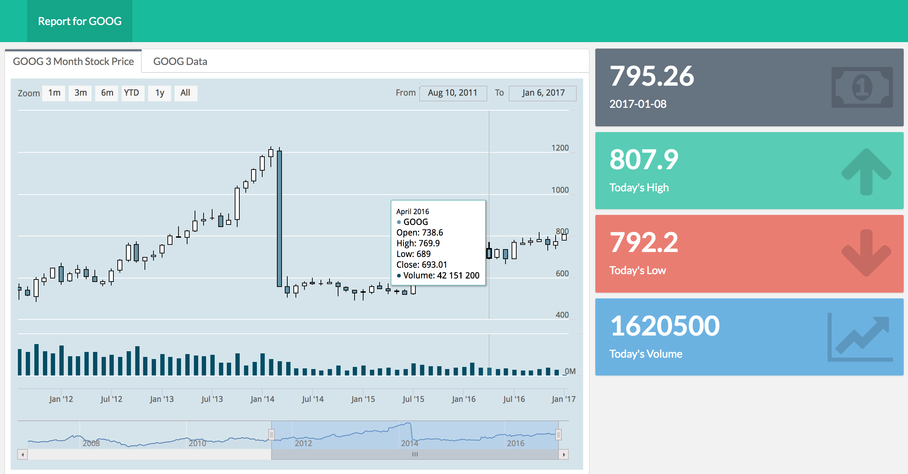

## For example . . .

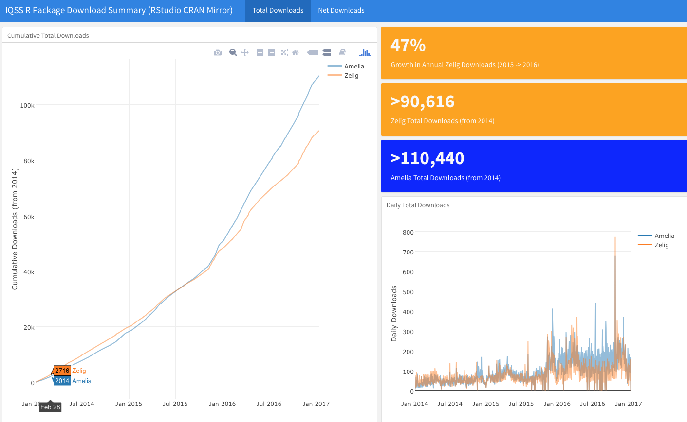

## Getting started

Once you installed the flexdashboard package, in RStudio select `File` > `New File` > `R Markdown...`. Then, select `Flex Dashboard` from the `From Template` new R Markdown type:

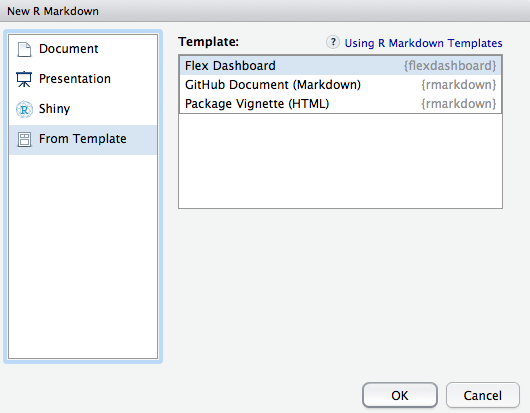

## Basic flexdashboard syntax: Header

Like other R Markdown documents, flexdashboards start with a [YAML](http://yaml.org/) header. E.g.:

```
---
title: "DataFest 2017 | Intro to dynamic web documents"
author: "Christopher Gandrud & Dustin Tingley"
date: "18 January 2017"
output:
    ioslides_presentation:
        css: datafest_slides.css
        logo: img/iqss_logo_flat.png
---
```

## Basic flexdashboard syntax: Rows

Dashboard rows are delimited by the 3rd level markdown header: `###`.

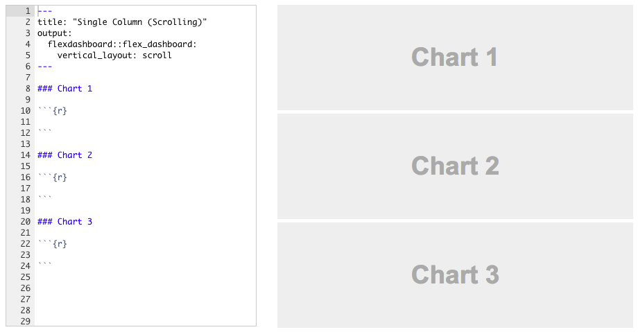

## Basic flexdashboard syntax: Columns

Separate columns are delimited with `Column` followed by `-------------------`. Column widths can be set in the section heading with the `data-width` attribute.

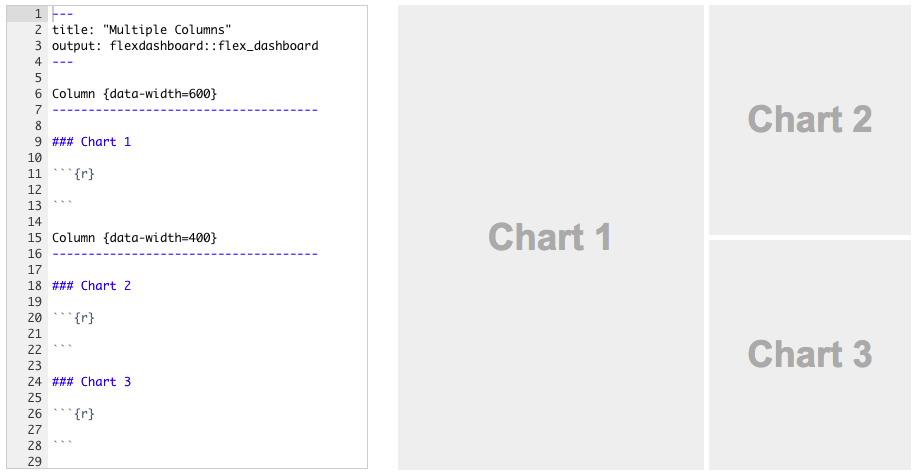

## Tabbed pages

You can create multi-page dashboards by placing the table label followed by `======================` after the material you want on the previous tab.

E.g.

```
Net Downloads
===========================================
```

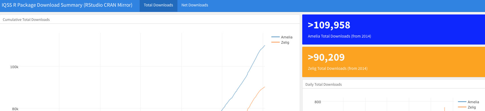


## Tabsets

Adding `.tabset` to a section heading can create tabs within a specific section.


## Do . . .

We could make a dashboard from the hometowns you provided.

Here's an example (using fake data): <http://tinyurl.com/hgk3fxx>

<br>

**You:** make a similar dashboard using R source code available at: <http://tinyurl.com/zwszswb>

Starter steps: 1) Turn sections into code chunks. 2) Insert YAML header. 3) Separate columns

Hint: it's typically good practice to place **setup code** in a separate chunk just under the header, with the code chunk option `include=FALSE`.

Full code for the exercise can be found at: <http://tinyurl.com/zwk5het>.

 
# Hosting documents rendered on the client-side

## Hosting client-side rendered HTML

<br>
<br>
<br>

There are lots of **free** services (e.g. [RPubs](https://rpubs.com/), [GitHub Pages](https://pages.github.com/)) for hosting webpages for
client-side rendering.

## Hosting through RPubs

1. Create an [RPubs](https://rpubs.com/) account.

2. After **knitting** an R Markdown document to HTML, click on *Publish* > *Publish Document...* in the output viewer.

3. In the resulting pop-up box, click *RPubs* > *Publish*

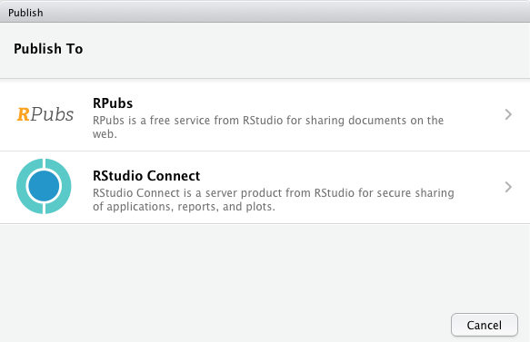

## RPubs dashboard example

<br>
<br>

For example: <http://rpubs.com/christophergandrud/datafest_ex_dashboard>.

Note: RPubs documents do not update when new data is available. It is a static file host.

# Dynamic + Interactive Shiny Apps

## Shiny apps

[Shiny](https://shiny.rstudio.com/) apps allow you to create interactive apps that leverage R to conduct **analyses in the browser** and present results.

For example:

- <https://shiny.rstudio.com/gallery/retirement-simulation.html>

- <https://shiny.rstudio.com/gallery/bus-dashboard.html>


## Shiny + Flexdashboards

<br>
<br>

You can turn your flexdashboards into full data exploration apps using Flexdasboards + Shiny.

See: <https://rstudio.github.io/shinydashboard/>

## Shiny flexdashboards

1. Add `runtime: shiny` to the YAML header options to declare the dashboard a shiny flexdashboard.

2. Add a `{.sidebar}` attribute to the first column in the dashboard. This is where we will place the controls that give us more control over the dashboard.

3. Add Shiny [inputs](http://shiny.rstudio.com/tutorial/lesson3/) (e.g., what data we will put into the analysis) and [outputs](http://shiny.rstudio.com/tutorial/lesson4/) (e.g., how the results of the analysis will be displayed).

## Shiny dashboard example

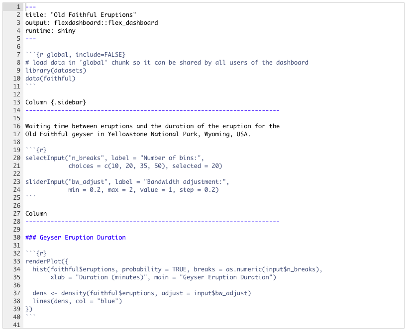

Source: <http://rmarkdown.rstudio.com/flexdashboard/shiny.html>

## Result

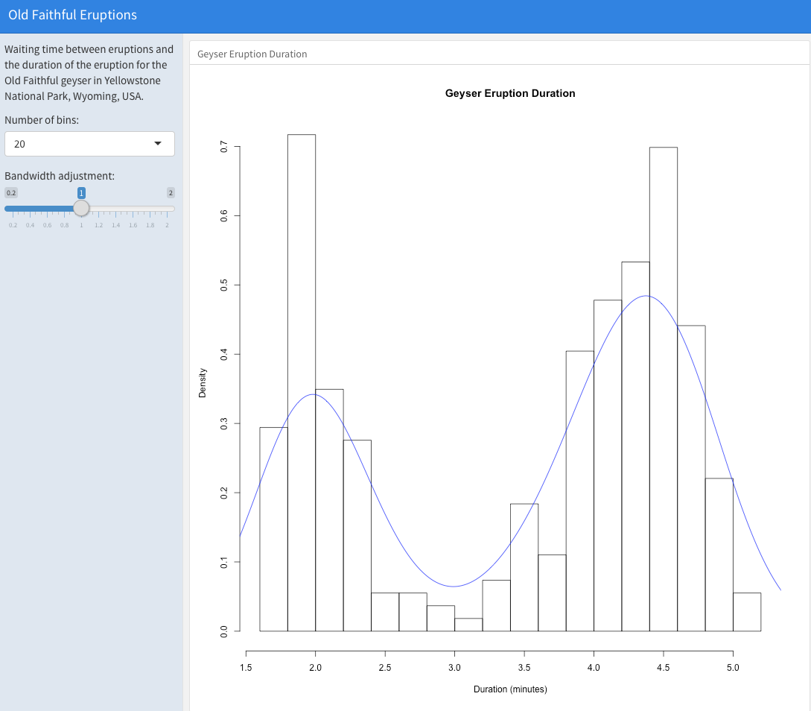

## Syntax breakdown: Inputs

```{r eval=FALSE}
selectInput("n_breaks", label = "Number of bins:",
            choices = c(10, 20, 35, 50), selected = 20)

sliderInput("bw_adjust", label = "Bandwidth adjustment:",
            min = 0.2, max = 2, value = 1, step = 0.2)
```

Creates **two elements in** a new `input` object: `n_breaks` and `bw_adjust`.

## Syntax breakdown: Outputs

`input` is passed to the output code in `renderPlot`:

```{r eval=FALSE}
renderPlot({
    hist(faithful$eruptions, probability = TRUE,
         breaks = as.numeric(input$n_breaks),
         xlab = "Duration (minutes)",
         main = "Geyser Eruption Duration")

    dens <- density(faithful$eruptions, adjust = input$bw_adjust)
    lines(dens, col = "blue")
})
```

## Its simpler than it seems

<br>
<br>

Note that in previous examples, **almost all of the code is exactly the same** as what you would use in R anyways.

The only difference is the includsion of functions to declare app inputs and outputs.

## Do . . .

Create a new shiny dashboard that **subsets** our Google Sheets survey data based on participants **position** (e.g. "undergraduate", "faculty") and **returns a bar plot** of the subset's **R skill level**.

**Attempt on you're own first**.

A starter script is here: <http://tinyurl.com/zt3fcvb>.

<br>

If you get stuck, the completed example R code is available at: <http://tinyurl.com/hwp5pgf>.

The complete R Markdown file with markup + R code (everything you need for the shiny app) is here: <http://tinyurl.com/jh3pnww>.

## Result

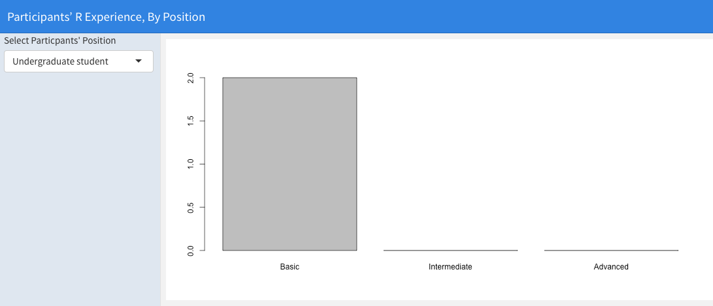

## Pure Shiny

Don't need to use flexdashboards, can write pure Shiny apps. Outside of our scope today.

[shinydashboard](https://rstudio.github.io/shinydashboard/) package is probably the easiest way to do this.

95% the same as what we do above.


## Show and tell

The [Vice Provost for Advances in Learning- Research group](http://vpal.harvard.edu/research) as well as others at Harvard have invested in Dashboards that are dyanamic and interactive via Shiny.

Lets look at some examples.

These are more involved on the programming side, but still make heavy use of packages.

Further, they can serve as templates as it is common to share Shiny app code! <https://shiny.rstudio.com/gallery/>

## Examples: Item Response Theory for quiz questions

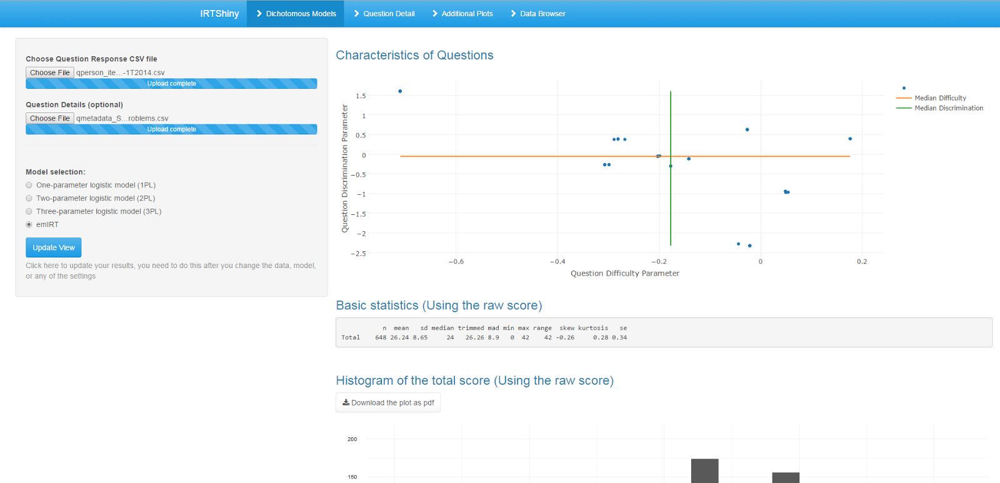


## Ex.: Sankey diagram for flow through HarvardX courses

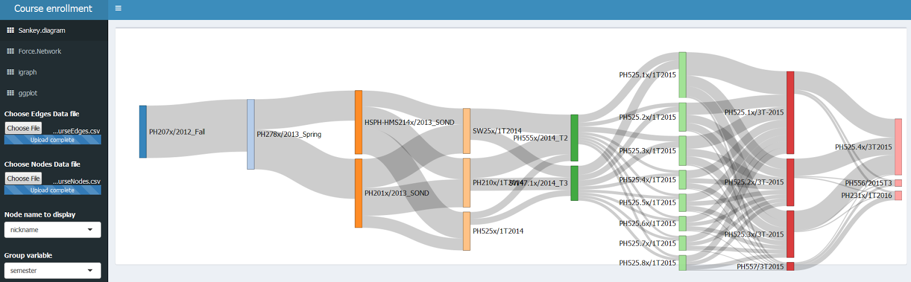


## Ex.: Structural Topic Modelling via stmGUI package

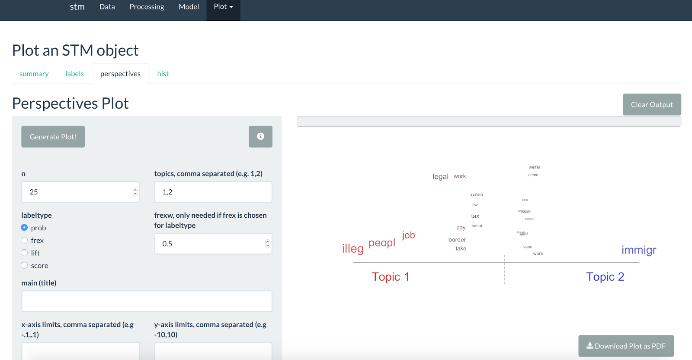

## Director of Graduate Studies Dashboard

<br>
<br>
<br>

<https://hmdc.shinyapps.io/GovDGSExample/>

# Serving Shiny

## Hosting through shinyapps.io

1. Create a [shinyapps.io](http://www.shinyapps.io/) account and follow sign up instructions.

2. After **running** your shiny app, click on *Publish* > *Publish Document...* in the output viewer.

3. In the resulting pop-up box connect your ShinyApps.io account following the onscreen instructions and **publish**.


## Hosting through IQSS

**If data cannot leave Harvard servers**, then IQSS/VPAL maintain a Shiny Server

Key features include Harvard Key authentication and support for up to level 3 data security.

# Institutional Considerations

## Researchers

When working with data, need to use **reproducible code**

Need to make data **transparent**

Tools for ex ante (e.g., power analysis) / ex post investigations (e.g., outliers)

Promotion of work!

## Staff/Administration

As an institution we generate tons of data. 

Across the University much data is managed by **old spreadsheet practices**

And databases/reporting/visualization tools are **separated** from data science tools

<br>

We are **not** ok with that in research, should we revisit this in other places?

R easily integrates with **modern databases** (SQL etc.)

99.9% of what you saw today is **free**.

## Students

Our students are learning R in their classes

R is now one of the most sought after programming language/we are in the era of big data

They could help us transform our **UniveRsity** and **Research** practices.


# Brainstorm Session

## Directions

What do you want to use Rmarkdown/dashboards for?

What data? How would you want to look at the data?

Everyone in teams contribute to a Google Document.

<http://tinyurl.com/h3saxpk>


#More Resources/Tutorial

##Tutorial Links

From:
[RStudio](http://shiny.rstudio.com/tutorial/)
[Dean Attali](http://deanattali.com/blog/building-shiny-apps-tutorial/)
[Plotly](https://plot.ly/r/shiny-tutorial/)
[Joe Cheng](https://github.com/jcheng5/user2016-tutorial-shiny)


