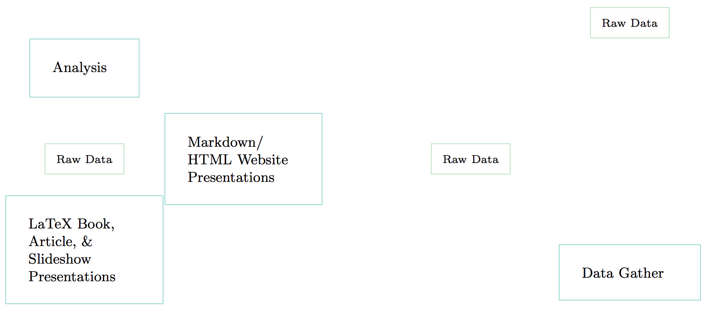
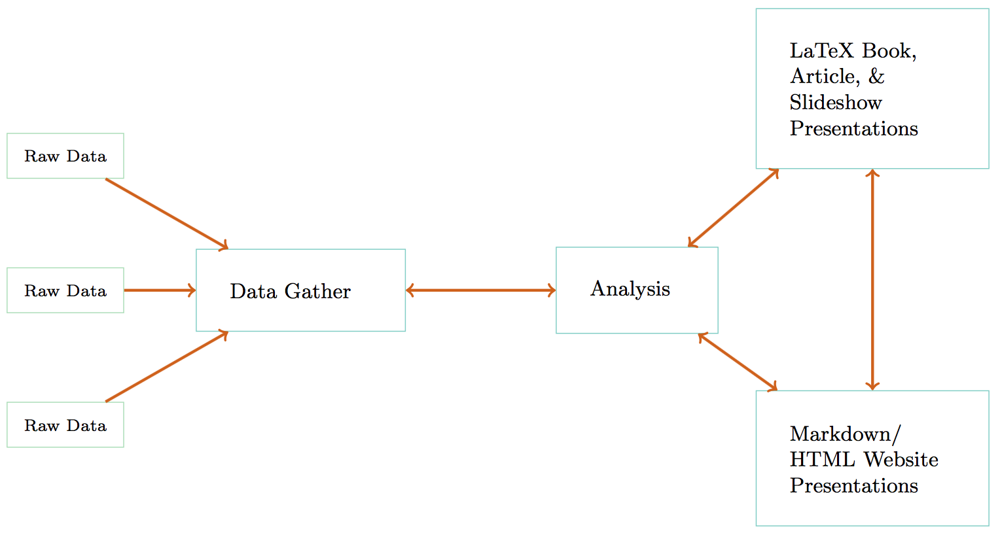
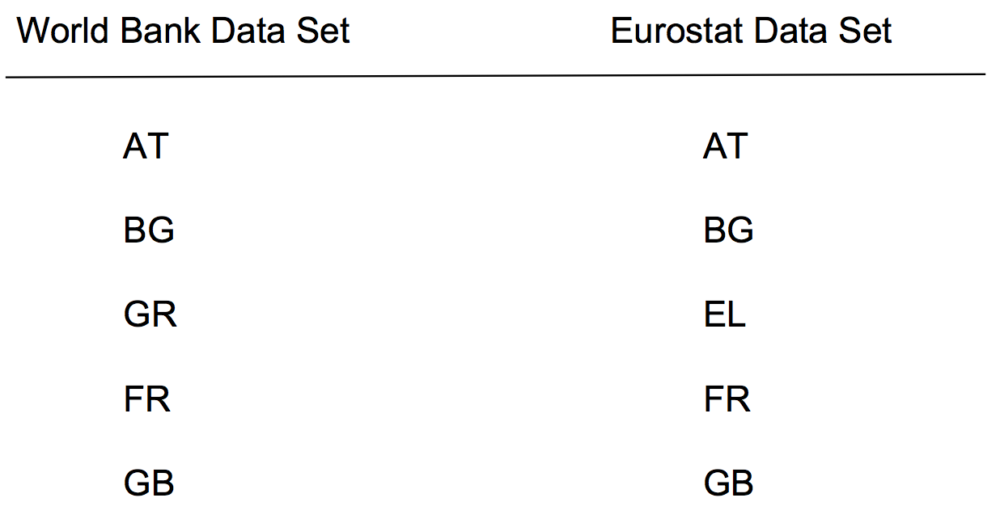
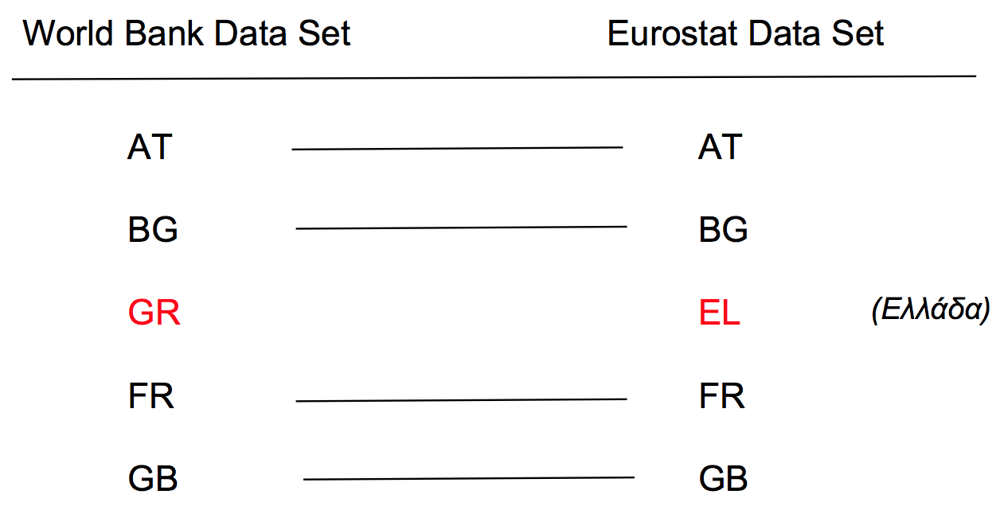
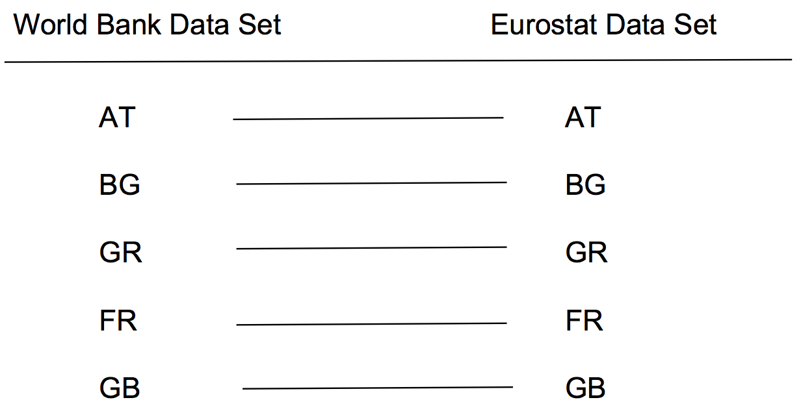
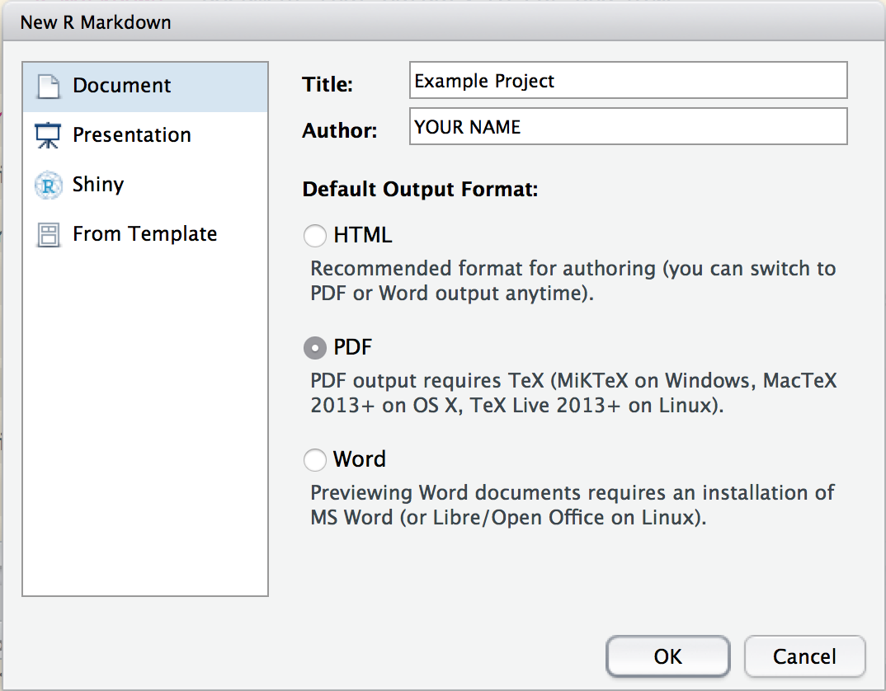
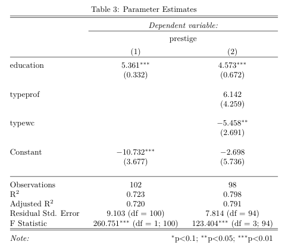

## Following along

<br>
<br>
<br>

This slide deck is available at: <http://tinyurl.com/j4f3mny>.

Source code for the slide deck and examples files is at: <http://tinyurl.com/gvbehak>.

## Broad Plan

<br>
<br>

- Key **concepts**/**motivation**

- R Markdown **hands-on**.

    + Hopefully it will be **easy**.

## Is this research?


## Is this research?


## No

> Papers, articles, slideshows, talks, books are **advertising, not research**.

## What are journal articles/books/etc?

> **Presentation documents**: announce select findings and try to convince an
audience that they are correct [@mesirov2010].

## What is research?

Quantitative research involves the **procedures** and **choices** researchers make to **gather** data, **process** it, and **analysis** it in order to address their research questions.

<br>
<br>

This includes “the **full software environment**, **code**, and **data** that produced the results” [@donoho2010, 3015].

## Quants and computer programming

> The practice of quantitative science **is computer programming**.

<br>

So, we need **computer programming tools** (preview: literate programming).

# Reproducible Comp. Research

## Replicable

<br>
<br>
<br>

**Replicable research**: when there is sufficient information available for independent researchers to make the **same findings**, using the **same procedures** with ***new*** data.

## However . . .{.build}

Sometimes full replications are not feasible because:

- **limited resources** for gathering new data (e.g. very expensive to build
another Large Hadron Collider),

- the original research already sampled the **universe of cases**.

*So...*

## Reproducible

<br>
<br>
<br>

**Reproducible research**: when there is **sufficient information** available for independent researchers to make the same findings, using the same procedures with the **same data**.

## Sufficient info.?--unconnected files



## Sufficient info.?--dynamically linked files



## Linking with literate programming {.build}

Quantitative data science is the **creation of a computer programme** to gather, transform, analyse data and present the results.

<br>

**Literate programming paradigm**: the human-readable presentation of a programme is interspersed with computer source code that are compiled together [see @knuth1992].

## Toolbox

- **Machine-readable source code**: R (alternatives: Python, Julia, etc.)

- **Human-readable explanation**: a markup language like Markdown
(alternatives: $\LaTeX$, HTML, etc.)

- "**Knit**" together with R Markdown.

    + R Markdown allows us to use one markup language--Markdown--to output to different presentation document types (e.g. PDF, HTML, MS Word).

    + Conversion from R Markdown to these formats is done via [Pandoc](http://pandoc.org/)

## Why reproducible research? {.build}

There are **costs** to using these tools. **Why** do it?

> Reproducibility is a **minimum** standard for evaluating scientific claims.

## Mistakes

<br>
<br>

Reproducibility can help uncover research fabrication. But more commonly . . .

<br>

We **all make mistakes** during all stages of our research!

## A recent mistake {.build}

I wanted to merge fiscal policy data from two data sets using country IDs.



## A recent mistake

But, Eurostat uses slightly different country IDs.



## Correcting the mistake

Fortunately, I had documented all of my steps using literate programming and could quickly find and fix the problem.



## Correcting mistakes

<br>
<br>

**Instead of pretending** like mistakes don’t happen, we should have **procedures that help us minimise** our errors and allow us (and others) to **find and correct** the errors we do make.

<br>

Really reproducible research is an important part of this process.

## Important Caveat!

> “A study can be reproducible and still be wrong” [@peng2014].
<br>
<br>
The original finding could just have been noise or caused by some data processing error and so on.

# Plan for learning tools

## Skills checklist

- Understand a reproducible research **workflow** with **literate programming**

> - Create a new **R Markdown** document that outputs to PDF and HTML

> - **Markdown** and **YAML** syntax

> - **R code chunks** into R Markdown documents that gathers data and outputs results

> - **Pandoc** footnotes and citations

## Following along

In this workshop we will **create a simple fake research project/article** using the literate programming tool R Markdown.

<br>

A completed version of the project can be found at: <http://preview.tinyurl.com/hynlfxq>

## What you need

- Installed:

    + R and RStudio

    + `rmarkdown` package for R

    + $\LaTeX$ (if you want to output to PDFs)

- Working internet connection


# Setup R Markdown File

## Create a new R Markdown file {.build}

In RStudio: `File` > `New File` > `R Markdown...`



## Save your file

<br>
<br>
<br>

Save your file as **main.Rmd** in a new folder called **datafest_reproduce**.


# YAML Syntax

## The header

Your file should start with something like:

```
---
title: "Example Project"
author: "YOUR NAME"
date: "17/01/2017"
output: pdf_document
---
```

This is the R Markdown file's **header**.

## The header

An R Markdown file is just a text file with markup instructions that R (and RStudio) understand.

Header specifies document-consistent formatting

It is at the start of a file and comes between `---`.

The header is written in YAML.

## YAML

YAML is a **human read-able data format**.

**Elements** are **separated** from values with a **colon** (`:`).

**Each element** is separated by a **new line**.

**Hierarchy** is maintained with **tabs**.

## This presentation's header

```
---
title: "DataFest 2017 | Reproducible Research Tools"
author: "Christopher Gandrud -- IQSS"
date: "17 January 2017"
output:
    ioslides_presentation:
        css: datafest_slides.css
        logo: img/iqss_logo_flat.png
bibliography: datafest_rep.bib
---
```

## In case you were wondering

<br>
<br>
<br>

YAML is a recursive acronym: ''YAML Ain't Markup Language''.

## Output types

The `output` element allows you to specify a wide variety of different output formats, including PDF, HTML, and MS Word. E.g.:

**PDF** (via $\LaTeX$)

```
output: pdf_document
```

**HTML**

```
output: html_document
```

**MS Word**

```
output: word_document
```

**Do. . .**: Compile your document to different formats.

## Table of Contents & Numbered Sections

You can add a table of contents and numbered sections to your PDF output:

```
output:
  pdf_document:
    toc: true
    number_sections: true
    fig_captions: true
```

## Different options for different output

To do the same for **HTML**, for example, also include the information under `html_document`.

Different formatting options are possible for differet output types:

```
output:
  pdf_document:
    toc: true
  html_document:
    toc: false
```

## Figure Options

Create consistent figure formatting, e.g.:

```
output:
  pdf_document:
    fig_width: 7
    fig_height: 6
    fig_caption: true
```

`fig_caption: true` attaches captions to figures.

To set the actual caption label, use the `fig.cap='SOME CAPTION'` **code chunk
option**.

## LaTeX options note

One important exception to the hierarchical options rule are a number of $\LaTeX$ specific formatting options including `lang`, `fontsize`, and `documentclass`.

These are specified in **top-level YAML**, e.g.:

```
title: "Example Project"
output: pdf_document
fontsize: 12pt
```

## Do . . . .

<br>
<br>
<br>

Include a few custom document options in your *main.Rmd* header.

## Templates

Templates allow you to choose custom formatting.

For example, the [rticles](https://github.com/rstudio/rticles) has templates for a number of different journal styles including:

- JSS

- AMS

- AEA

- Elsevier journals

## Using rticles templates

1. Install `rticles`.

2. `File` > `New File` > `R Markdown...` ? `From Template`


## Using rticles templates

Then, update YAML information. For example, with the Elsevier template:

```
title: Short Paper
author:
  - name: Alice Anonymous
    email: alice@example.com
    affiliation: Some Institute of Technology
    footnote: Corresponding Author
  - name: Bob Security
    email: bob@example.com
    affiliation: Another University
address:
  - code: Some Institute of Technology
    address: Department, Street, City, State, Zip
  - code: Another University
    address: Department, Street, City, State, Zip
abstract: |
  This is the abstract.

  It consists of two paragraphs.

bibliography: mybibfile.bib
output: rticles::elsevier_article
```

## Do . . .

<br>
<br>
<br>

Feel free to **replace** *main.Rmd* with an article template and use that for the remainder of the session.

# Markdown Syntax

## Markdown

Below the header in *main.Rmd* you should see text that looks like this:

```
## R Markdown

This is an R Markdown document. Markdown is a simple formatting
syntax for authoring HTML, PDF, and MS Word documents. For more
details on using R Markdown see <http://rmarkdown.rstudio.com>.

When you click the **Knit** button a document will be generated
that includes both content as well as the output of any embedded
R code chunks within the document. You can embed an R code chunk
like this:
```

## Markdown

Originally created by John Gruber to be an easy way to:

- write HTML files

- that are **human-readable as text files**.

## Markdown: HTML less painful {.build}

**HTML**:

```
<h1>A header</h1>

<p>This is some text with a
<a href="http://www.example.com">link</a></p>

<p>Here is some <strong>bold</strong> text.</p>
```

**Markdown**:

```
# A header

This is some text with a [link](http://www.example.com).

Here is some **bold** text.
```

## R Markdown

<br>
<br>
<br>

R Markdown allows us to not only make writing HTML easier but also $\LaTeX$ and MS Word via Pandoc.

## Markdown syntax: Headers

```
# Header 1

## Header 2

### Header 3
```

And so on.

## Markdown syntax

Horizontal lines:

```
---
```

Bold text:

```
**bold**
```

Italics:

```
*italics*
```

## Markdown syntax

Links:

```
[link](http://www.example.com)
```

Images:

```

```

## Markdown syntax

Unordered Lists:

```
- An item

- An item

- An item
```

Ordered Lists:

```
1. Item one

2. Item two

3. Item three
```

## Tables {.build}

```
| Name   | Something |
| ------ | --------- |
| Stuff  | Things    |
| Things | Stuff     |
```

<br>

| Name   | Something |
| ------ | --------- |
| Stuff  | Things    |
| Things | Stuff     |

## Math {.build}

R Markdown from RStudio supports [MathJax](http://www.mathjax.org/) (and $\LaTeX$). So, you can
write any [$\LaTeX$ math](http://en.wikibooks.org/wiki/LaTeX/Mathematics) with
R Markdown.

```
Inline equations have one dollar sign $s^2 =
\frac{\sum(x - \bar{x})^2}{n - 1}$.
```

**Inline equations** have one dollar sign $s^2 = \frac{\sum(x - \bar{x})^2}{n - 1}$.

**Display equations** have two dollar signs:

```
$$s^2 = \frac{\sum(x - \bar{x})^2}{n - 1}$$
```

$$s^2 = \frac{\sum(x - \bar{x})^2}{n - 1}$$

## Expansion

You can include **any** HTML syntax in a Markdown document. You can also change the formatting by adding a **custom CSS** file (just like a website).

However, this will **only render in HTML output.**

If you are using $\LaTeX$ (other than math syntax), you can also include $\LaTeX$ syntax in your RMarkdown document for rendering as a PDF.

## Do . . .

Delete all of the content of *main.Rmd* and use at least **three** pieces of Markdown syntax.

<br>

When you're finished "knit" the file and see the results by clicking on .

# R Code Chunks

## Code chunks Inline {.build}

To use syntax highlighting on code chunks inline with the text, surround your text
with ``

Knitable inline chunks with a back-tick then `r`.

For example:

```{r, eval=FALSE}
Two plus two equals `r 2 + 2`.
```

Produces:

Two plus two equals `r 2 + 2`.

## Do . . .

<br>
<br>
<br>

Add this knitable code to *main.Rmd*:

```{r, eval=FALSE}
Two plus two equals `r 2 + 2`.
```

If you want, use a non-R engine to conduct some operation and return the results inline.

## Code chunks in Display

Use three back-ticks (```) to **start** and **end** a code chunk that is **not run**.

To create a **knit-able** code chunk begin the chunk with ````{r}`. Close the chunk with another three ticks.

Note: `r` is just one of the "engines" you can use with RMarkdown. Others include `python`, `bash`, and `scala`.


## Do . . .

<br>
<br>

Add this code to *main.Rmd* in a knitable display code chunk

```
plot(1:10, rnorm(n = 10))
```
## Automatic table generation (basics) {.build}

You can turn any matrix or data frame into a well formatted table with the knitr function `kable`.

```{r, eval=FALSE}
knitr::kable(mtcars)
```

## Do . . .

<br>
<br>

Place the following code in a display chunk in your *main.Rmd* file:

```{r, eval=FALSE}
knitr::kable(mtcars)
```

## Chunk options

Change how R Markdown chunks behave with **options**. Place
options in the chunk head: ````{r echo=FALSE, error=FALSE}`

| Option          | What it Does                                               |
| --------------- | ---------------------------------------------------------- |
| `echo=FALSE`    | Does not print the code only the output                    |
| `error=FALSE`   | Does not print errors                                      |
| `include=FALSE` | Does not include the code or output, but does run the code |
| `fig.width`     | Sets figure width                                          |
| `cache=TRUE`    | Cache the chunk. It is only run when the contents change.  |

Many others at <http://yihui.name/knitr/options>

## Computationally intensive work

Avoid running code time-intensive code everytime a presentation document is compiled. 
Different strategies:

- `cache=TRUE` code chunk option.

- [Makefiles](http://mrbook.org/blog/tutorials/make/)

Paradigm for both is to *run code only when it changes*.

## Global chunk options

You can set the the options for all code chunks in a document with `knitr::opts_chunk$set`.

For example, include a code chunk at the beginning of your document with:

```{r eval=FALSE}
knitr::opts_chunk$set(echo = FALSE)
```

## Do . . .

<br>
<br>

Set the code chunks in *main.Rmd* so that only plots/tables are returned to the presentation document.

## Sourcing an external script {.build}

In reality it can be unwieldy to include all of your research code in a single R Markdown document.

An alternative is to `source` and script located elsewhere.

For example, this chunk sources an R source code file stored in the file *bbc_medals_scrape.R*. It scapes a table from the BBC and includes creates a table with the results.

```{r, eval=FALSE}
source('bbc_medals_scrape.R')

# Create table
knitr::kable(medals, caption = '2012 Medal Count')
```

## Do . . .

Download *bbc_medals_scrape.R* from: <http://tinyurl.com/zqmr28w>. Place it in the same folder as *main.Rmd*.

Place the following code in a new code chunk in *main.Rmd*:

```{r, eval=FALSE}
source('bbc_medals_scrape.R')

# Create table
knitr::kable(medals, caption = '2012 Medal Count')
```

Note: you will need to have the `rvest` and `dplyr` packages installed to run this script.

## Regression estimates tabel

The [stargazer](https://cran.r-project.org/web/packages/stargazer/index.html) package creates well formatted regression parameter estimate tables.

For example:

```{r eval=FALSE}
library(car); library(stargazer)

# Estimate normal linear model
m1 <- lm(prestige ~ education, data = Prestige)
m2 <- lm(prestige ~ education + type, data = Prestige)

# Create formatted table
stargazer <- stargazer(m1, m2,
                       title = 'Parameter Estimates',
                       type = 'latex', header = FALSE)
```

**Note:** Include `results='asis'` in the code chunk header.

## Result:



## Do . . .

<br>
<br>
<br>

Include a regression table with `stargazer` in *main.Rmd*.

# Pandoc Footnotes

## Pandoc footnotes

R Markdown can use Pandoc footnotes.

**In-text**: In the text place a **unique** footnote key in the format:

- `[^KEY]`

**At the end** of your document put the full footnote starting with the key,
e.g.

- `[^KEY]: This is a footnote.`

# Pandoc/BibTeX Citations

## BibTeX citations

BibTex allows you to create a **database** of **all** of the **literature/packages
you cite**.

You can then insert them into your text and they will:

- Be **automatically formatted** consistently.

- Generate an appropriately ordered, consistently formatted **reference list** at
the end of your document **with only the works you actually cited**.

## The BibTeX Database

A BibTeX database is just a text file with the extension `.bib`.

Each entry follows a standard format depending on the type of media.

```
@DOCUMENT_TYPE{CITE_KEY,
    title = {TITLE},
    author = {AUTHOR},
    . . . = {. . .},
}
```

**Note**: Commas are very important!

## The Cite Key

<br>
<br>
<br>

The cite key **links** a specific citation in your presentation document to a specific
BibTeX database entry.

They must be **unique**.

It **does not matter** what order your BibTeX entries are in the `.bib` file.

## BibTeX Articles

```
@article{donoho2010,
  author = {Donoho, David L},
  title = {An invitation to reproducible computational research},
  journal = {Biostatistics},
  year = {2010},
  volume = {11},
  number = {3},
  pages = {385--388}
}
```

## BibTeX Books

```
@book{cox1997,
    title={Making Votes Count: Strategic Coordination in the World's
            Electoral Systems},
    author={Gary W. Cox},
    year={1997},
    volume = {7},
    publisher={Cambridge University Press},
    address = {Cambridge}
}
```

## More

<br>
<br>

For more media types and entry fields see
[http://en.wikipedia.org/wiki/BibTeX](http://en.wikipedia.org/wiki/BibTeX).

## Tip: Google Scholar

Google scholar generates BibTeX entries.

On an entry click `Cite > BibTeX`.

For a YouTube how-to see [https://www.youtube.com/watch?v=SsJSR2b4_qc](https://www.youtube.com/watch?v=SsJSR2b4_qc).

Sometimes they need to be **cleaned** a little.

## Linking your .bib file.

To link your `.bib` file to your RMarkdown document add to the header:

```
bibliography:
    - BIB_FILE_NAME.bib
    - ANOTHER_BIB_FILE_NAME.bib
```

**Note**: The files should be in the **same directory** as your R Markdown file.

## Including BibTeX citations in RMarkdown

R Markdown uses [Pandoc syntax](http://johnmacfarlane.net/pandoc/README.html)
to include a citation in-text.

General format: `@CITE_KEY`.

So if the cite key is `box1973` then `@box1973` will return  @box1973 in the text
of the presentation document.

## Formatting In-Text Citations

| Markup                      | Result                    |
| --------------------------- | ------------------------- |
| `[@box1973]`                | [@box1973]                |
| `[see @box1973]`            | [see @box1973]            |
| `[see @box1973, 33-40]`     | [see @box1973, 33-40]     |
| `[@box1973; @acemoglu2000]` | [@box1973; @acemoglu2000] |
| `@box1973 [33-40]`          | @box1973 [33-40]          |

## Reference List

A reference list with the full bibliographic details of all cited documents
will be **automatically created** at the end of your document.

Tip: Put `# References` at the very end of your R Markdown document to
have a section heading before the reference list.

## Do . . .

Create a file called *references.bib* in the same folder as *main.Rmd*.

Include the following citation:

```
@article{donoho2010,
  author = {Donoho, David L},
  title = {An invitation to reproducible computational research},
  journal = {Biostatistics},
  year = {2010},
  volume = {11},
  number = {3},
  pages = {385--388}
}
```

Link this to *main.Rmd* in the header and add a citation for `@donoho2010` in the text.

## Futher resources {.build}

We only covered basic tools. Much more information is available at: <http://rmarkdown.rstudio.com/> and (shameless plug):


## If there is time. . .

<br>
<br>
<br>

Begin converting a piece of your research to R Markdown.


## References
