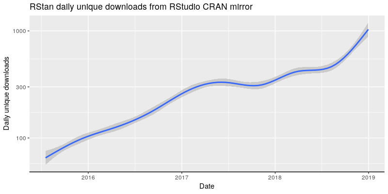
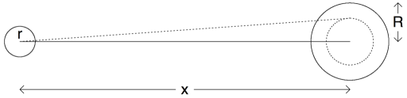

```{r setup, include = FALSE}
knitr::opts_chunk$set(echo = TRUE)
library(crayon)
card <- function(value = c("A", as.character(2:9), "10", "J", "Q", "K"), 
                 suit = c("S", "H", "D", "C"),
                 style = NULL) {
  value <- match.arg(value)
  suit <- match.arg(suit)
  
  deck <- list(S = c("\U1F0A1", "\U1F0A2", "\U1F0A3", "\U1F0A4", "\U1F0A5", "\U1F0A6", "\U1F0A7",
                     "\U1F0A8", "\U1F0A9", "\U1F0AA", "\U1F0AB", "\U1F0AD", "\U1F0AE"),
               H = c("\U1F0B1", "\U1F0B2", "\U1F0B3", "\U1F0B4", "\U1F0B5", "\U1F0B6", "\U1F0B7",
                     "\U1F0B8", "\U1F0B9", "\U1F0BA", "\U1F0BB", "\U1F0BD", "\U1F0BE"),
               D = c("\U1F0C1", "\U1F0C2", "\U1F0C3", "\U1F0C4", "\U1F0C5", "\U1F0C6", "\U1F0C7",
                     "\U1F0C8", "\U1F0C9", "\U1F0CA", "\U1F0CB", "\U1F0CD", "\U1F0CE"),
               C = c("\U1F0D1", "\U1F0D2", "\U1F0D3", "\U1F0D4", "\U1F0D5", "\U1F0D6", "\U1F0D7",
                     "\U1F0D8", "\U1F0D9", "\U1F0DA", "\U1F0DB", "\U1F0DD", "\U1F0DE"))
               
  value <- switch(value,
                  "A" = 1L,
                  "10" = 10L,
                  "J" = 11L,
                  "Q" = 12L,
                  "K" = 13L,
                  as.integer(value))
  if (is.null(style)) style <- if (suit %in% c("H", "D")) red else reset
  return(fansi::sgr_to_html(style(deck[[suit]][value])))
}
```

<style type="text/css">
slides > slide:not(.nobackground):after {
content: '';
}
</style>

## Obligatory Disclosure

* Ben is an employee of Columbia University, which has received several research grants to develop Stan
* Ben is also a manager of GG Statistics LLC, which uses Stan for business purposes
* According to Columbia University 
  [policy](https://research.columbia.edu/content/conflict-interest-and-research), any such employee who 
  has any equity stake in, a title (such as officer or director) with, or is expected to earn at least 
  $\$5,000.00$ per year from a private company is required to disclose these facts in presentations

## Three Perspectives on Probability

1. **Classical**: Every simple event in a finite set has an equal probability of happening by construction
    * What is the probability that a rolled die has a $3$ face up?
2. **Frequentist**: The probability of event $A$ is the proportion of times that $A$ occurs in the limit as the number of 
  trials approaches infinity
    * What is the probability that someone has cancer? 
3. **Bayesian**: The degree of belief that a proposition is true
    * What is the probability that the New England Patriots win the Super Bowl in $2019$?
  
> - Classical and Frequentist perspectives require randomization
> - Regardless of which perspective you apply, the rules of probability remain the same

## Expected Value of a Function

> - What is the "expectation" of a function? How does it differ from the mode or median?
> - Evaluate that function at all possible inputs, multiply each by the respective probability of the input happening, and sum
> - What is the expected value if you roll one (fair) die?
> - Each face has a $\frac{1}{6}$ probability of turning up, so 
$$1 \times \frac{1}{6} + 2 \times \frac{1}{6} + 3 \times \frac{1}{6} + 4 \times \frac{1}{6} + 
5 \times \frac{1}{6} + 6 \times \frac{1}{6} = \frac{21}{6}$$
> - Popular normative theory of decisionmaking: Make the decision or choose the action that maximizes the expectation of 
  your utility function

## Rules of Texas Hold 'Em Poker

> - Expected value is a key concept in poker
> - Decision for each player is to fold, call, or raise
> - Each player is dealt two cards face down -> decisions
> - Three cards in the middle are turned face up -> decisions
> - One card in the middle is turned face up -> decisions
> - One card in the middle is turned face up -> decisions
> - Form the best poker hand with your two face-down cards and any three face-up cards in the middle
> - Flush beats straight beats three of a kind beats two pairs beats one pair beats high card, etc.

## What Do You Do with `r card("A", "C")` `r card("5", "C")`?

```{r}
vembedr::embed_url("https://youtu.be/dZyGfk2HDaY?t=10")
```

## Go [All In](https://floattheturn.com/wp/pushfold/) w/ 138 of `r choose(52, 2)` Possible Hands {.smaller}

* Pairs that are better than fives (9 pairs $\times$ 6 suit combinations = 54 hands)
    * `r card("A", "S")` `r card("A", "H")`, `r card("A", "S")` `r card("A", "D")`, `r card("A", "S")` `r card("A", "C")`,
      `r card("A", "H")` `r card("A", "D")`, `r card("A", "H")` `r card("A", "C")`, `r card("A", "D")` `r card("A", "C")`,
      `r card("K", "S")` `r card("K", "H")`, `r card("K", "S")` `r card("K", "D")`, `r card("K", "S")` `r card("K", "C")`,
      `r card("K", "H")` `r card("K", "D")`, `r card("K", "H")` `r card("K", "C")`, `r card("K", "D")` `r card("K", "C")`,  
      `r card("Q", "S")` `r card("Q", "H")`, `r card("Q", "S")` `r card("Q", "D")`, `r card("Q", "S")` `r card("Q", "C")`,
      `r card("Q", "H")` `r card("Q", "D")`, `r card("Q", "H")` `r card("Q", "C")`, `r card("Q", "D")` `r card("Q", "C")`,
      `r card("J", "S")` `r card("J", "H")`, `r card("J", "S")` `r card("J", "D")`, `r card("J", "S")` `r card("J", "C")`,
      `r card("J", "H")` `r card("J", "D")`, `r card("J", "H")` `r card("J", "C")`, `r card("J", "D")` `r card("J", "C")`,  
      `r card("10", "S")` `r card("10", "H")`, `r card("10", "S")` `r card("10", "D")`, `r card("10", "S")` `r card("10", "C")`,
      `r card("10", "H")` `r card("10", "D")`, `r card("10", "H")` `r card("10", "C")`, `r card("10", "D")` `r card("10", "C")`,
      `r card("9", "S")` `r card("9", "H")`, `r card("9", "S")` `r card("9", "D")`, `r card("9", "S")` `r card("9", "C")`,
      `r card("9", "H")` `r card("9", "D")`, `r card("9", "H")` `r card("9", "C")`, `r card("9", "D")` `r card("9", "C")`,  
      `r card("8", "S")` `r card("8", "H")`, `r card("8", "S")` `r card("8", "D")`, `r card("8", "S")` `r card("8", "C")`,
      `r card("8", "H")` `r card("8", "D")`, `r card("8", "H")` `r card("8", "C")`, `r card("8", "D")` `r card("8", "C")`,
      `r card("7", "S")` `r card("7", "H")`, `r card("7", "S")` `r card("7", "D")`, `r card("7", "S")` `r card("7", "C")`,
      `r card("7", "H")` `r card("7", "D")`, `r card("7", "H")` `r card("7", "C")`, `r card("7", "D")` `r card("7", "C")`,  
      `r card("6", "S")` `r card("6", "H")`, `r card("6", "S")` `r card("6", "D")`, `r card("6", "S")` `r card("6", "C")`,
      `r card("6", "H")` `r card("6", "D")`, `r card("6", "H")` `r card("6", "C")`, `r card("6", "D")` `r card("6", "C")`
* Ace and at least a jack of different suit (6 combinations $\times$ 6 suit pairs = 36 hands)
    * `r card("A", "S")` `r card("K", "H")`, `r card("A", "S")` `r card("K", "D")`, `r card("A", "S")` `r card("K", "C")`,
      `r card("A", "S")` `r card("Q", "H")`, `r card("A", "S")` `r card("Q", "D")`, `r card("A", "S")` `r card("Q", "C")`,
      `r card("A", "S")` `r card("J", "H")`, `r card("A", "S")` `r card("J", "D")`, `r card("A", "S")` `r card("J", "C")`,
      `r card("A", "H")` `r card("K", "S")`, `r card("A", "H")` `r card("K", "D")`, `r card("A", "H")` `r card("K", "C")`,  
      `r card("A", "H")` `r card("Q", "S")`, `r card("A", "H")` `r card("Q", "D")`, `r card("A", "H")` `r card("Q", "C")`,
      `r card("A", "H")` `r card("J", "S")`, `r card("A", "H")` `r card("J", "D")`, `r card("A", "H")` `r card("J", "C")`,
      `r card("A", "D")` `r card("K", "S")`, `r card("A", "D")` `r card("K", "H")`, `r card("A", "D")` `r card("K", "C")`,
      `r card("A", "D")` `r card("Q", "S")`, `r card("A", "D")` `r card("Q", "H")`, `r card("A", "D")` `r card("Q", "C")`,  
      `r card("A", "D")` `r card("J", "S")`, `r card("A", "D")` `r card("J", "H")`, `r card("A", "D")` `r card("J", "C")`,
      `r card("A", "C")` `r card("K", "S")`, `r card("A", "C")` `r card("K", "H")`, `r card("A", "C")` `r card("K", "D")`,
      `r card("A", "C")` `r card("Q", "S")`, `r card("A", "C")` `r card("Q", "H")`, `r card("A", "C")` `r card("Q", "D")`,
      `r card("A", "C")` `r card("J", "S")`, `r card("A", "C")` `r card("J", "H")`, `r card("A", "C")` `r card("J", "D")`,
* Ace and at least a nine of the same suit (5 combinations $\times$ 4 suits = 20 hands)
    * `r card("A", "S")` `r card("K", "S")`, `r card("A", "S")` `r card("Q", "S")`, `r card("A", "S")` `r card("J", "S")`,
      `r card("A", "S")` `r card("10", "S")`, `r card("A", "S")` `r card("9", "S")`,
      `r card("A", "H")` `r card("K", "H")`, `r card("A", "H")` `r card("Q", "H")`, `r card("A", "H")` `r card("J", "H")`,
      `r card("A", "H")` `r card("10", "H")`, `r card("A", "H")` `r card("9", "H")`,
      `r card("A", "D")` `r card("K", "D")`, `r card("A", "D")` `r card("Q", "D")`,  
      `r card("A", "D")` `r card("J", "D")`, `r card("A", "D")` `r card("10", "D")`, `r card("A", "D")` `r card("9", "D")`,
      `r card("A", "C")` `r card("K", "C")`, `r card("A", "C")` `r card("Q", "C")`, `r card("A", "C")` `r card("J", "C")`,
      `r card("A", "C")` `r card("10", "C")`, `r card("A", "C")` `r card("9", "C")`
* Both cards at least 10 of the same suit (6 combinations $\times$ 4 suits = 24 hands)
    * `r card("K", "S")` `r card("Q", "S")`, `r card("K", "S")` `r card("J", "S")`, `r card("K", "S")` `r card("10", "S")`,
      `r card("Q", "S")` `r card("J", "S")`, `r card("Q", "S")` `r card("10", "S")`, `r card("J", "S")` `r card("10", "S")`, 
      `r card("K", "H")` `r card("Q", "H")`, `r card("K", "H")` `r card("J", "H")`, `r card("K", "H")` `r card("10", "H")`,
      `r card("Q", "H")` `r card("J", "H")`, `r card("Q", "H")` `r card("10", "H")`, `r card("J", "H")` `r card("10", "H")`,  
      `r card("K", "D")` `r card("Q", "D")`, `r card("K", "D")` `r card("J", "D")`, `r card("K", "D")` `r card("10", "D")`,
      `r card("Q", "D")` `r card("J", "D")`, `r card("Q", "D")` `r card("10", "D")`, `r card("J", "D")` `r card("10", "D")`, 
      `r card("K", "C")` `r card("Q", "C")`, `r card("K", "C")` `r card("J", "C")`, `r card("K", "C")` `r card("10", "C")`,
      `r card("Q", "C")` `r card("J", "C")`, `r card("Q", "C")` `r card("10", "C")`, `r card("J", "C")` `r card("10", "C")`
* Ace and a five of the same suit (4 suits = 4 hands): `r card("A", "S")` `r card("5", "S")`,
  `r card("A", "H")` `r card("5", "H")`, `r card("A", "D")` `r card("5", "D")`, `r card("A", "C")` `r card("5", "C")`

## Utility Is From Prize $ not Poker Chips

* 6th place and worse: $0
* 5th place: $2 million
* 4th place: $2.84 million
* 3rd place: $4 million
* 2nd place: $6 million
* 1st place: $10 million

> - David Einhorn was eliminated in 6th place two hands ago
> - How is Kaverman's fold with a pair of eights consistent with expected utility maximization?
  
## What Do You Do with `r card("10", "S")` `r card("10", "C")`?

```{r, echo = FALSE}
vembedr::embed_url("https://youtu.be/dZyGfk2HDaY?t=46")
```

## _Now_ What Do You Do with `r card("10", "S")` `r card("10", "C")`?

```{r, echo = FALSE}
knitr::include_graphics("AH.png", dpi = 100)
```

## Lessons from Poker for Science

* Poker manages to utilize all three perspectives on probability:

  1. Classical: Every card that you cannot see is equally likely to be turned over next
  2. Frequentist: The process of shuffling the deck is random and dealing is repeated
    under somewhat similar experimental conditions
  3. Bayesian: Within each hand, players update their probability distribution over
    their opponents' hands given new information (revealed cards, bets, mannerisms, etc.)
    in order to make a decision to bet / call / fold.

* Scientists, policymakers, etc. can adopt the same mindset as a poker player and
  rigorously make decisions that maximize their expeced value weighting with posterior 
  probabilities over what they don't know conditional on the data they have 

## What Is the Bayesian Approach?

* Inputs:
  1. A probability distribution representing how you believe endogenous data will be 
    generated for each admissible value of any unknown parameters
  2. A probability distribution representing your beliefs about those unknown parameters
  3. Data
* Outputs:
  1. Random draws from an UPDATED probability distribution representing how you believe 
    endogenous data will be generated for each admissible value of any unknown parameters
  2. Realizations of functions of that updated probability distribution such as your utility
  
## Bayesian Approach to Golf Putting

* Inputs:
  1. ???
  2. ???
  3. Data: Observations on the distance of a putt and how many were made $(y_i)$ at 
    each distance $(d_i)$

>- (1) could be a binomial distribution which is defined by
$\Pr\left(\left.y_i\right|N_i,p\left(d_i\right)\right) = {N_i! \choose y_i!\left(N_i - y_i\right)!} p\left(d_i\right)^{y_i} \left(1 - p\left(d_i\right)\right)^{N_i - y_i}$
>- What function is $p\left(d_i\right)$? How does the success probability on each putt vary as a function of distance?
>- Plausible that $p\left(d_i\right) = e^{-\beta d_i} \in \left(0,1\right) \forall \beta > 0$
>- What distribution represents your beliefs about $\beta$ in (2)?
>- Could be an exponential distribution w/ expectation $\mu = \frac{1}{15}$

## Stan Is Many Things

* A [probabilistic programming language](https://en.wikipedia.org/wiki/Probabilistic_programming_language)
* A set of mostly Bayesian algorithms that utilize the math library to randomly draw from the 
  posterior distribution defined in a Stan program
* A transpiler that maps statements in the Stan language to equivalent C++
* A C++ library of mathematical functions whose derivatives can be calculated automatically
* A collection of (mostly R) packages for visualizing and analyzing the output, 
  some of which also come with pre-compiled Stan programs
* A community of people that use one or more of the above
    
## Season 3, Episode 9 of Billions

<video width="600" height="480" controls>
  <source src="https://video.twimg.com/ext_tw_video/999106109523742720/pu/vid/640x360/ljdUoEqXji0ES_CV.mp4?tag=3" type="video/mp4">
Your browser does not support the video tag.
</video> 

## Stan Is Trending


    

## The Stan Language

* Symbols in the Stan language must be declared with a type, which
are `int`(egers), `real` numbers, or containers thereof
* The Stan language utilizes blocks for organization:

    * `data` : _Known_ values that you are conditioning on
    * `transformed data` : Functions of `data`
    * `parameters` : _Unknown_ values that you want the posterior distribution of
    * `transformed parameters` : Conditionally deterministic functions of the `parameters`
    * `model` : Where you define what you believe about the data-generating process
    * `generated quantities` : Conditionally deterministic functions that are
      not needed by the `model` block
      
## Stan Syntax for Golf Putt Example

```{r, echo = FALSE, comment = ""}
cat(readLines("golf1.stan"), sep = "\n")
```

## Drawing from Posterior Distributions using the **rstan** Package

```{r, golf1, message = FALSE, results='hide', cache=TRUE}
Sys.setenv(R_MAKEVARS_USER = normalizePath("~/.R/Makevars"))
library(rstan)
golf_data <- read.csv("golf_data.csv")
dat <- with(golf_data, list(obs = nrow(golf_data), feet = feet, 
                            tries = tries, made = made, mu = 1 / 15))
model1 <- stan_model("golf1.stan")
post1 <- sampling(model1, data = dat, refresh = 0)
```
```{r}
print(post1, pars = "beta")
mat <- as.matrix(post1)
```

## Drawing from Posterior Distributions using the **pystan** Package

```{python, eval=FALSE}
import pystan
from numpy import genfromtxt
golf_data = genfromtxt('golf_data.csv', delimiter=',', skip_header=1)
dat = {'obs' : len(golf_data), 'feet' : golf_data[:,0], 
'tries' : golf_data[:,1].astype(int), 'made' : golf_data[:,2].astype(int), 
'mu' : 1.0 / 15.0}
model1 = pystan.StanModel(file='golf1.stan', 
                          extra_compile_args=['-Os', '-g0'])  
post1 = model1.sampling(data=dat, refresh=0)
print(pystan.misc._print_stanfit(post1, pars=['beta']))
mat = post1.extract(permuted=True)
```

## A Better Model for Golf Putting



* The radius $(r)$ of a golf ball is $\frac{1.68}{2 \times 12}$ feet
* The radius $\left(R\right)$ of the hold is $\frac{4.25}{2 \times 12}$ feet
* [Gelman and Nolan 2002](http://www.stat.columbia.edu/~gelman/research/published/golf.pdf) provides a 
  more principled $p\left(d_i\right)$ function, namely
$$p\left(d_i\right) = 2 \Phi\left(\frac{1}{\sigma} \mathrm{sin}^{-1}\left(\frac{R - r}{d_i}\right)\right) - 1$$
where $\Phi\left(\cdot\right)$ is the Cumulative Distribution Function of the standard normal distribution


## Syntax for Second Golf Putt Example

```{stan output.var="golf2", eval = FALSE, echo = TRUE}
data {
  int<lower = 0> obs;           // number of levels of feet from hole
  vector<lower = 0>[obs] feet;  // distance to hole, measured in feet
  int<lower = 0> tries[obs];    // number of puts at each level of feet
  int<lower = 0> made[obs];     // number of puts made at each level of feet
  real<lower = 0> r;            // radius of the golf ball (in feet)
  real<lower = 0> R;            // radius of the hole (in feet)
}
transformed data { 
  vector[obs] num = asin((R - r) * inv(feet)); // numerator in prob function
}
/* fill in the rest, possibly modifying a copy of golf1.stan */
```

Open up a new text file called `golf2.stan` and try to implement the Gelman and Nolan (2002) model.
Hint: The `Phi` function in the Stan language implements the standard normal cumulative distribution
function.

## The Rest of `golf2.stan`

```{r, echo = FALSE, comment=""}
cat(readLines("golf2.stan")[-(1:11)], sep = "\n")
```

## Draw from the Second Posterior Distribution

```{r, golf2, results="hide", cache = TRUE}
model2 <- stan_model("golf2.stan")
dat$r <- 0.68 / (2 * 12)
dat$R <- 4.25 / (2 * 12)
post2 <- sampling(model2, data = dat, refresh = 0)
```
```{r}
print(post2, pars = "sigma_degrees")
```

## An Even Better Model for Golf Putting

* [Brodie (2018)](http://statmodeling.stat.columbia.edu/wp-content/uploads/2019/03/putt_models_20181017.pdf)
derives a model that accounts for the fact that the putt must be on-line but also must travel at least
$d_i$ feet 
$$p\left(d_i\right) = \left(2 \Phi\left(\frac{1}{\sigma_1} \mathrm{sin}^{-1}\left(\frac{R - r}{d_i}\right)\right) - 1\right) \times$$
$$\left(\Phi\left(\frac{2}{\sigma_2^{d_i + 1}}\right) - \Phi\left(\frac{-1}{\sigma_2^{d_i + 1}}\right)\right)$$
* Has an additional standard deviation parameter, $\sigma_2$, which 
is the standard deviation of the error in how far the putt goes
* Open of a new text file called `golf3.stan` and try to implement the Brodie (2018) model. Hint: The `^`
operator implements exponentiation in the Stan language but is not vectorized so you need a 
`for (i in 1:obs) {...}` loop.

## The Rest of `golf3.stan`

```{r, echo = FALSE, comment=""}
cat(readLines("golf3.stan")[-(1:11)], sep = "\n")
```

## Draw from the Third Posterior Distribution

```{r, golf3, results="hide", cache = TRUE}
model3 <- stan_model("golf3.stan")
post3 <- sampling(model3, data = dat, refresh = 0)
```
```{r}
print(post3, pars = c("sigma_degrees", "sigma_distance"))
```

## Model Comparison

* Suppose your utility function is log predictive density for future golf putts
* What weights over the three models maximize its expectation?
```{r, loo, cache=TRUE, message = FALSE}
library(loo)
loo_model_weights(list(golf1 = loo(post1), golf2 = loo(post2), 
                       golf3 = loo(post3)))
```

## More Information

* I will be doing a [Stan Meetup](https://www.meetup.com/Stan-Users-Boston-Camberville/events/257934074/) at 6PM tonight
* I teach a Stan [class](https://courseworks2.columbia.edu/courses/72393) at Columbia with YouTube [videos](https://www.youtube.com/playlist?list=PLSZp9QshJ8wwWjrsGDbguwcPLUwHWUxo0)
* Richard McElreath teaches a similar [class](https://github.com/rmcelreath/statrethinking_winter2019)
 with videos and has a draft second edition of a Stan-based [textbook](https://xcelab.net/rm/sr2/) (requires password)
* The R package **rstanarm** comes with several basic Stan models
* The R package **brms** generates Stan code from R syntax
* You can always get help at https://discourse.mc-stan.org/ 
