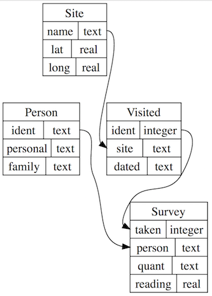

> Questions:
> - "How can I get data from a database?"
> - "What are various options I can use to manipulate my data (e.g. sort, remove dupes, aggregate)?
> - "How can I select subsets of data?"
> - "How can I calculate new values on the fly?"
> - "How can I combine data from multiple tables?"
> Objectives:
> - "Explain the difference between a table, a record, and a field."
> - "Explain the difference between a database and a database manager."
> Keypoints:
> - "A relational database stores information in tables, each of which has a fixed set of columns and a variable number of records."
> - "A database manager is a program that manipulates information stored in a database."


We going to assume some base familiarity of SQL. The remainder of this lesson will go through essential SQL commands that will get you off an running. For a more comprehensive review, we urge you to walk through the Software Carpentry [Databases and SQL lessons](http://swcarpentry.github.io/sql-novice-survey/).


**Our data:** In the late 1920s and early 1930s, William Dyer, Frank Pabodie, and Valentina Roerich led expeditions to the Pole of Inaccessibility in the South Pacific, and then onward to Antarctica. Two years ago, their expeditions were found in a storage locker at Miskatonic University. We have scanned and OCR the data they contain, and we now want to store that information in a way that will make search and analysis easy.

Before we get into the data and using SQLite to select the data, the tables below show the database we will use in our examples:

**Person**: people who took readings.

|id      |personal |family
|--------|---------|----------
|dyer    |William  |Dyer
|pb      |Frank    |Pabodie
|lake    |Anderson |Lake
|roe     |Valentina|Roerich
|danforth|Frank    |Danforth

**Site**: locations where readings were taken.

|name |lat   |long   |
|-----|------|-------|
|DR-1 |-49.85|-128.57|
|DR-3 |-47.15|-126.72|
|MSK-4|-48.87|-123.4 |

**Visited**: when readings were taken at specific sites.

|id   |site |dated     |
|-----|-----|----------|
|619  |DR-1 |1927-02-08|
|622  |DR-1 |1927-02-10|
|734  |DR-3 |1930-01-07|
|735  |DR-3 |1930-01-12|
|751  |DR-3 |1930-02-26|
|752  |DR-3 |-null-    |
|837  |MSK-4|1932-01-14|
|844  |DR-1 |1932-03-22|


**Survey**: the actual readings.

|taken|person|quant|reading|
|-----|------|-----|-------|
|619  |dyer  |rad  |9.82   |
|619  |dyer  |sal  |0.13   |
|622  |dyer  |rad  |7.8    |
|622  |dyer  |sal  |0.09   |
|734  |pb    |rad  |8.41   |
|734  |lake  |sal  |0.05   |
|734  |pb    |temp |-21.5  |
|735  |pb    |rad  |7.22   |
|735  |-null-|sal  |0.06   |
|735  |-null-|temp |-26.0  |
|751  |pb    |rad  |4.35   |
|751  |pb    |temp |-18.5  |
|751  |lake  |sal  |0.1    |
|752  |lake  |rad  |2.19   |
|752  |lake  |sal  |0.09   |
|752  |lake  |temp |-16.0  |
|752  |roe   |sal  |41.6   |
|837  |lake  |rad  |1.46   |
|837  |lake  |sal  |0.21   |
|837  |roe   |sal  |22.5   |
|844  |roe   |rad  |11.25  |


You may notice a couple of things:
- Our table names are in the singular (e.g. Person vs People), and by convention we capitalize the first letter
- the column names are descriptive but succint, and are in lower case
- per table, there is something that makes each row unique


Notice that three entries --- one in the `Visited` table,
and two in the `Survey` table --- don't contain any actual
data, but instead have a special `-null-` entry. We don't have enough time to cover this situation; instead we refer you to the Software Carpentry [lesson on Missing Data](http://swcarpentry.github.io/sql-novice-survey/05-null/).
we'll return to these missing values [later]({{ site.github.url }}/05-null/).

Let's begin by opening up our SQLite database and interrogating our data!

> ## Getting Into and Out Of SQLite
>
> In order to use the SQLite commands *interactively*, we need to
> enter into the SQLite console. 

Open a shell or Terminal window and move to the location where our data is:

Mac: Command-space to open up Spotlight search, type `Terminal`, and when the Terminal application appears, press Enter. Then enter the command `cd /Users/Shared/datafest_2017/`.
PC: Go to your Windows/Start menu search, type `cmd`, and when the Windows Shell option appears, press Enter. Then enter the command `cd C:\Users\Public\datafest_2017\`.

This folder should have your csv and sqlite3 database files in there. Now enter `sqlite3 survey.db`

> The SQLite command is `sqlite3` and you are telling SQLite to open up
> the `survey.db`.  You need to specify the `.db` file otherwise, SQLite
> will open up a temporary, empty database.
>
> To get out of SQLite, type out `.exit` or `.quit`.  If you forget any SQLite `.` (dot)
> command, type `.help`.


Let's turn on two options in our console to make working with SQL and SQLite more user-friendly:
```sql
.mode column
.header on
```

> All SQLite-specific commands are prefixed with a `.` to distinguish them from SQL commands.
> Type `.tables` to list the tables in the database.
>
> ```sql
> .tables
> 
> Person   Site     Survey   Visited
> ```
> To see how the database tables are structured, type
>
> ```sql
> .schema
> 
> CREATE TABLE Person (id text, personal text, family text);
> CREATE TABLE Site (name text, lat real, long real);
> CREATE TABLE Visited (id text, site text, dated text);
> CREATE TABLE Survey (taken integer, person text, quant text, reading real);
> ```
>
> For a full list of commands, type `.help` and see the [SQLIte CLI page](https://sqlite.org/cli.html)

## Selecting Data

For now,
let's write an SQL query that displays scientists' names.
We do this using the SQL command `SELECT`,
giving it the names of the columns we want and the table we want them from.
Our query and its output look like this:

```sql
SELECT family, personal FROM Person;
```

|family  |personal |
|--------|---------|
|Dyer    |William  |
|Pabodie |Frank    |
|Lake    |Anderson |
|Roerich |Valentina|
|Danforth|Frank    |

Case does not matter, the columns names are separated by commands, and a semicolon is used to terminal the statement. If you forget the semicolon, SQL will prompt you with additional `>` on a new line. 

Database records are not stored in any particular order. This means that query results aren't necessarily sorted, and even if they are, we often want to sort them in a different way, e.g., by their identifier instead of by their personal name. We can do this in SQL by adding an `ORDER BY` clause to our query:

```sql
SELECT * FROM Person ORDER BY family;
```

|id     |personal |family  |
|-------|---------|--------|
|danfort|Frank    |Danforth|
|dyer   |William  |Dyer    |
|lake   |Anderson |Lake    |
|pb     |Frank    |Pabodie |
|roe    |Valentina|Roerich |

By default, results are sorted in ascending order (i.e., from least to greatest). We can sort in the opposite order using `DESC` instead of the default `ASC`.


The real meat of our data, which measurements were taken at each site, is in the `Survey` table, so let's switch to that quantitative data. To determine  we can examine the `Survey` table. Data is often redundant, so queries often return redundant information. For example, if we select the quantities that have been measured from the `Survey` table, we get this:

```sql
SELECT quant FROM Survey;
```

|quant|
|-----|
|rad  |
|sal  |
|rad  |
|sal  |
|rad  |
|sal  |
|temp |
|rad  |
|sal  |
|temp |
|rad  |
|temp |
|sal  |
|rad  |
|sal  |
|temp |
|sal  |
|rad  |
|sal  |
|sal  |
|rad  |

We can eliminate the redundant output to make the result more readable by adding the `DISTINCT` keyword to our query:

```sql
SELECT DISTINCT quant FROM Survey;
```

|quant|
|-----|
|rad  |
|sal  |
|temp |

We can use the `DISTINCT` keyword on multiple columns. If we select more than one column, the distinct *pairs* of values are returned.


We can get unique data 

## Filtering Data

One of the most powerful features of a database is the ability to filter data, i.e., to select only those records that match certain criteria. For example, suppose we want to see when a particular site was visited. We can select these records from the Visited table by using a WHERE clause in our query. We can also add Boolean operators to filter our data. For example, we can ask for all information from the DR-1 site collected before 1930:

```sql
SELECT * FROM Visited WHERE site = 'DR-1' AND dated < '1930-01-01';
```

|id |site|dated     |
|---|----|----------|
|619|DR-1|1927-02-08|
|622|DR-1|1927-02-10|

We can also filter by partial matches. For example, if we want to know something just about the site names beginning with “DR” we can use the LIKE keyword. The percent symbol acts as a wildcard, matching any characters in that place. It can be used at the beginning, middle, or end of the string:

```sql
SELECT * FROM Visited WHERE site LIKE 'DR%';
```
|id |site|dated     |
|---|----|----------|
|619|DR-1|1927-02-08|
|622|DR-1|1927-02-10|
|734|DR-3|1930-01-07|
|735|DR-3|1930-01-12|
|751|DR-3|1930-02-26|
|752|DR-3|          |
|844|DR-1|1932-03-22|

***
**Exercise:**

* Normalized salinity readings are supposed to be between 0.0 and 1.0. Write a query that selects all records from Survey with salinity values outside this range.

***

## Calculating New Values

After carefully re-reading the expedition logs, we realize that the radiation measurements they report may need to be corrected upward by 5%. Rather than modifying the stored data, we can do this calculation on the fly as part of our query:

```sql
SELECT 1.05 * reading FROM Survey WHERE quant='rad';
```
|1.05 * reading|
|--------------|
|10.311        |
|8.19          |
|8.8305        |
|7.581         |
|4.5675        |
|2.2995        |
|1.533         |
|11.8125       |


We can also combine values from different fields, for example by using the string concatenation operator ||:

```sql
SELECT personal || ' ' || family FROM Person;
```
| |
|-----------------|
|William Dyer     |
|Frank Pabodie    |
|Anderson Lake    |
|Valentina Roerich|
|Frank Danforth   |

## Aggregating Data
SQL has built in functions that enable data aggregation, some of the more commonly used ones are `min`, `max`, `avg`, `count`, `sum`, `round`. 

There are several simpler ways to use these functions on tables, e.g. 

`SELECT min(dated) FROM Visited;`, 

`SELECT sum(reading) FROM Survey WHERE quant='sal';`, or 

`SELECT min(reading), max(reading) FROM Survey WHERE quant='sal' AND reading<=1.0;`.

However, aggregating all records at once doesn’t always make sense. For example, suppose we suspect that there is a systematic bias in our data, and that some scientists’ radiation readings are higher than others. In this scenario, we could use the following code for aggregating for one scientist at a time:

```sql
SELECT person, count(reading), round(avg(reading), 2)
FROM  Survey
WHERE quant='rad'
AND   person='dyer';
```
|person|count(reading)|round(avg(reading), 2)|
|------|--------------|----------------------|
|dyer  |2             |8.81                  |


Or, we could replace the `AND` with `GROUP BY` and get a table of aggregated values, which is much more useful to evaluate the bias:

```sql
SELECT   person, count(reading), round(avg(reading), 2)
FROM     Survey
WHERE    quant='rad'
GROUP BY person;
```
|person|count(reading)|round(avg(reading), 2)|
|------|--------------|----------------------|
|dyer  |2             |8.81                  |
|lake  |2             |1.82                  |
|pb    |3             |6.66                  |
|roe   |1             |11.25                 |

***

**Exercise:**

* How many temperature readings did Frank Pabodie record, and what was their average value?

***

## Importing Data

We don't have time in our workshop today to show how to go through importing datafiles into a brand new database. We will give one example that we won't go through.

There are two steps when creating a database and pulling in new data: 1) creating the structure of the database to house the data, and 2) importing the data itself.

In SQLite, assuming that you have started your console session in the same directory as your datafiles to import, you can execute the following commands:

```sql
CREATE TABLE "Person" ("id" TEXT, "personal" TEXT, "family" TEXT)
.mode csv
.import Person.csv Person
```

The first command creates a `Person` table with three columns, each column as a TEXT field. There are other data types one can use (e.g. integer, real, etc). Please see the [SQLite Data Types document](https://www.sqlite.org/datatype3.html) for more info. These second line ensure that the file we pull in is recognized as a comma-separated value file. And the third line imports the file that is in our local, working directory into the `Person` data table.


Although the console interface is the better, more reproducible option for doing this type of work, the [SQLite Manager plug-in](https://addons.mozilla.org/en-US/firefox/addon/sqlite-manager/) for the [Firefox browser](https://www.mozilla.org/firefox) can help you with this process as well.


## Combining Data

Rarely is all the data that you need contained within one data sheet. Often, one collects data there are columns of similar, overlap, or matching between two datafiles or data tables. With the above methods for selecting, filtering, and aggregating data, we can construct an SQL query that will allow us to match & merge the data, while at the same time sorting, select, filtering, and aggregating. (Now try that in Excel!)

In our toy example, in order to submit our data to a web site that aggregates historical meteorological data, we might need to format it as latitude, longitude, date, quantity, and reading. However, our latitudes and longitudes are in the `Site` table, while the dates of measurements are in the `Visited` table and the readings themselves are in the `Survey` table. We need to combine these tables somehow.

This figure shows the relations between the tables:



The SQL command to do this is `JOIN`. To keep it simple, we are going to join only the site `Visited` table with the quantitative `Survey` table data. To perform this feat, we use the following query

```sql
SELECT *
FROM Visited JOIN Survey
ON Survey.taken = Visited.id;
```

We'll explain the two new expressions that you have not seen before:

**`Visited JOIN Survey`** This expression tells SQL that you'd like to combine the two tables `Visited` and `Survey`. Alone, this instructs SQL to create a 'cross product' of the two tables -- it joins each record of one table with each record of the other table to give all possible combinations. But, we modify this combination with the next expression...

**`ON Survey.taken = Visited.id`** This phrase instructs SQL to filter records where there is a match between the `taken` column of `Survey`, and the `id` column of `Visited`. Once we add this to our query, the database manager throws away records that combined information about two different sites, leaving us with just the ones we want.

Notice that we used `Table.field` format to specify field names in the output of the join. We do this because tables can have fields with the same name, and we need to be specific which ones we’re talking about. For example, if we joined the `Person` and `Visited` tables, the result would inherit a field called `id` from each of the original tables.

So our query results in the following output:

id | site | dated | taken | person | quant | reading | 
---------- | ---------- | ---------- | ---------- | ---------- | ---------- | ----------
619 | DR-1 | 1927-02-08 | 619 | dyer | rad | 9.82 | 
619 | DR-1 | 1927-02-08 | 619 | dyer | sal | 0.13 | 
622 | DR-1 | 1927-02-10 | 622 | dyer | rad | 7.8 | 
622 | DR-1 | 1927-02-10 | 622 | dyer | sal | 0.09 | 
734 | DR-3 | 1930-01-07 | 734 | lake | sal | 0.05 | 
734 | DR-3 | 1930-01-07 | 734 | pb | rad | 8.41 | 
734 | DR-3 | 1930-01-07 | 734 | pb | temp | -21.5 | 
735 | DR-3 | 1930-01-12 | 735 |  | sal | 0.06 | 
735 | DR-3 | 1930-01-12 | 735 |  | temp | -26.0 | 
735 | DR-3 | 1930-01-12 | 735 | pb | rad | 7.22 | 
751 | DR-3 | 1930-02-26 | 751 | lake | sal | 0.1 | 
751 | DR-3 | 1930-02-26 | 751 | pb | rad | 4.35 | 
751 | DR-3 | 1930-02-26 | 751 | pb | temp | -18.5 | 
752 | DR-3 |  | 752 | lake | rad | 2.19 | 
752 | DR-3 |  | 752 | lake | sal | 0.09 | 
752 | DR-3 |  | 752 | lake | temp | -16.0 | 
752 | DR-3 |  | | | 752 | | | roe | sal | 41.6 | 
837 | MSK-4 | 1932-01-14 | 837 | lake | rad | 1.46 | 
837 | MSK-4 | 1932-01-14 | 837 | lake | sal | 0.21 | 
837 | MSK-4 | 1932-01-14 | 837 | roe | sal | 22.5 | 
844 | DR-1 | 1932-03-22 | 844 | roe | rad | 11.25 | 

This small query is only the start of what you can do with the JOIN command. Ways to extend this include:
- use `AND` with additional `ON` expressions and another `JOIN` phrase to merge in a 3rd table. For example:
```sql
SELECT Site.lat, Site.long, Visited.dated, Survey.quant, Survey.reading
FROM   Site JOIN Visited JOIN Survey
ON     Site.name=Visited.site
AND    Visited.id=Survey.taken
AND    Visited.dated IS NOT NULL;
```
- suffix this query with `ORDER BY`, `GROUP BY`, or other SQL expressions. 

### A Note on Unique Values and Identifiers

We can tell which records from `Site`, `Visited`, and `Survey` correspond with each other because those tables contain [primary keys](http://swcarpentry.github.io/sql-novice-survey/reference/#primary-key) and [foreign keys](http://swcarpentry.github.io/sql-novice-survey/reference/#foreign-key). A primary key is a value, or combination of values, that uniquely identifies each record in a table. A foreign key is a value (or combination of values) from one table that identifies a unique record in another table. Another way of saying this is that a foreign key is the primary key of one table that appears in some other table. In our database, `Person.id` is the primary key in the `Person` table, while `Survey.person` is a foreign key relating the `Survey` table's entries to entries in `Person`.

Most database designers believe that every table should have a well-defined primary key. They also believe that this key should be separate from the data itself, so that if we ever need to change the data, we only need to make one change in one place. One easy way to do this is to create an arbitrary, unique ID for each record as we add it to the database. This is actually very common: those IDs have names like "student numbers" and "patient numbers", and they almost always turn out to have originally been a unique record identifier in some database system or other. As the query below demonstrates, SQLite [automatically numbers records](https://www.sqlite.org/lang_createtable.html#rowid) as they're added to tables, and we can use those record numbers in queries:

```sql
SELECT rowid, * FROM Person;
```

|rowid|id      |personal |family  |
|-----|--------|---------|--------|
|1    |dyer    |William  |Dyer    |
|2    |pb      |Frank    |Pabodie |
|3    |lake    |Anderson |Lake    |
|4    |roe     |Valentina|Roerich |
|5    |danforth|Frank    |Danforth|


***

**Exercise:**

* Our `Visited JOIN Survey` query above merges the data from these two tables. Write a similar query that joins data from the `Person` and `Survey` tables, and showing only the non-match columns.

***

[Next Lesson](03_scripting_with_databases.md)

***

*Materials used in these lessons are derived predominantly from Software Carpentry's Databases and SQL lessons, which have been released under the Creative Commons Attribution license (CC BY 4.0). Small portions were also derived from Data Carpentry's SQL for Ecology lessons, which have been released under the Creative Commons Attribution license (CC BY 4.0).*
