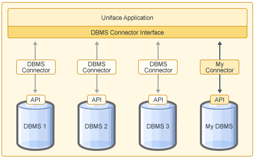
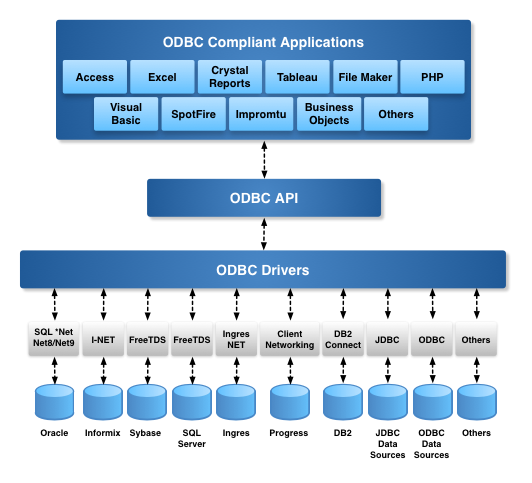

> questions:
> - "How can I access databases from scripts and programs written in Python, R, Stata, or other languages?"
> objectives:
> - "Write short programs that execute SQL queries."
>
> keypoints:
> - "General-purpose languages have libraries for accessing databases."
> - "To connect to a database, a program must use a library specific to that database manager."
> - "These libraries use a connection-and-cursor model."
> what we won't cover:
> - "Programs can read query results in batches or all at once."
> - "Queries should be written using parameter substitution, not string formatting."


## Moving to R (dplyr), Python, and Stata for accessing local/remote DB

One real value in using databases is that this data is accessible from multiple analysis and visualization environments, like R, Python, Stata, and Tableau. The real win is that these environments request the data, and all the heavy computation is done on the back end. This allow greater amount of flexibility in scripting, the data is managed uniformly, and the processing is offloaded to the database backend (SQLite). Let's look at one example:

The best way to connect to a database (remote or local) is through the native driver (connector) that comes with the database program itself. With this driver, your program in any common language can natively connect directly to the database. Each database program will require its own custom driver.


*Image from [Uniface Info](http://unifaceinfo.com/docs/0907/Uniface_Library_HTML/ulibrary/UnifaceDatabaseConnectors_0B1A074C362F5F0369E54E0046832324.html)*

A more modular, generic approach is using ODBC (Open Database Connectivity). This approach uses a database manager as a broker to hide database-specific commands, so that your program can use generic SQL-querying language. All that is needed is a specific driver to sit between the ODBC manage and the database.


*Image from [OpenLink Software](https://uda.openlinksw.com/odbc/)*


### Accessing our data: A pseudocode example

All scripts and programs (we'll use the word 'script' to mean both of these) written in whatever language you choose will follow a standard pattern of steps. We'll write this pattern in pseudocode -- steps that outline code but are not specific to a particular language. These steaps are as follows:

```
01: load necessary libraries for database
02: create and open the database connection
03: initialize the pointer (cursor) into the database system
04: execute the SQL query
05: fetch the query results
06: iterate over the data and print the results
07: close the database connection
```

Let's go through these in more detail...

```
01: load necessary libraries for database
```
The script starts by importing the library, package, or extension needed to access the database. Often, to make the scripting language flexible, these are add-ons that 'extend' the functionality of the language. Sometimes these are built-in (as in Python) or sometimes these must be downloaded separately (as in R).
If we were connecting to MySQL, DB2, or some other database,
we would import a different library,
but all of them provide the same functions,
so that the rest of our program does not have to change
(at least, not much)
if we switch from one database to another.

```
02: create and open the database connection
```
Line 2 establishes a connection to the database.
The way we open the connection will differ among database systems, but they usually follow a similar format. This is typically database server hostname, communication port, username, password, etc. Since we're using SQLite, which is local to our computer,
all we need to specify is the name of the database file.

```
03: initialize the pointer (cursor) into the database system
```
This step then uses the open connection to create a [cursor]({{ site.github.url }}/reference/#cursor).
Just like the cursor in an editor,
its role is to keep track of where we are in the database.

```
04: execute the SQL query
```
Next, with this cursor (pointer) we ask the database to execute a query for us. The query is written in SQL , and passed as a string. It's our job to make sure that SQL is properly formatted; if it isn't, or if something goes wrong when it is being executed, the database will report an error.

The one exception to that is with the package dplyr in R, which turns R-like expressions into the required SQL behind-the-scenes, and executes that SQL on our behalf. We'll see an example of this shortly.

```
05: fetch the query results
```
The database returns the results of the query to us in response to a fetch call, which we capture in a temporary variable.

```
06: iterate over the fetched data and do something with the results
```
The format of this data will vary from language to language, and even within languages, may be represented by different data structures depending on what module/package/extension you use to interrogate the database. You'll need to read the documentation or look at example code to get exact details. Most commonly, in the result set one record (line) in the variable represents one record in the database. 

We can loop over each of the lines/records and process each one. This might be printing each, further breaking down each line into their individual fields (columns), or whatever your needs require. 

```
07: close the database connection
```
Finally, when we're done, we need to tidy up. This almost always means closing the connection to the database. Depending on the analysis environment, you might need to do additional work. For example, in Python, you also need to close the cursor before closing the database connection.

Why do this? Well, since the database can only keep a limited number of these open at one time.
Since establishing a connection takes time, though, we shouldn't open a connection, do one operation, then close the connection, only to reopen it a few microseconds later to do another operation. Instead, it's normal to create one connection that stays open for the lifetime of the program.

**One final note:** We did not talk about error checking. This should be done after each step, as you never know what might go wrong. For simplicity sake, we left these steps out. (But you won't, will you?)

### Language-specific Examples for Using Databases

So let's see how we would implement this pseudocode in R, Python, and Stata!

**R (standard)**
You can download [`R_sqlite_dplyr.R`](https://raw.githubusercontent.com/hbs-rcs/datafest/master/DataFest-2020/Custom_Databases_for_Data_Management/scripts/R_sqlite_dplyr.R) to your local machine and put it in your `datafest/` folder.

```r
# import our required packages
library('RSQLite')

# open the database connection
connection <- dbConnect(SQLite(), "/Users/Shared/datafest/survey.db")

# execute and fetch the results
results <- dbGetQuery(connection, "SELECT Site.lat, Site.long FROM Site;")

# print 'em out
print(results)

# close the connection
dbDisconnect(connection)
```

**R with dplyr**
```r
#
# somewhat using dplyr
# import our required packages
library('RSQLite')
library('dplyr')

connection <- DBI::dbConnect(RSQLite::SQLite(), "/Users/Shared/datafest/survey.db")

# execute and fetch the results
results <- tbl(connection, sql("SELECT Site.lat, Site.long FROM Site"))

# print 'em out
print(results)

# close the connection
dbDisconnect(connection)
```

**R with dplyr and dbplyr**
```r
## better examples
# real dplyr with dbplyr
#
#
library(dplyr)
library(dbplyr)

connection <- DBI::dbConnect(RSQLite::SQLite(), "/Users/Shared/datafest/survey.db")
src_dbi(connection)

# sql
results <- tbl(connection, sql("SELECT Site.lat, Site.long FROM Site"))
results
str(results)

# dplyr
sites <- tbl(connection, "Site")
str(sites)

sites %>% 
  select(lat, long)
sites

sites %>% 
  select(lat, long) %>%
  show_query()
  
dbDisconnect(connection)


# Simple query and filter
# find readings out of range:
# SELECT * FROM Survey WHERE quant = 'sal' AND ((reading > 1.0) OR (reading < 0.0));
connection <- DBI::dbConnect(RSQLite::SQLite(), "/Users/Shared/datafest/survey.db")
src_dbi(connection)
s
urvey <- tbl(connection, "Survey")
survey %>% 
  select(person, quant, reading) %>% 
  filter(quant == 'sal',
         reading > 1 | reading < 0)

# what did it do?
survey %>% 
  select(person, quant, reading) %>% 
  filter(quant == 'sal',
         reading > 1 | reading < 0) %>% 
  show_query()

# collect data
salinity_readings <- survey %>% 
  select(person, quant, reading) %>% 
  filter(quant == 'sal',
         reading > 1 | reading < 0)
salinity_readings

dbDisconnect(connection)


# do a join
# SELECT * FROM Visited JOIN Survey ON Survey.taken = Visited.id and person = "lake" ORDER BY quant ASC;

library(dplyr)
library(dbplyr)

connection <- DBI::dbConnect(RSQLite::SQLite(), "/Users/Shared/datafest/survey.db")
src_dbi(connection)

survey <- tbl(connection, "Survey")
both <- left_join(survey, tbl(connection, "Visited"),
                   by = c("taken" = "id")) %>% 
  filter(person == "lake") %>%
  arrange(quant)
both
explain(both)

dbDisconnect(connection)
```

**Python**

The python code is slightly more verbose than that for R, but is still very easy to understand. You can download the two files [`bad_query.py`](https://raw.githubusercontent.com/hbs-rcs/datafest/master/DataFest-2020/Custom_Databases_for_Data_Management/scripts/bad_query.py) and [`better_query.py`](https://raw.githubusercontent.com/hbs-rcs/datafest/master/DataFest-2020/Custom_Databases_for_Data_Management/scripts/better_query.py):

```python
# import our python3-print-in-python2 and SQLite modules
from __future__ import print_function
import sqlite3

# Open the connection, create a cursor, & use the cursor to execute the query
connection = sqlite3.connect("survey.db")
cursor = connection.cursor()
cursor.execute("SELECT Site.lat, Site.long FROM Site;")

# fetch the results as a python list, and print 'em
results = cursor.fetchall()
for r in results:
    print(r)

# clean up by closing our cursor & connection
cursor.close()
connection.close()
```

**Brief notes:** We import the modules for our database backend sqlite3 and a print function that works for both Python2 and Python3. 
If we were connecting to MySQL, DB2, or some other database,
we would import a different library. We then establish a connection, create our cursor, execute the SQL query, and fetch the results.
This result is a list with one entry for each record in the result set;
if we loop over that list and print those list entries,
we can see that each one is a tuple
with one element for each field we asked for. We finally close our cursor and our database connection.


**Stata**

```stata
set more off
odbc load lat=lat lon=long, exec(`"SELECT Site.lat, Site.long FROM Site;"') dsn("DF_Survey_DB") clear  
list
```

**Brief notes:** Stata does not need the open connect and cursor calls that the other languages do, so the code is even more compact. Unfortunately, Stata can only use one table at a time. Thus executing calls where the joins are done outside of Stata is even more important!

### Database Safety

So, the queries that we have done were simple and static. Once can do dynamic queries by including a wildcard in your query statement:

```python
query = "SELECT personal || ' ' || family FROM Person WHERE id=?;"
person = 'dyer'
cursor.execute(query, person)
```

The `?` wildcard allows you to substitue in a value at the time of the query execution. This means that you can dynamically set the value of a variable (or some other method) in order to make your script flexible and more abstract.


## Exercises:
> 
> We've shown how to execute the SQL code for a one table query in pseudocode. Modify your code and query for a two table join? 
> 
> 

***

*Materials used in these lessons are derived predominantly from Software Carpentry's Databases and SQL lessons, which have been released under the Creative Commons Attribution license (CC BY 4.0). Small portions were also derived from Data Carpentry's SQL for Ecology lessons, which have been released under the Creative Commons Attribution license (CC BY 4.0).*
