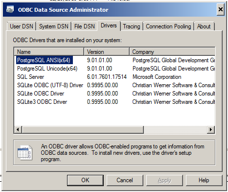
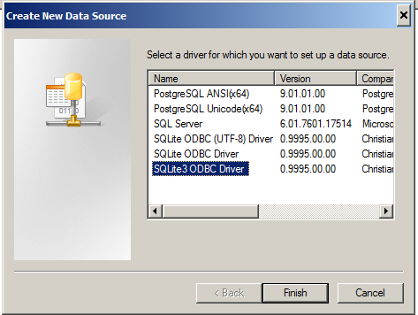
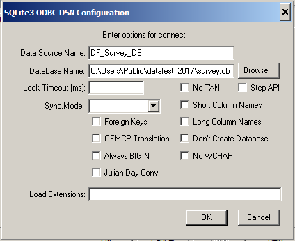

# Installation Instructions for *Multiple Approaches to Combining Data*

Our hands-on session will be focusing on using SQLite3 as a lightweight, local database engine. We will primarily use materials and software from the Software Carpentry's [Databases & SQL lesson](http://swcarpentry.github.io/sql-novice-survey/). And we will extend these to include demonstrating the use of SQLite from within Stata via an ODBC connection. Although there are multiple layers to this hands-on, the installation per platform is rather straightforward. Let's dig in!

Although this looks lengthy, it is not and should take only about 5 minutes to complete.  Please install in the sections below:

[Data Files](#data-files)<br>
[DB Browser for SQLite](#db-browser)<br>
One (or all) of the following :<br>
  [Python + modules](#python--sqlite-module)<br>
  [R + packages](#r--rstudio--rsqlite--dplyr-packages)<br>
  [Stata + ODBC](#stata--odbc-drivers)
  
If you already have R, Python, or Stata installed, you will still need to install supplemental files in those sections.

## Data Files

1. Create a folder at the following location:

- Mac:    `/Macintosh HD/Users/Shared/datafest`
- PC :    `C:\Users\Public\datafest`
    
2. Download the following files into that folder, ensuring that the files have the names within single quotes:


- ['survey.db' sqlite3 database](../../../../raw/master/DataFest-2020/Custom_Databases_for_Data_Management/data/survey.db)
- ['person.csv' file](../../../../raw/master/DataFest-2020/Custom_Databases_for_Data_Management/data/person.csv)
- ['site.csv' file](../../../../raw/master/DataFest-2020/Custom_Databases_for_Data_Management/data/site.csv)
- ['survey.csv' file](../../../../raw/master/DataFest-2020/Custom_Databases_for_Data_Management/data/survey.csv)
- ['visited.csv' file](../../../../raw/master/DataFest-2020/Custom_Databases_for_Data_Management/data/visited.csv)


## DB Browser for SQLite

Please download the appropriate version for your operating systerm from: https://sqlitebrowser.org/dl/

The installation process is pretty simple and easy-to-follow for Mac and Windows.   
    
## Analysis Environments

You do not need to install all three analysis environments; instead, only install the one(s) that you are most interested. In session, we are going to demonstrate how to use SQLite from each of them. Please note that you might be required to install these for other Datafest Hands-on sessions.

### Python v3.x + SQLite module

1. For Mac or PC, please download to your `Installers` folder the appropriate installer from [Continuum Analytics](https://www.continuum.io/) Anaconda Python installer and run it to start the installation process. If you don't know which PC installer to use, please use the 32-bit one.

    Mac 64-bit: https://repo.anaconda.com/archive/Anaconda3-2019.10-MacOSX-x86_64.pkg       
    PC 64-bit : https://repo.anaconda.com/archive/Anaconda3-2019.10-Windows-x86_64.exe

2. To test the success of your installation, open up a Terminal or cmd shell window, type in `python` and press Enter. You are successful if the prompt changes to `>>> ` and 'Continuum Analytics' is mentioned in the text above. Type `quit()` and Enter to exit. If you did not get this prompt, please see the HelpDesk volunteers at DataFest concourse.
    
### R + RStudio + RSQLite + dplyr packages

1. For Mac or PC, please download to your `Installers` folder the R installer from the [CRAN](https://cran.r-project.org/) site and run it to start the installation process:

    Mac: https://cran.r-project.org/bin/macosx/R-3.6.2.pkg       
    PC : https://cran.r-project.org/bin/windows/base/R-3.6.2-win.exe

2. For Mac or PC, please download to your `Installers` folder the RStudio installer from the [RStudio](https://www.rstudio.com/) site and run it to start the installation process:

    Mac: https://download1.rstudio.org/desktop/macos/RStudio-1.2.5033.dmg       
    PC : https://download1.rstudio.org/desktop/windows/RStudio-1.2.5033.exe


3. Final step is to install the R packages needed for the workshop. Open up the RStudio program. In the console window that appears in the left pane, please enter the following commands one-at-a-time, *noting that there may be long pauses* as RStudio processes and installs all the dependent packages:

```
    install.packages(c('RSQLite','dplyr','dbplyr'))
```

Red text may appear and scroll by. For the most part, that should be fine. But the final message should be something like...

```
The downloaded binary packages are in
	C:\Users\myuser\AppData\Local\Temp\RtmpusjIjg\downloaded_packages
```

4. To test the success of your installation, enter the following commands:

```
    library('RSQLite')
    library('dplyr')
    library('dbplyr')
```
    
For RSQLite, there should be nothing printed. For dplyr, you may get someting like the following:

```
Attaching package: ‘dplyr’

The following objects are masked from ‘package:stats’:

    filter, lag

The following objects are masked from ‘package:base’:

    intersect, setdiff, setequal, union`


Attaching package: ‘dbplyr’

The following objects are masked from ‘package:dplyr’:

    ident, sql
```

If you receive any error (not warning) messages, please see the HelpDesk volunteers at DataFest concourse.


### Stata + ODBC drivers

This is perhaps the most complex of the three analysis environments, as the ODBC (Open DataBase Connectivity) installation can be complex and/or difficult. We have provided preset configuration files & images that will only work if you've followed the instructions above. 

#### Stata

You must have a licensed copy of [Stata](http://www.stata.com) pre-installed. We will not provide it for your for this workshop.

#### ODBC Manager

The ODBC Manager software acts as a broker between your front-end program (R, Python, Stata) and the backend database, allowing you to slot in any database. 

1a. For the PC, this step is not needed as it is built into the Windows operating system.

1b. For the Mac, please download to your `Installers` folder the [iODBC Manager 3.52.12 disk image](http://download3.openlinksw.com/uda/components/7.0/universal-apple-macosx10.7-32/mxkozzzz.dmg). Open the disk image file, and double-click the installer package to start the installation process.


#### ODBC Drivers

For each backend database or data source, you need software (a driver) to communicate between it and the ODBC Manager. We will use open source drivers from [http://www.ch-werner.de/sqliteodbc/](http://www.ch-werner.de/sqliteodbc/), which work well-enough for our purposes. Know that these can cost anywhere from $20 to $200!

1. For Mac or PC, please download to your `Installers` folder the appropriate installer and open/run the appropriate program, disk image, or package to start the installation process. **PC users:** please download and install **BOTH** sets of drivers.

    Mac: [v0.9994 (with full-text search support) disk image](http://www.ch-werner.de/sqliteodbc/sqliteodbc-0.9994.dmg)
    PC : [v0.9996 Win64 binary](http://www.ch-werner.de/sqliteodbc/sqliteodbc_w64.exe)

#### ODBC Configuration

**PC**

Unfortunately, this must be done by hand via the Windows GUI interface. Although these instructions were written for Window 7 SP1, they may vary slightly for v8.1, or v10. Please adjust accordingly. If really stuck, see the HelpDesk volunteers in the DataFest concourse.

1. From your Start / Search menu, look for 'ODBC', and run a program similar to "Data Sources (ODBC)" or the Control Panel "Set up data sources (ODBC)". **Please choose the 64-bit one** if you are presented with more than one choice.

2. Click on the "Drivers" tab. You should see "SQLite3 ODBC Driver" listed here, among others:



 If you do not, please retry the ODBC Manager and ODBC Driver PC installation steps. If you still do not see it here, please see the HelpDesk volunteers at DataFest concourse.

3. Click on the "User DNS" tab. Click on the "Add" button. Select the "SQLite3 ODBC Driver". 



PLEASE verify that you selected SQLite3, not the other choices. Click on the "Finish" button.

4. In the new window that appears, enter "DF_Survey_DB" as the Data Source Name. For Database Name, enter `C:\Users\Public\datafest\survey.db` or use the "Browse" button to navigate to the `survey.db` file in your `datafest` folder. 



You should have this window configured as such. Click on "OK" to close this window, and "OK" again to close the ODBC Manager.

5. Open Stata, and enter `odbc list`. You should see the data source that you entered there as a clickable link. Click on the DF_Survey_DB link, and you should see the list of the four data tables in our database. If you do not get this, please show the error messages to the HelpDesk volunteers at DataFest concourse.

**Mac**

1. For Mac, please download to your `Installers` folder the [Mac ODBC Configuration Script](../../../../raw/master/DataFest-2020/Custom_Databases_for_Data_Management/installers/mac/mac_odbc_config.command) (right-mouse click and "Save Link As..."). 

2. Click on the Search icon in the Mac main menu bar, or press Command-Space to bring up the Spotlight search. Enter "Terminal" and press Enter/Return when the Terminal application appears.

3. In the Terminal window that appears, enter the following command (note that 'Installers' is capitalized):

	`bash /Users/Shared/datafest/Installers/mac_odbc_config.command`

4. If all installed successfully, you should see a confirmation message "Files are present and installed OK". If not, you will be informed, and you should download the *.ini files from the GitHub site found at 'installers > mac' and place in your invisible Library home folder. If you are stuck, please show the error messages to the HelpDesk volunteers at DataFest concourse.

5. Open Stata, and enter `set odbcdriver ansi, permanently`, Enter, and `odbc list`. You should see the data source that you entered there as a clickable link. Click on the DF_Survey_DB link, and you should see the list of the four data tables in our database. If you do not get this, please show the error messages to the HelpDesk volunteers at DataFest concourse.


