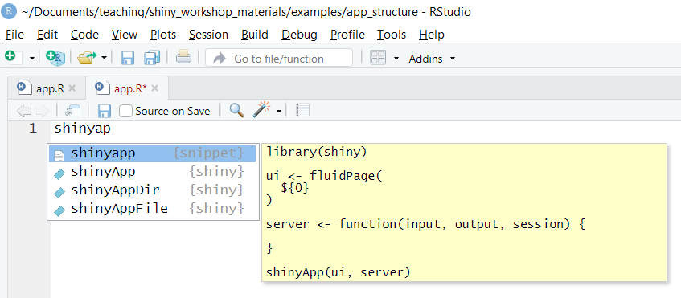

```{r setup, eval = TRUE, include=FALSE}
knitr::opts_chunk$set(echo = FALSE)
knitr::opts_chunk$set(message = FALSE)
knitr::opts_chunk$set(warning = FALSE)
knitr::opts_chunk$set(eval = FALSE)
options(width = 70)
```

# R Shiny Workshop Setup

## Required software
There are a few things you need to install in order to follow along with the examples and exercises.

- **R**: https://cran.r-project.org
- **RStudio**: https://rstudio.com/products/rstudio/download/
- **tidyverse, plotly, leaflet, and DT packages**: \newline `install.packages(c("tidyverse", "plotly", "DT"))` 


## Workshop materials and setup

1. Download workshop materials from https://github.com/izahn/shiny_workshop/archive/master.zip and unzip.
2. Start Rstudio
3. Open `shiny_workshop_materials.Rproj` (*File \rightarrow Open Project \rightarrow `shiny_workshop_materials.Rproj`*)
4. Open shiny cheatsheet (*Help \rightarrow Cheat sheets \rightarrow Web applications with shiny*)

# What is shiny and what is it good for?

## A web application framework in R

> - Shiny is a web application framework in R.

> - You can build websites without knowing HTML/CSS/Javascript!

> - The whole R package ecosystem is available for use in your web app!

> - If you already know R shiny makes it easy to build a website.


## Use cases and examples

- Exploratory data analysis: https://jjames.shinyapps.io/shinyHome/

- Teaching and learning: http://www.statstudio.net/free-tools/dists/

- Search and recommendation engine: https://public-service.vpal.harvard.edu/

> - Many more examples at https://www.showmeshiny.com/

> - Some built-in examples accessible via `runExample()`


## Sharing and deploying

> - Shiny apps can be run locally using the `shiny` R package.
\begin{center}
  \tikz{
  \node (LT) at (0,0) {\LARGE \faLaptop};
  \node (R)  at (0, 0) {\faRProject};
  }
\end{center}

> - Apps can be deployed to the freemium https://shinyapps.io service.
\begin{center}
  \tikz{
  \node (LT) at (0,0) {\faLaptop};
  \node [opacity=0.2](CLD)  at (2, 0) {{\LARGE \faCloud}\hspace{-1em}\faServer \faRProject};
  \draw [->] (LT) edge[bend left=30] (CLD);
  \draw [->] (CLD) edge[bend left=30] (LT);
  }
\end{center}


> - You (or your organization) can run a free version of Shiny Server on your own system, or pay for the full-featured *RStudio Connect* platform.


# Structure of a shiny application

Objectives:

- Learn the required components of a shiny application.

- Learn how to create shiny apps from a template.

- Start to think in terms of *inputs* and *outputs*.

- Practice creating apps using storm data as an example.


## Shiny app components

> - Shiny apps have two main components: the *ui* and the *server*.

> - Can be in a single `app.R` file or in separate `ui.R` and `server.R` files.

> - The *ui* specifies the layout of elements on the page, including *input* and *output* elements.

> - The *server* does all computations, *renders output* and sends it to the *ui*.


## Example: Create new shiny app

There are two convenient ways to create a new shiny app.


Option 1: Create a new shiny web app from example
: *File \rightarrow New File \rightarrow Shiny Web App*

Option 2: Create a new shiny app from a template
: *File \rightarrow New File \rightarrow R Script*; start typing `shinyapp` and select the shinyapp *snippet*

   
## Exercise 1: Create a shiny app

Open the exercise file: *File \rightarrow Open File \rightarrow exercises/01_new_shiny_app.R*

1. Start typing `shinyapp` and select the shinyapp *snippet*


2. Save the file and click the "Run App" button. You should see a blank app and no errors!

3. Add some text inside the ui element, e.g., "Hello World!". Save and click the "Reload App" button".


## Example project data

We will be using the `storms` data set distributed with the `dplyr` package as an example.

```{r,eval=TRUE, echo = TRUE}
library(shiny)
library(dplyr)
data(storms)
names(storms)
```

Our first goal is to **display the number of storms by year** in our shiny app.

## UI and server elements

- The `ui` specifies the elements of your application and their arrangement.
  - Common elements include *inputs*, *outputs*, and *descriptive text*.
  - Elements can be easily arranged in panels and tabs.
   
- The `server` is responsible for all computation and output rendering.
  - The `server` monitors *inputs* and other *reactive* values.
  - When inputs change, rendered outputs are created or updated.


## Outputs and Renderers

*Outputs* are the way generated content produced by R is displayed in shiny. Examples include:

- `textOutput()`

- `plotOutput()`

- `tableOutput()`

You can use

```{r, echo = TRUE}
help.search("output", package = "shiny")
```

to find other output functions in shiny.


## Outputs and Renderers

Each `*output()` function has a corresponding `render*()` function. For example:

> - `textOutput()` \rightarrow `renderText()`

> - `plotOutput()` \rightarrow `renderPlot()`

> - `tableOutput()` \rightarrow `renderTable()`


## Example: render outputs

Start
: *examples/02_render_output.R*

Finished
: *examples/02_render_output_finished.R*


## Exercise 2: Display number of storms by year.

Open the exercise file: *File \rightarrow Open File \rightarrow exercises/02_storms_by_year.R*

1. Add a table output element to the ui and a corresponding renderer to the server.
   The table should display the number of named storms in each year.

2. Add a plot output element to the ui, and a corresponding renderer to the server.
   The plot should display the number of named storms in each year.


## Creating input elements

*Inputs* are form elements like check boxes, text fields, and sliders. Examples include:

- `textInput()`

- `selectInput()`

- `fileInput()`

You can use

```{r, echo = TRUE}
help.search("input", package = "shiny")
```

to find other input functions in shiny.


## Accessing inputs

- Inputs are accessed in the *server* function via the *input* argument.

- Inputs are *reactive*, meaning that changes trigger updates.

- It is often helpful to `print` or use `str` to examine inputs; `str(reactiveValuesToList(input))`
  will show the current input names and values.

## Example: create and use input

Start
: *examples/03_input_output.R*

Finished
: *examples/03_input_output_finished.R*


## Exercise 3: Display storms for a user-selected year.

Open the exercise file: *File \rightarrow Open File \rightarrow exercises/03_storms_filtered.R*

1. Add a sliderInput element to the ui .

2. Modify the renderTable expression to filter the year displayed to the one selected by the user.


# User interface (UI)

Objectives:

- Learn the high-level layout features provided by shiny.

- Learn how to include html tags in your shiny app.

- Explore available shiny themes.

- Practice creating apps using different layouts.


## Page layouts 

Our storms app is functional, but not much to look at. 

Top-level page layout functions in shiny include:

- `fluidPage()`
- `navbarPage()`
- `fixedPage()`
- `fillPage()`
- `bootstrapPage()`

`fluidPage` is the most commonly used, and `navbarPage` is useful for more complex apps with many elements. 

See https://shiny.rstudio.com/articles/layout-guide.html for more.

## Layout functions

Other layout functions include:

- `fluidRow()` / `fixedRow()`
- `column()`,
- `sidebarLayout()`
- `splitLayout()`
- `verticalLayout()`

These are often used inside the page layout functions.

See https://shiny.rstudio.com/articles/layout-guide.html for more.


## HTML tags

In addition to the high-level layout functions you can also use low-level functions to generate html tags.

Directly available tag functions include:

- `h1()` .. `h6()` (headers)
- `p()` (paragraph)
- `a()` (link)
- `br()` (line break)
- `div()` (division)

See `?builder` for more.


## Shiny themes

Shiny uses bootstrap ( https://getbootstrap.com/ ) under the hood, providing easy access to a range of themes.

To use other themes, install the `shinythemes` package and use the `theme` argument to your page layout function.

More information at https://rstudio.github.io/shinythemes/


## Example: Page and element layout

Start
: *examples/04_layout_appearance.R*

Finished
: *examples/04_layout_appearance_finished.R*


## Exercise 4: Spiff up the storms app

Open the exercise file: *File \rightarrow Open File \rightarrow exercises/04_storms_pretty.R*

1. Lay out this application using `navbarPage` and `tabPanel.
   See https://shiny.rstudio.com/articles/layout-guide.html 
   for examples.

2. Use html tags (e.g., `h2()`, `p()`, `a()`) to add some descriptive text to your application.

3. Use the `shinythemes` package (install if needed) to change the theme used by your app.
   See https://rstudio.github.io/shinythemes/ for examples.


# Interactive tables and graphs

Javascript is the language of the web, and many of the most popular javascript libraries can be used directly from R.

Objectives:

- Discover available html widgets that can be used in shiny applications.

- Learn how html widgets interact with shiny.

- Practice using html widgets as inputs and outputs in shiny apps.


## Interactive tables with DT

The DataTables javascript library can be used to create interactive tables directly from R. Features inlude:

- searching,
- pagination, 
- sorting.

Interacting with tables updates `input`, enabling integration with Shiny.

See https://shiny.rstudio.com/articles/datatables.html for more.

## Interactive graphs with plotly

Plotly is a robust javascript data visualization library with an excellent R package. Features include:

- easy converson of `ggplot` graphs,
- hover, click, pan and zoom
- support for  plots, scatter plots, error bars, box plots, heatmaps and much more.

Plotly includes an `event_data` function for retrieving values produced by interacting with the plot. This enables deep integration with Shiny.

See https://plot.ly/r/shiny-coupled-events/ for more.


## Interactive maps with leaflet

Leaflet is a popular javascript library for producing interactive maps.

Like DataTables, interacting with leaflet maps updates `input`, enabling interacting with shiny.

See http://rstudio.github.io/leaflet/shiny.html for more.


## Example: html widgets DT and Plotly

Start
: *examples/05_htmlwidgets.R*

Finished
: *examples/05_htmlwidgets_finished.R*


## Exercise 5: Interactive storms map

Open the exercise file: *File \rightarrow Open File \rightarrow exercises/05_interactive_storms_map.R*


1. Run the app and click on the blue markers. Examine the output in 
the console to determin the input corresponding to the row number 
of the clicked observation.

2. Use the slice function to select the row corresponding
to the clicked marker from the storms data frame and return
this row to the stormDetails output on line 65.


# Where to go from here


## Learning resources

A number of excellent tutorials and other resources are available, including:

- https://www.linkedin.com/learning/building-data-apps-with-r-and-shiny-essential-training

- https://shiny.rstudio.com/tutorial/

- http://shiny.rstudio.com/articles/

- https://shiny.rstudio.com/images/shiny-cheatsheet.pdf


## Reactivity and dynamic UI elements

We have only touched on the reactive model shiny uses to enable interactivity. You can learn much more about it at https://vimeo.com/rstudioinc/review/131218530/212d8a5a7a/#t=42m2s

## Debugging shiny apps

We've seeen how to use `print` or `str` to insect values. You can also use breakpoints in Rstudio.

More information about debugging shiny apps is available at https://shiny.rstudio.com/articles/debugging.html


