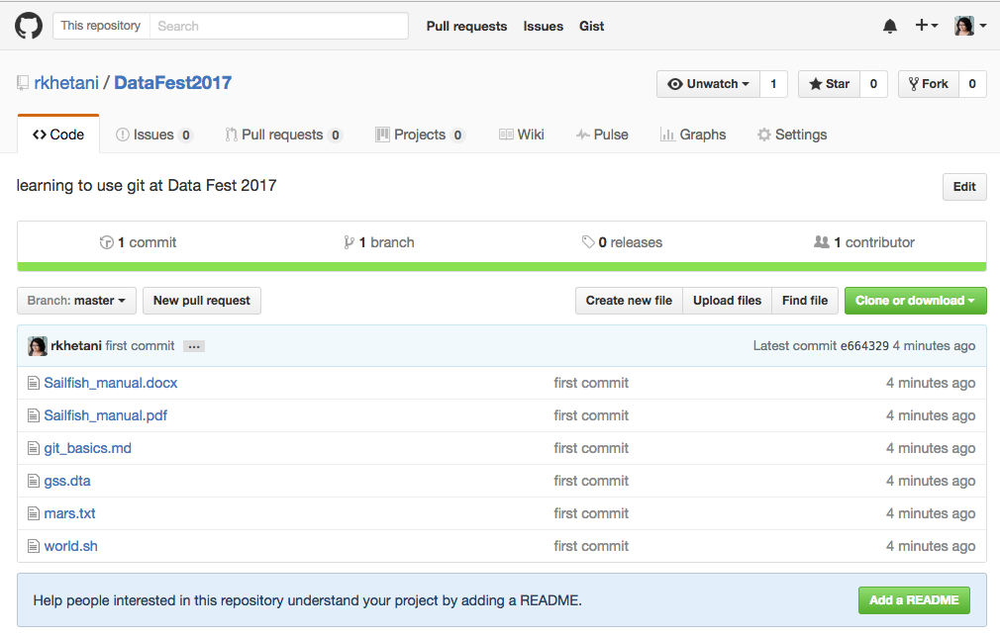
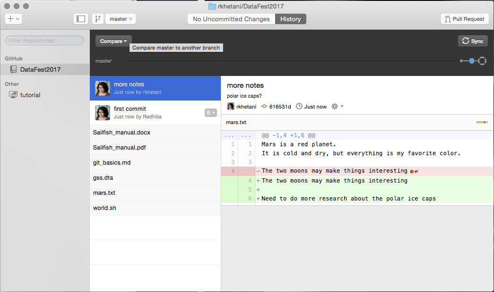
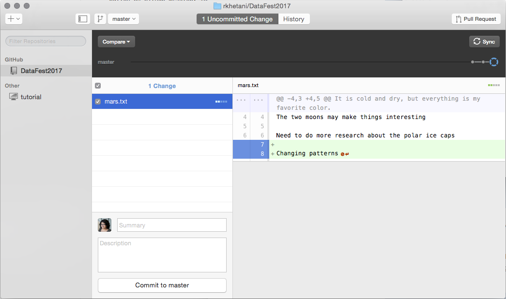
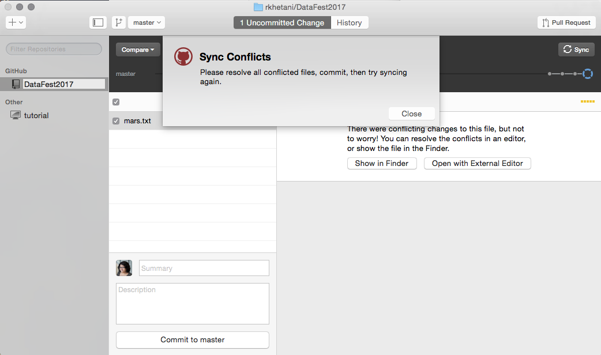
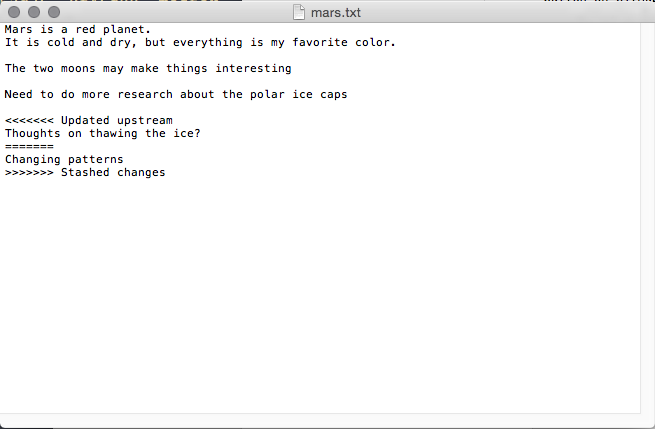

# Version Control with Git/Github

>> NOTE: Materials used in these lessons are derived/adapted from [Daniel van Strien's "An Introduction to Version Control Using GitHub Desktop," Programming Historian, (17 June 2016)](http://programminghistorian.org/lessons/getting-started-with-github-desktop) and from [Software Carpentry instructional material](https://swcarpentry.github.io/git-novice/). Licensing information available at the bottom of this page.

## What is Version Control, and why use it?

We'll start by exploring how version control can be used to keep track of what one person did and when. Even if you aren't collaborating with other people, it is better than the scenario like this:

```
mydocument.txt
mydocumentversion2.txt
mydocumentwithrevision.txt
mydocumentfinal.txt
```
The system used for naming files may be more or less systematic. Adding dates makes it slightly easier to follow when changes were made:

```
mydocument2016-01-06.txt
mydocument2016-01-08.txt
```

Some word processors let us deal with this a little better, without creating a new file for every "save", such as Microsoft Word's "Track Changes" or Google Docs' [version history](https://support.google.com/docs/answer/190843?hl=en).

Version control systems start with a base version of the document and then save just the changes you made at each step of the way by taking a so-called "snapshot". A snapshot records information about when the it was taken, but also about what changes occurred between different snapshots. You decide when these snapshots are collected, and this allows you to ‘rewind’ your file to an older version. 


Once you think of changes as separate from the document itself, you can then think about "playing back" different sets of changes onto the base document and getting different versions of the document. For example, two users can make independent sets of changes based on the same document.


If there aren't conflicts, you can even play two sets of changes onto the same base document.


A version control system is a tool that keeps track of these changes for us and helps us version and merge our files.

## Why Version Control Text Documents?

As research increasingly makes use of digital tools and storage it becomes important to consider how to best manage our research data. This becomes especially important when we want to collaborate with other people. Though version control was originally designed for dealing with code (.R, .pl. .py) there are many benefits to using it to with text documents too (.txt, .csv, .tsv). Though not all of these benefits will be covered in this lesson, version controlling your document allows you to:

* Track developments and changes in your documents
* Record the changes you made to your document in a way that you will be able to understand later
* Experiment with different versions of a document while maintaining the original version
* ‘Merge’ two versions of a document and manage conflicts between versions
* Revert changes, moving ‘backwards’ through your history to previous versions of your document

> Note: Different Version Control systems handle different non-text files differently. In most cases Word documents, graphics files, data objects from R or STATA, etc., can be included but most tools have limited capabilities for these.

Version control will not be necessary for all of the documents you write. However there are times when version control will be very useful. For substantial work such as articles, books, or dissertations, version control makes a lot of sense.

Version control is particularly useful for facilitating collaboration. One of the original motivations behind version control systems was to allow different people to work on large projects together, in the case of Git to manage the Linux kernel source code. Benefits of collaborating with Version Control include:

* flexibility and control
* multiple people can simultaneously work on a document
* easy conflict resolution 
* easy to revert to an older version

The example implementation of version control we are going to use today will be public; but, it is possible to use version control and keep your documents hidden permanently or until you decide to make them available.

## What are Git and GitHub?

Though often used synonymously, Git and GitHub are two different things. Git is a particular implementation of version control originally designed by Linus Torvalds as a way of managing the Linux source code. [Other systems](https://en.wikipedia.org/wiki/Comparison_of_version_control_software) of version control exist though they are used less frequently. Git can be used to refer both to a particular approach taken to version control and the software underlying it.

GitHub is a company which hosts Git repositories (more on this below) and provides software for using Git. This includes ‘GitHub Desktop’ which will be covered in this tutorial. GitHub is currently the most popular host of open source projects by [number of projects and number of users](https://en.wikipedia.org/wiki/Comparison_of_source_code_hosting_facilities#Popularity).

Although GitHub’s focus is primarily on source code, other projects are increasingly making use of version control systems like GitHub to manage the work-flows of journal publishing, open textbooks, other humanities projects, and teaching materials. 

Becoming familiar with GitHub will be useful not only for version controlling your own documents but will also make it easier to contribute and draw upon other projects which use GitHub. In this lesson the focus will be on gaining an understanding of the basic aims and principles of version control by uploading and version controlling a plain text document. This lesson will not cover everything but will provide a starting point to using version control.

## Why Not use Dropbox or Google Drive?

Dropbox, Google Drive and other services offer some form of version control in their systems. There are times when this may be sufficient for your needs. However there are a number of advantages to using a version control system like Git:

* Language support: Git supports both text and programming languages. As research moves to include more digital techniques and tools it becomes increasingly important to have a way of managing and sharing both the ‘traditional’ outputs (journal articles, books, etc.) but also these newer outputs (code, datasets etc.)
* More control: a proper version control systems gives you a much greater deal of control over how you manage changes in a document, including the ability to comment on every change making it easier to revert.
* Useful history: using version control systems like Git will allow you to produce a history of your document in which different stages of the documents can be navigated easily both by yourself and by others.

## Getting Started

GitHub Desktop will allow us to easily start using version control. GitHub Desktop offers a Graphical User Interface (GUI) to use Git. Though there are some potential advantages to using the command line version of Git in the long run, using a GUI can reduce the learning curve of using version control and Git. If you decide you are interested in using the command line you can find more resources at the end of the lesson.

### A Note on Terminology

One of the trickiest aspects of using GitHub is the new terminology. Some of the commands are fairly self-explanatory, others less so. This tutorial will try and briefly summarise new terms. It may also be helpful to have a [glossary](https://help.github.com/articles/github-glossary/) on hand to refer to. But in general it can be best to pick up terminology through using GitHub rather than trying to understand all of the terms before you begin using it.

### Register for a GitHub Account

Since we are going to be using [GitHub](https://github.com/) we will need to register for an account at GitHub if we don’t already have one. For [students](https://education.github.com/pack) and [researchers](https://github.com/blog/1840-improving-github-for-science) GitHub offers free private repositories. These are not necessary but might be appealing if you want to keep some work private.

### Install GitHub Desktop

Most of you should have already installed [Github Desktop](https://desktop.github.com/). Open it and sign in using the credentials you used to sign up for a github account. 


Once you sign in, you'll see that there is already a tutorial repository available to you.


## Version Controlling a directory of files

### Creating a Repository

Git tracks the contents of a folder by creating a repository in a given folder; so it is important to organize projects in folders. 

Tracking items in a folder (repository) using Git:

* The repository is made up of a folder whose contents are ‘watched’ for changes by Git.
* A repository can have many files and sub-folders
* It is best to create one repository for each major project you are working on, i.e., one repository for an article, one for a book, and one for some code you are developing. 
* These folders are like the normal folders you would have on your computer for different projects, though the files in the folders have to be deliberately added to the repository in order to be version controlled. 
* It can be set up to ignore some items in the folder (very large datasets, or temp files)
* Do not create repositories for folders within a repository (avoid matryoshka repos!)

Download the folder we have generated for this session [from here](https://github.com/IQSS/datafest/raw/master/versioning/data/DataFest2017.zip), and unzip it.

### Adding a Folder/Repository

There are a number of different ways to add files/folders for GitHub Desktop to track. We can drag the folder containing the file onto GitHub Desktop. When you do this you will be asked whether you want to create a repository for this folder. Alternatively we can click on the ‘plus’ icon to open a window to choose folders we want to add. 


Once we have added our folder we will be able to see it in a list of repositories on the left column.


If we choose the repository we just added we will see the files contained in that repository. From this menu we can choose which files we want to version control. (There might be times when we are working on projects in which files are produced which we don’t need or want to version control.) On the right we will see the current document.

If we were to look at hidden folders in the folder we have just added to GitHub you will see that the folder now contains an extra folder with the name ‘.git’. This folder is how GitHub desktop tracks changes we make within our version controlled folder whether these changes be adding new files or modifying existing ones.

Let's open the `mars.txt` document using our favorite text editor (see note below) and add a couple of lines to it.

```
Mars is a red planet.
It is cold and dry, but everything is my favorite color.

The two moons may make things interesting
```
> **Text Editors:**
> When creating a plain text document, you will want to use a text editor like TextWrangler (Mac) or NotePad++ (Windows) instead of Microscoft Word or the default text editors. You will also want to make sure that you do not save it as Rich Text Format, but as plain text. There are a huge number of free and paid text editors available. Some of these are very straightforward and simple to use while others have a learning curve and potential uses beyond simple text editing. In the long run using a more advanced and extendable text editor like Vim or Emacs may save you time.

Save the changes to your file and go back to GitHub Desktop. You will see that these new lines of text appear. This lets us know that GitHub is able to see changes in your file but at the moment these changes haven’t been recorded in an official ‘snapshot’ of your repository. To do this we need to **add** and **commit** our changes.


In the context of Github Desktop the **add** to place changes in the *staging area* is completely transparent. However, it is important to know these terms for a proper understanding of how Git functions. You can place several changes in the staging area, and only **commit** when you are ready. But, do spend some time thinking about how and if all these changes go together, it might be best to only group a few related changes together in the staging area before the **commit** step.

### Committing Changes

A **commit** tells Git that you made some changes which you want to record. Though a **commit** seems similar to saving a file, there are different aims behind ‘committing’ changes compared to saving changes. **Commits** take a snapshot of the file at that point and allow you to document information about the changes made to the document.

To commit changes you must give a summary of the changes and include an optional message. It is important that you think carefully about when to make commits, since the advantages of version control taking snapshots of your changes regularly relies on you making commits. It is often tempting to just commit changes when you have finished working on a document but this might not reflect when important changes occurred.


When you commit you will see ‘commit to master’. This refers to the ‘master branch’. Within a Git repository it is possible to have multiple ‘branches.’ These different branches are essentially different places in which to work. Often they are used to test new ideas or work on a particular feature without modifying or "contaminating" the master copy (e.g. production version of a webpage). Initially it is not necessary to use the branches feature of GitHub, but you may want to learn to use it in the future, particularly if you want to use GitHub to collaborate on a repository with other people. 

A useful way to think about commits is as the ‘history’ of your document. Each commit records a development or change made to the documents in your repository; the history of the document can be traced by looking at all of the commits. For this history to be useful later on, either for ourselves or for someone else, it is important that this history is recorded at relevant points. Trying to make commits ‘atomic’ is an important consideration. What this means is that each commit ‘makes sense’ on its own. The changes in the commit and the message are understandable without having to look at surrounding commits.

> **Commit Messages**: It is important that you use meaningful commit summaries and messages. You don't need to write which files were changes, as Git will track that by itself; you should describe changes at a higher level. Writing good commit messages requires some prior thought. This is especially important when you are working on a collaborative project, as it is especially important that other people can understand your commit messages. 

### Publishing Your Repository

At the moment we are only recording our changes locally. We may be happy to only store our changes locally (it is still important to back our files up) but we may want to upload our repository onto GitHub to make it public or to have it stored outside of our computer (for collaborating/sharing/backing up). 

The process of doing this through GitHub Desktop is straightforward. On GitHub desktop you ‘publish’ repositories. This will **push** your repository from your computer to the GitHub website and set up a *remote* repository on Github's servers in the process.


Once you have ‘published’ your repository it will be viewable on your profile at GitHub’s website. You can choose to keep it public or make it private, and if it's private, you can choose specific github users with whom you want to share it.

For this lesson, we will stick with a public repository. To quickly view your repository online you can use the repository menu and choose ‘View on GitHub’. This will bring you to your repository online in your browser.




Once your document is online, you can continue to make local changes to your file. But you will have to sync your local changes to reflect these changes in the published GitHub repository. GitHub stores changes both locally (on your computer) and remotely (on their servers). It is important to keep these changes in sync. 

On GitHub Desktop this process is simplified by using the **Sync** option, which **pulls** in the changes in the remote repository and **pushes** any local changes to the remote repo. This will ensure your local (computer) and remote (GitHub server) repositories are current. 

### Making Changes Remotely

It is also possible to make a change to your repository on the web interface. Clicking on the name of the file will take you to a new page showing your document.

Click on the edit option. You will now be able to edit the file and add some new text.


Once you have made some changes to your file, you will again see the option to commit changes at the bottom of the text entry box.


Once you have committed these changes they will be stored on the remote repository. To get them back onto our computer we need to sync our these changes. Use the ‘sync’ button on GitHub Desktop to sync the local repository. We now have our remote changes synced back onto our computer.



You can see from this view that we now have the text with changes highlighted in green and red. Red indicates where things have been removed while green indicates additions. This can be useful for viewing the edits you have made before making a commit and helps you spot whether all the changes are ones you want to commit. On the left you will see a history of the changes you have made. At the moment this is very brief but as you work on a project the history might become much longer. Being able to see the changes you have made at different stages can be very useful.

### Managing Conflicts

A ‘conflict’ emerges when you try to merge or ‘sync’ two versions of a document with changes which conflict with each other. If you are careful about committing and syncing local changes (on your computer) then it is unlikely you will run into this issue, but if you do it can be resolved fairly easily.

The most likely way a conflict will emerge is if you make a change remotely (on the GitHub website), and then make a subsequent change on your local machine without first synching the changes from the website. If you make changes in different parts of a document these changes can be ‘merged’ or synced together without any conflict. But these changes might conflict with one another (i.e. if you try and change the same line of the document in two different ways).


An example will help illustrate the most likely way conflicts can emerge, and how to deal with them. 

Say we add a change to our remote repository (on the GitHub website).


We commit this change on the website and subsequently make a change to the document using the text editor on our local machine, and save it.



If we now commit our local changes and then sync our changes we get a message warning us about sync conflicts.



This is not a big problem. What you will need to do is manage these conflicts. GitHub desktop offers you the option of opening the file with the sync conflicts.

If we choose to open file with an external text editor the document will open with whichever text editor/application we have chosen as the default for opening markdown files. If you haven’t set a default application you can choose to ‘show in finder’ (or ‘show in folder’ for Windows). This will show the folder with your file. From here you can open it with your preferred editor.


If we take a look at the file we will see Git has highlighted the conflicting section.



You will see that the conflicting section is marked with <<<<<<< and ends with >>>>>>>. These are known as the conflict markers. The two conflicting blocks are divided by a ======= line. There are a number of approaches to dealing with a conflict:

* You could choose to go with either of the changes by deleting the version you no longer want and removing the conflict markers, OR
* You could change the section entirely and not choose either of the options.

Once you have ‘resolved’ the conflict you can go onto **commit** and **sync** your changes as usual. When you go to commit your changes you see that GitHub desktop specifies that the commit is to merge a conflict. This is useful if you later want to go back and review how you managed any conflicts.


This may seem like a convoluted approach to dealing with conflicts but it is very useful because of the control given to you in dealing with conflicts. If conflicts emerge on a system like Dropbox the result is two files being created; although this is better than potentially losing important changes, it also means you still have to look at these two documents and decide how you are going to merge them. If you are careful about always syncing changes you will be able to avoid having to deal with conflicts. When collaborating the likelihood for conflicts increases so it is useful to be aware of how to deal with conflicts before you begin to collaborate using GitHub. 

## Further Resources

GitHub Desktop offers an easy way of getting started with GitHub and version control. Depending on your use case GitHub desktop may be sufficient for your needs. If you are already familiar with using the Command Line then using Git on the Command Line may offer some advantages. Version control systems like Git have a lot of features available to use. Some of these will only be applicable in very specific contexts, others will be more commonly useful. Alongside the lesson suggested above the resources below will allow you to gain a deeper understanding of version control.

* The [GitHub Desktop](https://desktop.github.com/) and the GitHub Desktop [documentation](https://help.github.com/desktop/) outlines more features included in GitHub Desktop.
* GitHub provides extensive support in the form of [guides](https://guides.github.com/) and [help](https://help.github.com/).
* GitHub [Glossary](https://help.github.com/articles/github-glossary/) outlines the most commonly used GitHub/Git terminology.

***

*Materials used in these lessons are derived from Daniel van Strien's ["An Introduction to Version Control Using GitHub Desktop,"](http://programminghistorian.org/lessons/getting-started-with-github-desktop), Programming Historian, (17 June 2016). [The Programming Historian ISSN 2397-2068](http://programminghistorian.org/), is released under the [Creative Commons Attribution license](https://creativecommons.org/licenses/by/4.0/) (CC BY 4.0).*
